> **Formal Modeling and Analysis of an Audio/Video Protocol:**
>
> **An Industrial Case Study Using UPPAAL**
>
> *Klaus Havelund*
>
> *Arne Skou*
>
> *Kim Guldstrand Larsen*
>
> BRICS,Aalborg University,Denmark
>
> {havelund,ask,kgl}@cs.auc.dk
>
> *Kristian Lund*

Bang &Olufsen,Denmark klu@bang-olufsen.dk

> **Abstract**

*A formal and automatic verification of a real-life proto- col is
presented.The protocol,about 2800 lines of assem- bler code,has been
used in products from the audio/video company Bang &Olufsen throughout
more than a decade, and its purpose is to control the transmission of
messages between audio/video components over a single bus.Such
communications may collide,and one essential purpose of the protocol is
to detect such collisions.The functioning is highly dependent on
real-time considerations.Though the protocol was known to be faulty in
that messages were lost occasionally,the protocol was too complicated in
order for Bang &Olufsen to locate the bug using normal testing.
However;using the real-time verification tool UPPAAL,an error trace was
automatically generated,which caused the detection of\"the error\"in the
implementation.The error was corrected and the correction was
automatically proven correct,again using UPPAAL.A future,and more auto-
mated,version of the protocol,where this error is fatal,will incorporate
the correction.Hence,this work is an elegant demonstration of how model
checking has had an impact on practical software development.The effort
of modeling this protocol has in addition generated a number ofsugges-
tions for enriching the UPPAAL language.Hence,it\'s also an excellent
example of the reverse impact.*

**1.Introduction**

Since the basic results by Alur,Courcoubetis and Dill \[1,2\]on
decidability of model checking for real-time sys- tems with dense time,a
number of tools for automatic verification of hybrid and real-time
systems have emerged \[5,10,8\].These tools have by now reached a
state,where they are mature enough for application on industrial case-

> studies as we hope to demonstrate in this paper.
>
> One such tool is the real-time verification tool UPPAAL¹
> \[5\]developed jointly by BRICS²at Aalborg University and Department
> of Computing Systems at Uppsala Univer- sity.The tool provides support
> for automatic verification of safety and bounded liveness properties
> of real-time sys- tems,and it contains a number of additional features
> includ- ing graphical interfaces for designing and simulating system
> models.The tool has been applied successfully to a num- ber of
> case-studies \[13,3,4,12,7\]which can roughly be divided in two
> classes:real-time controllers and real-time communication protocols.
>
> Industrial developers of embedded systems have been following the
> above work with great interest,because the real-time aspects of
> concurrent systems can be extremely difficult to analyse during the
> design and implementation phase.One such company is Bang &Olufsen
> -having development and production of fully integrated home au-
> dio/video systems as a main activity.
>
> In 1996,BRICS and Bang &Olufsen (B&O)agreed to collaborate on a case
> study based on one of the company\'s existing protocols for
> audio/video device control.The pro- tocol was of interest for three
> reasons:Firstly,it contained an unexplained error which occasionally
> caused data loss. The source of this error was unknown to
> everyone,includ- ing B&O,prior to the exercise.That is,normal testing
> had not been sufficient to identify the wrong code.Our goal should be
> to explain the error.Secondly,the proto- col documentation was very
> low level(consisting solely of assembler listings and flow charts)-so
> the company could expect an improved documentation as a byproduct of
> the work.Thirdly,B&O is about to move(a corrected version

{width="1.354229002624672in"
height="6.944444444444444e-3in"}

> 1See URL:[http://www.docs.u.se/docs/rtmvuppal/index.shtml
> for](http://www.docs.u.se/docs/rtmvuppal/index.shtmlfor) information
> about UPPAAL.
>
> 2BRICS-Basic Research in Computer Science -is a basic research centre
> funded by the danish government at Aarhus and Aalborg University.
>
> 2

0-8186-8268-X/97\$10.00 ◎1997 IEEE

> Authorized licensed use limited to:BEIHANG UNIVERSITY.Downloaded on
> March 21,2026 at 09:02:51 UTC from IEEE Xplore.Restrictions apply.

of)the protocol to a different platform;thus the case-study will test
the benefits of the modeling and verification abili- ties of UPPAAL in a
realistic development process.Finally, the company had no problems in
publishing the results in full detail afterwards.Although the protocol
is designed for use in audio/video networks,it is a general purpose
protocol applicable also in other contexts.

This paper reports the preliminary results of our collab- oration.We
describe how the UPPAAL tool has been ap- plied in constructing a model
of the current protocol imple- mentation.The model was developed via 5
major iteration steps during 3 months,where each new step was motivated
by further clarification of the implementation-obtained by
simulation,trial verification,discussions and code inspec- tion.In the
final model,accepted by B&O as valid with re- spect to the current
implementation,we identified a timing error in the collisior detection
of the protocol implementa- tion(via diagnostic information provided
automatically by UPPAAL).Finally,a corrected version of the protocol was
suggested and afterwards successfully verified.For each model
version,the verification was performed on a suitably reduced model,in
order to be manageable by the tool while still allowing the error to be
identified.

During the development of models,we found that the notion of timed
autcmata and their graphical representation served extremely well as
communication means between the industrial protocol designer and the
tool expert doing the simulation and verification.In addition,the
graphical simulation features of UPPAAL lead to fast detection of sev-
eral(obvious)errors in the early models.

The resulting protocol documentation consists of 9 timed automata(a few
pages of drawings).This is shorter by an order of magnitude than the
original documentation,i.e.a few pages of timed automatons versus 2800
lines of assem- bler code and 3 pages of flow charts.Most of the origi-
nal information was immediately available-either via the flowcharts or
through discussions.However,a few times we had to walk through the
assembler code in order to obtain precise information,The lack of a
model(formal or infor- mal)and the fact that the diagnostic trace³of the
protocol consisted of close to 2000 transitions-steps,indicates that the
error probably would not have been found without the tool assistance.In
fact,by using the diagnostic information from the tool,it was possible
to provoke the error in B&O\'s laboratory.The paper is organized as
follows:In sections 2 and 3,we present the UPPAAL tool and the B&O
protocol. In section 4 we pre:sent our model of the existing protocol,
and in sections 5 arid 6 we present the identification of the protocol
error and its correction.Section 7 provides con- cluding
remarks,evaluates the UPPAALtool in retrospective and points out further
work.

> 3guaranteed by UPPAAL to be the shortest such.

**2.The** UPPAAL **model and tool**

UPPAAL is a tool box for symbolic simulation and au- tomatic
verification of real-timed systems modeled as net- works of timed
automata \[2\]extended with integer vari- ables.More precisely,a model
consists of a collection of non-deterministic processes with finite
control structure and real-valued clocks communicating through channels
and shared integer variables.The tool box is developed in collaboration
between BRICS at Aalborg University and Department of Computing Systems
at Uppsala University, and has been applied to several
case-studies\[13,3,4,12,7\].

The current version of UPPAAL is implemented in C++, XFORMs and MOTIF
and includes the following main fea- tures:

> ·A graphical interface based on Autograph\[6\]allowing graphical
> descriptions of systems.
>
> ● A compiler transforming graphical descriptions into a textual
> programming format.
>
> ●A simulator,which provides a graphical visualization and recording of
> the possible dynamic behaviors of a system description.This allows for
> inexpensive fault detection in the early modeling stages.
>
> ● A model checker for automatic verification of safety and
> bounded-liveness properties by on-the-fly reach- ability analysis.
>
> ·Generation of (shortest)diagnostic traces in case veri- fication of a
> particular real-time system fails.The di- agnostic traces may be
> graphically visualized using the simulator.

A system description(or model)in UPPAAL consists of a collection of
automata modeling the finite control structures of the system.In
addition the model uses a finite set of (global)real-valued clocks and
integer variables.

Consider the model of figure 1. The model con- sists of two components A
and B with control nodes {A0,A1,A2,A3}and {B0,B1,B2,B3}respectively.In
ad- dition to these discrete control structures,the model uses two
clocks x and y,one integer variable n and a channel a for communication.

The edges ofthe automata are decorated with three types of labels:a
guard,expressing a condition on the values of clocks and integer
variables that must be satisfied in order for the edge to be taken;a
synchronization action which is performed when the edge is taken forcing
as in CCS \[15\] synchronization with another component on a complemen-
tary action⁴,and finally a number of clock resets and as- [signments to
integer var]{.underline}iables.All three types of labels are

4Given a channel name a,a!and a?denote complementary actions
corresponding to sending respectively receiving on the channel a.

{width="1.3472342519685039in"
height="6.968503937007874e-3in"}

> 3
>
> Authorized licensed use limited to:BEIHANG UNIVERSITY.Downloaded on
> March 21,2026 at 09:02:51 UTC from IEEE Xplore.Restrictions apply.

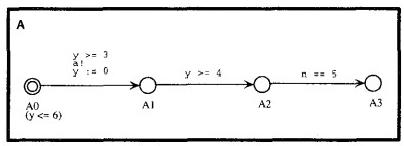{width="2.8054899387576553in"
height="1.0069400699912512in"}

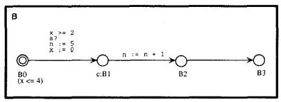{width="2.805576334208224in"
height="1.0139041994750657in"}

> **Figure 1.An example** UPPAAL **model**
>
> optional:absence of a guard is interpreted as the condition true,and
> absence of a synchronization action indicates an internal
> (non-synchronizing)edge similar to T-transitions in CCS.Reconsider
> figure 1.Here the edge between A0 and A1 can only be taken,when the
> value of the clock y is greater than or equal to 3.When the edge is
> taken the action a!is performed thus insisting on synchronization with
> B on the complementary action a?;that is for A to take the edge in
> question,B must simultaneously be able to take the edge from B0 to
> B1.Finally,when taking the edge,the clocky is reset to 0.The edge
> between A2 and A3 can only be taken if n equals 5.
>
> In addition,control nodes may be decorated with so- called
> invariants,which express constraints on the clock values in order for
> control to remain in a particular node. Thus,in figure 1,control can
> only remain in A0 as long as the value of y is no more than 6.
>
> Formally,states of a UPPAAL model are of the form (1,v),where l is a
> control vector indicating the current con- trol node for each
> component of the network and v is an assignment giving the current
> value for each clock and inte- ger variable.The initial state of a
> UPPAAL model consists of the initial node of all components⁵and an
> assignment giving the value 0 for all clocks and integer variables.A
> UPPAAL model determines the following two types oftran- sitions
> between states:
>
> Delay transitions As long as none of the invariants of the control
> nodes in the current state are violated,time may progress without
> affecting the control node vector and with all clock values
> incremented with the elapsed duration of time.In figure 1,from the
> initial state 《(A0,BO),x=0,y=0,n=0)time may elapse 3.5
>
> 5indicated graphically by a double circled node.
>
> time units leading to the state((A0,BO),x=3.5,y= 3.5,n=0).However,time
> cannot elapse 5 time units as this would violate the invariant of B0.

Action transitions If two complementary labeled edges of two different
components are enabled in a state then they can synchronize.Thus in
state\<(A0,BO),x = 3.5,y =3.5,n =0)the two components can syn- chronize
on a leading to the new state((A1,B1),x= 0,y =0,n=5)(note that x,y,and n
have been appropriately updated).If a component has an inter- nal edge
enabled,the edge can be taken without any synchronization.Thus in
state〈(A1,B1),x=0,y= 0,n=5),the B-component can perform without syn-
chronizing with A,leading to the state((A1,B2,x= 0,y=0,n=6).

Finally,in order to enable modeling of atomicity of transition-sequences
of a particular component(i.e.with- out time-delay and interleaving of
other components)nodes may be marked as committed(indicated by a
c-prefix).If one of the components in a state is in a control node la-
beled as being committed,no delay is allowed to occur and any action
transition(synchronizing or not)must in- volve the particular component
(the component is so-to- speak committed to continue).In the state
\<(A1,B1),x=

0,y=0,n=5)B1 is committed;thus without any delay the next transition
must involve the B-component.Hence the two first transitions of B are
guaranteed to be performed atomically.Besides ensuring atomicity,the
notion of com- mitted nodes also helps in significantly reducing the
space- consumption during verification.

In this section and indeed in the modeling of the au- dio/video protocol
presented in the following sections,the values of all clocks are assumed
to increase with identical speed (perfect clocks).However,UPPAAL also
supports analysis of timed automata with varying and drifting time-
speed of clocks.This feature was crucial in the modeling and analysis of
the Philips Audio-Control protocol \[3\]us- ing UPPAAL.

**3.Informal protocol description**

In this section we provide an informal presentation of the device
control protocol,which is used in existing B&O au- dio/video
equipments.The description is split into protocol environment,protocol
syntax,and dynamic protocol rules as advocated in\[11\].

**3.1.Protocol environment**

The audio/video components in a B&O system are in- tegrated through a
broadcast network,called the bus,for

{width="1.3402285651793526in"
height="6.965223097112861e-3in"}

> 4
>
> Authorized licensed use limited to:BEIHANG UNIVERSITY.Downloaded on
> March 21,2026 at 09:02:51 UTC from IEEE Xplore.Restrictions apply.

command exchange as indicated in figure 2.Examples of commands are start
and stop of a VCR initiated via a re- mote control⁶.Because the bus is
shared,there is a risk of collision between component transmissions,and
the proto- col rules must ensure that collisions are recognized by all
involved componenits in order to prevent data loss or dupli- cation.

**3.2.Protocol syntax and encoding**

> 1(5V) 0(0V)
>
> 1562μs 1562\*iμs 1562μs
>
> **Figure 3.Physical representation of aT;mes- sage.**

The components exchange information via so-called frames,where each
frame consists of a number of T- messages following the abstract syntax:

> frame:=T{Ti\|T₂\|T₃}≥15T₄

So,a frame consists of aTs,followed by a sequence of at least 15⁷symbols
over the set{Ti,T₂,T₃}and terminated by a T4.The Ti\'s have the
following roles:T₅indicates the start of a frame (used for bus
reservation);T₄indicates the termination of a frame (used for bus
release);and Ti, T₂,and T₃are used for the actual frame data.The
detailed rules for bus reservation and release are given in section 3.3.

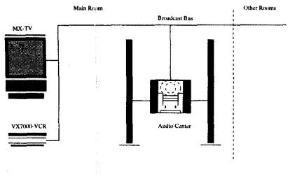{width="2.847204724409449in"
height="1.7221839457567805in"}

> **Figure 2.Example B&O configuration**

Each T-message(T;)is represented on the bus as voltage levels(0 Volts
and 5 Volts)according to the pattern in fig- ure 3.The figure shows that
the Ti\'s are separated by OV for 1562μs-the so-called protocol
period.The Ti\'s are identified by the length of the 5V signal between
the OV pe- riods.Besides the T;\'s,there is an additional pattern called
a jamming signal,which is defined as a OV signal for 25ms.

{width="1.3402373140857393in"
height="6.972878390201225e-3in"}Each component outputs to and reads from
the bus via a one-bit register,wlhere 0 represents OV,and 1 represents
5V.When two or more components are accessing the bus, the OV has
priority,that is,the bus changes states according to a logical and as
described in figure 4.For the remainder

6Typical devices are TV-sets,VCRs,radios,tape recorders,CDs,active
loudspeakers etc.

> 7The header size of a frame. A header consists of

(format,address,command)

of this paper,we use 0 and 1 to denote both the register values and the
voltage levels of the bus.

+--------:+-------------+-------------+
| current | > component | > component |
| bus     | > output,   | > output,   |
| state   | > new bus   | > new bus   |
|         | > state     | > state     |
+---------+-------------+-------------+
| > 0(0V) | > 0,0       | > 1,0       |
| >       | >           | >           |
| > 1(5V) | > 0,0       | > 1,1       |
+---------+-------------+-------------+

> **Figure 4.Rules for changes of bus state**

**3.3.Protocol rules**

Below we describe (in an informal way)the different rules,which must be
obeyed when the bus is accessed by a component.We only deal with the
sender aspects of a component,as the receiver part is
straightforward.Please observe that each component has its own
clock-running independently of all other clocks in the system.In order
to structure the descriptions,we define the following meta phases for a
component:The idle phase,where it waits for a new frame to become ready
for transmission,the initial- ization phase,where it waits for bus
reservation,the trans- mission phase,where the frame transmission takes
place, and the collision handling phase,which is entered after a
collision detection.

> Bus Reservation Rule A network component reserves the bus by issuing a
> T5 and releases the bus by issuing a T₄or by detecting a collision and
> issuing a jamming signal.That is,if a component has issued a Ts,all
> other components consider the bus as being reserved.
>
> Frame Gap Rule A network component must ensure the duration of at
> least 50 ms between its transmitted frames.However,if a component has
> generated ajam- ming signal,it may resend its(destroyed)frame imme-
> diately after the jamming signal.
>
> *Frame Initialization Rule When a frame becomes ready* for
> transmission (in the idle phase),the sending com- ponent delays for
> 781μs(the reaction delay),enters

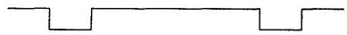{width="2.6389206036745407in"
height="0.2638954505686789in"}

> 5
>
> the initialization phase,and waits for bus reservation. When
> reservation is possible(i.e.a T has not been detected on the bus),the
> component must wait for ad- ditional 2 periods and check that the bus
> state is 1 dur- ing the final 781μs of these 2 periods.If this is not
> the case,bus reservation is retried.Otherwise,another 781μs is
> awaited,and the transmission phase is en- tered,starting the
> transmission of aT5.
>
> Bus Sample Rule A sender must sample the bus contents for each period
> (S₁-points in figure 5)and in the mid- dle of each period (S₂-points
> in figure 5).
>
> Bus Output Rule A sender must issue output to the bus in the beginning
> of each sample period(the W-points in figure 5).For a given period,the
> condition 0\< (W-S₁)\<600μs must be satisfied.8In the actual model,we
> have estimated the quantity(W-S₁)to 40μs---the so-called output-delay
> of the protocol.
>
> Collision Detection Rule A sending component must check the bus for
> collision at each S₂-point(see fig- ure 5).For a given period,s₁and
> s₂denote the bus values sampled at points S₁and S₂.Furthermore,pn and
> pf denote the values output to the bus from the component at points W
> of the given period and its pre- decessor.A transmission is collision
> free,if the condi- tion ps=S1\^Pn=S2 is satisfied for each S₂-point.
> If this is not the case,the sender enters the collision handling
> phase.
>
> Collision Handling Rule Due to the priority between volt- age levels,a
> collision can only occur,when 0 is sam- pled from the bus.Moreover,if
> the duration of such an (inconsistent)0 signal is less than 3
> periods,the rule is that the component must issue a jamming sig- nal
> and thereafter reenter the initialization phase.If the duration is at
> least 3 periods,another component is jamming.The rule is that the
> sending(non-jamming) component must wait for 18 periods after the
> 0signal has disappeared from the bus,and thereafter reenter the
> initialization phase.This delay gives a jamming com- ponent the
> possibility to retransmit its frame without further collisions.
>
> Transmission Stop Rule Whenever a collision has been de- tected,the
> component must stop from issuing further bus outputs(and enter the
> collision handling phase). In this way,it becomes possible to detect
> if the colli- sion is caused by the jamming of another component.
>
> Detection Stop Rule The final collision detection during frame
> transmission is the detection performed 781μs after the first 0 signal
> of the terminating symbol T₄ .
>
> 8Due to the physical laws of how fast the bus can change its state.
>
> 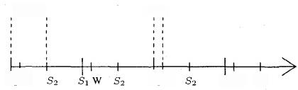{width="2.9166229221347333in"
> height="0.874990157480315in"}40μs
>
> S₁w S₁W S₂
>
> Pf 51 Pn
>
> s2:bus sample at S₂
>
> s1:bus sample at S₁
>
> Pn:present bus output at W
>
> Pf:previous bus output at W
>
> **Figure 5.Relative ordering of the variables involved in the
> collision detection performed at the rightmost** S₂-point
>
> Put in another way:When the detection has success- fully passed both
> the period of the leading 0 of T₄ and also the successor period,the
> detection must be stopped.This rule avoids
> \'false\'collisions,i.e.colli- sions,that are detected after the final
> 0 of a frame.
>
> Protocol Correctness A protocol implementation is correct with respect
> to collision if the following two condi- tions are satisfied:(1)if the
> frame transmitted by a sender Xis destroyed(by another sender),then
> sender X shall detect this;and (2)if one sender detects a
> collision,then all other simultaneously transmitting senders should
> detect it.

**4.A validated formal model of the protocol**

From the informal description given in the previous sec- tion it is by
no means easy to determine whether the proto- col is
correct,i.e.satisfies the Protocol Correctness criteria. Thus,in this
section we develop a model of the protocol in the UPPAAL language in
order to enable a formal auto- mated verification of its correctness
using the UPPAAL tool set.We will refer to this model as
validated,meaning that it has been approved by B&O as being a correct
abstraction of the existing implementation.

The model is-as all models-an abstraction of the real implemented
protocol in the sense that it leaves out details regarded as unimportant
for the verification task.In our case,an additional challenge in
choosing abstraction is the need to reduce the state space to search,and
hence to reduce time and space consumption during the automatic
verifica- tion.

The construction of a model was an iterative process.

Several issues had to be right.First of all,the model should be
valid,reflecting the code in the protocol,and not do

{width="1.347146762904637in"
height="7.003499562554681e-3in"}

> 6
>
> Authorized licensed use limited to:BEIHANG UNIVERSITY.Downloaded on
> March 21,2026 at 09:02:51 UTC from IEEE Xplore.Restrictions apply.

something different.Second,the model should be as ab- stract as possible
tc make verification efficient,but detailed enough in order to catch the
error,the nature of which we were not aware.Third,the correctness
criteria should itself be valid,reflecting a desired property;and
fourth,the cor- rectness criteria should be such that the yet unknown
error could be caught.The correctness criteria went through a couple of
iterations,and was constantly under debate.

We present the complete validated model of the proto- col,and from this
we shall then derive a reduced model to which the UPPAAL verifier is
applied.This reduction is done basically by limiting the number of
frames a sender can transmit;and also by limiting the contents of the
in- dividual frames:the number of contained T-messages,and their
kind.Even with these reductions the protocol will turn out to exhibit
erroneous behavior.

**4.1.Overview**

The protocol is modeled in UPPAAL as a network of 9 timed
automata(figure 6),which can be divided into three groups:a bus,a sender
system named A,and a sender sys- tem named B.Note that there are no
frame-receivers,as these are not regarded important for the verification
task in hand.The sender systems are completely symmetric in their
construction,hence,we shall only describe one such, namely system A.

which is activated from the sender at S₂-points,represents the collision
detection algorithm.

The frame generator and observer are part of what we will call the
environment,hence in principle not compo- nents of the implemented
protocol.The frame generator basically generates the O\'s and 1\'s of a
frame to be output by the sender,hence it models the signals coming for
exam- ple from a remote control unit.The observer is purely used to
formulate the correctness criteria.

The components communicate via channel synchroniza- tions and via shared
variables.The figure illustrates the channel connections by arcs going
from one component(the one that does a send\"!\")to another(the one that
does a receive "?").As an example,Sender_A reads the current value of
the bus by receiving on either channel zero(value is 0)or channel
one(value is 1),whichever is enabled.In addition,for each component it
is shown(written inside the box)which variables it acccsses in which
manner.A vari- able x is in bold(x)if it is assigned to,and in normal
font (x)if it is only read from.Finally,if a variable is local, it is in
italic (x).Note,that by convention a variable may be mentioned in
several components if they share it.In a few cases,variables that are
only initialized in a component have been omitted for clarity.

**4.2.The bus**

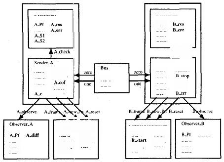

> **Figjure 6.The Protocol**

The sender system A consists of four automata:a sender Sender A,a
detector Detector A,a frame generator Frame_Generator A and an observer
Observer.A.The pro- tocol itself(which is the one implemented in
assembler),is here modeled by the sender and the detector.The sender is
the key component of the system,and is responsible for transmitting the
frames over the bus,while the detector

The status of the bus is decided by two variables,A_Pn and
B_Pn,representing the bus registers,as shown in fig- ure 7.The two
variables (initialized to 1)are set by the sender systems at W-points by
the sending system perform- ing one of the assignments A_Pn :=0 or A_Pn
:=1. The senders can sample the actual bus contents by synchro- nizing
on channels zero and one respectively.

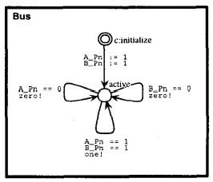{width="1.840278871391076in"
height="1.5763713910761155in"}

> **Figure 7.The Bus**

**4.3.The frame generator**

The frame generator,figure 8,is the component that con- cretely sets the
bus by assigning values 0 and 1 to the vari- able APn on request from
the sender at its W-points.The generator is initialized by an
A_frame!action from the sender,where after each new assignment to A_Pn
is trig- gered by an A.new_Pn!action from the sender,until con- trol
returns to the start node.The generator decides what values to assign
each time it is triggered by the sender.An A_reset!action from the
sender resets the frame gener- ator in case a collision has been
detected.Of course one can argue that assigning to A_Pn is not part of
the environ- ment;and we could certainly let the generator just produce
0\'s and 1\'s,and let the sender perform the assignments to the bus
registers.In fact,such a model existed on our way to the current
model,which is however smaller in terms of number of variables used.

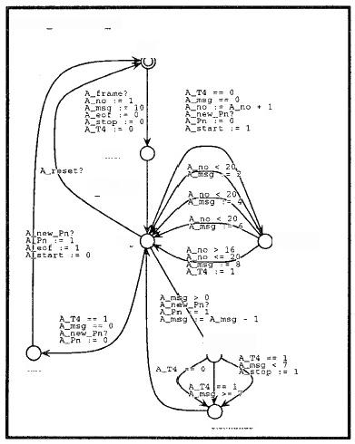

> **Figure 8.The Generator**

Besides A_Pn,three other externally visible variables are assigned
to:A_eof,A_stop and A_start.First,the vari- able Aeof is set to 1 as
soon as the last T₄message in a frame has been transmitted.The sender
will then stop transmitting.Second,according to the Detection Stop Rule,
the last collision detection is performed 781μs after the 0 period
beginning the last T₄message,and is hereafter dis- connected.This is
modeled by letting the generator assign the value 1 to the variable
A_stop at this point.Finally,

> according to the Bus Reservation Rule,a precondition for Sender B to
> begin transmission of a new frame is that no T₅message has been output
> by Sender_A trying to reserve the bus.Hence,an accurate model would
> here let Sender B sample the bus to detect T₅\'s.This complicates the
> model unnecessarily,and as an abstraction,we let system A set the
> variable A_start to 1 when system A has transmitted aT₅ (to keep the
> graph simple:at every output of a 0 ending a
>
> T-message),and clear it again after the last T₄,when the bus is
> released.Sender B can then read this variable;and vice versa.
>
> Three local variables A_no,Amsg and A_T4 are used to control the flow
> of the generator.A frame consists of a sequence of T-messages,which we
> number from 1 and up.The current T-message number is stored in the
> variable A_no.The variable A.msg contains the remaining length (in
> terms of periods)of the current message;that is:the re- maining number
> of 1\'s to be output.Recall,that the T₅start message consists of 1\'s
> for ten periods (of 1562μs)or sim- ply ten 1\'s;hence this variable is
> initialized to 10.Finally, the variable AT4 is set to 1 when the last
> T₄message is transmitted,just to invoke the exit of the frame
> generation.
>
> As long as there are messages to transmit,control re- turns to the msg
> node.From there the upper right loop is entered each time a 0 is
> output,and at the same time a non- deterministic choice is made of a
> new message(length). Note that the lengths of T-messages (in terms of
> periods, and hence the number of 1\'s to be output)are as follows:
> T₁:2,T₂:4,T₃:6,T₄:8,and T₅:10.The model is limited to transmit minimum
> 17 and maximum 20 messages (including the startingT5 and the
> endingT₄).This is to limit the search space.The lower right loop is
> entered for each 1 output to the bus,calculating the value of the
> A.stop variable each time:when there are less than seven 1\'s left to
> be output of the last T₄message,collision detection is disconnected.

Note,that the frame generator can be regarded as provid- ing three
procedures (the channels),which will be "called" from the sender. The
intention is that when the sender "calls"one of these procedures,the
sender waits until the "procedure\'s return".To model such
procedure-calls (which are to be performed atomically)in UPPAAL,we have
used UPPAAL\'s committed nodes.This is even more the case for the
detector described below.

> **4.4.The detector**
>
> The detector represents the collision detection algorithm, and is to
> be regarded as a procedure,which,according to the Collision Detection
> Rule,is"called"from the sender at S₂-points,through an
> A_check!action.As"arguments" it takes the samples s1 and s₂represented
> by the global variables A_S1 and AS2;and the outputs pf and pn repre-
>
> 8
>
> Authorized licensed use limite to:BEIHANG UNIVERSITY.Downloaded on
> March 21,2026 at 09:02:51 UTC from IEE Xplore.Restrictions apply.

sented by the global variables A.Pf and A_Pn,where after it checks the
relationship between these values.The result of the check is written
into the variables A_err and A_res. Basically A_err counts the number of
O\'s sampled,while A_res is set to 0 if no action is to be taken,1 if
sender A should jam,and finally 2 if another sender(B in this case)is
jamming.In the latter two cases,sender A should react.The detector is
fully made up of committed nodes,hence it con- sumes no time,and
\"returns\"instantly to the wait_call node after being activated.The
graph corresponds closely to a flowchart extracted from the assembler
code.The reader is not supposed to grasp the details.

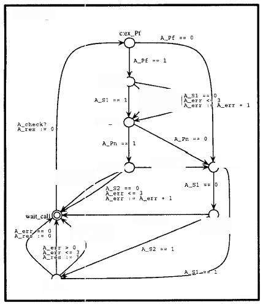

> **Figure 9.The Detector**

**4.5.The sender**

The sender is responsible for triggering outputs to the bus,and is the
main and most complicated component,see figure 10.It has a single
clock,named A_c,which mainly is used to model the timer interrupts that
arrive with inter- vals of 781 μs.The sender-nodes can be divided into
three groups:the initialization phase,the transmission phase,and the
collision response phase(entered when a collision has been detected,and
furthermore a response has been de- cided).

**Initialization phase.** This is the upper part of the dia- gram.The
nodes ex_startand other_started model

the first part of the Frame Initialization Rule (related to the Bus
Reservation Rule),which specifies that no frame can be transmitted if a
T₅message coming from another sender,B in this case,has been detected on
the bus.Recall,that this detection is modeled(abstracted)with the Bstart
vari- able being set to l by Frame_Generator B.The loop at node
other.started represents the fact that in case a T₅has been
detected,then we wait until a T₄message is received, releasing the
bus.This waiting is done by once every 3124 μs to check whether the
T₄message has been received;here at this abstract level modeled by
B_start being equal to 0 again,where after we proceed with the
precondition check.

The nodes ex_silencel and ex_silence2 model the remaining part of the
Frame Initialization Rule,where it is specified that the sender must
wait further two periods (2\*1562μs)after the T₅reservation check;and in
the last 781μs of the second period,the bus must be silent(1).This is
modeled by waiting 3\*781=2343μs,and then check the bus value at the
beginning and at the end of the remaining 781 μs interval.Note how the
bus is sampled by synchro- nizing on either zero?(bus value is 0)or
one?(bus value is 1).

Transmission phase. This is the mid part of the diagram. The
transmission starts in node transmit in case the pre- condition checked
in the initialization phase is satisfied. The transition to the
check_eof node initializes the frame generator(Frame_Generator.A)via the
A_frame!action. The sender now enters a loop,where each iteration repre-
sents a period of 2\*781=1562μs.Basically four variables are assigned to
during one iteration of this loop:A.Pn in W-points(as we have seen,by
Frame_Generator A),APf, to hold the previous old value of A_Pn,and
finally AS1 and A_S2 to hold the samples in respectively S₁-points and
S₂-points,as recorded in the Bus Sample Rule.

In the node check_eof it is examined whether an end of frame has been
reached,in which case the stop node is entered,and according to the
Frame Gap Rule, 50 ms must then pass before a new frame is transmit-
ted.Node check_eof furthermore represents an S₁-point where A_S1 is
sampled if the frame has not been finished. After the sampling,in node
newPn,40μs elapses accord- ing to the Bus Output Rule before a new value
is output,as- signed to A_Pn by Frame_Generator_A,which is triggered
with the Anew_Pn!action.Note that in case the variable A_err differs
from 0,it means that a collision has been de- tected,and according to
the Transmission stop Rule,trans- mission should stop,here modeled by
just outputting 1\'s to the bus.In the node sample,A_S2 is
sampled,reaching node call_observe.Here the observer and the collision
detection,in case not disconnected,are activated.In the ex_jam node the
result A_res of the collision detection is examined,and collision
response is begun in case it\'s dif-

> 9
>
> Authorized licensed use limited to:BEIHANG UNIVERSITY.Downloaded on
> March 21,2026 at 09:02:51 UTC frrom IEEE Xplore.Restrictions apply.
>
> Sender_A
>
> A_e ;0
>
> =781)
>
> 50000 Ae\<=5000)
>
> *☆eo=- ¹*
>
> c:check_eof 二B
>
> (AP=40)
>
> Ae₅\"=786
>
> 7

是agart 。-1

> ccall_check
>
> nilsile781)
>
> Ae243)
>
> 2343
>
> (A=781)

A_observe!

> c:call_observe
>
> Ae=28116
>
> **Figure 10.The Sender**

ferent from 0,i.e.either is 1 or 2,as described in the next paragraph.

Collision response phase.This is the lower part of the dia- gram.Recall
that the value of A_res decides the response. When 1,SenderAmust jam for
25ms as stated in the Col- lision Handling Rule.When 2,another(Sender
B)must be jamming,and we must wait for the bus to be silent,where after
18 periods(28116μs)must pass according to the same rule.

**5.Error detection using** UPPAAL

In this section we shall describe how the error was found in the
validated protocol just presented in the previous sec- tion.First,the
correctness criteria will be formulated,and second,the result of the
verification of this criteria,an error trace,will be explained.

**5.1.The correctness criteria**

The correctness criteria is informally stated in the Pro- tocol
Correctness statement.It says,that(1)if the frame transmitted by a
sender X is destroyed (by another sender), then sender X shall detect
this;and(2)if one sender de- tects a collision,then every other
simultaneously transmit-

> 10
>
> Authorized licensed use limite to:BEIHANG UNIVERSITY.Downloaded on
> March 21,2026 at 09:02:51 UTC trom IEEE Xplore.Restrictions apply.
>
> ting sender should detect it.In order to formulate rule(1), we must
> formulate what it means for a frame to be de- stroyed.We define a
> frame as destroyed if sampled val- ues differ from output
> values.Hence,we introduce an ob- server automaton observing this for
> each sender,and figure 11 shows the observer for SenderA.

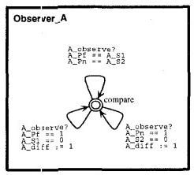{width="1.6944936570428697in"
height="1.5347451881014873in"}

model,where basically each sender only transmitted a sin- gle frame of
T1 messages,surrounded by a Ts and a T₄ . This was considered harmless
as the purpose was to locate an existing error rather than to prove some
property uni- versally true.The verifier rejected the stated correctness
criteria as being true,and figure 12 illustrates a condensed version of
the error trace produced by UPPAAL⁹in terms of a bus-value
diagram.UPPAAL required 6,27 minutes of computation and 32M bytes of
memory on a Sparc 10.

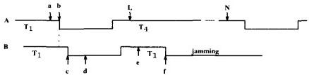{width="3.041616360454943in"
height="0.7429582239720035in"}

> Figure 12.The error trace visualized
>
> Figure 11.The Observer

Recall,that this observer is communicated to from the sender in terms of
an A_observe! action at each S₂- point.In receiving this signal,the
observer sets the variable A.diff to 1 if and only if there is a
mismatch between sampled values and output values.That is,if either
ALPf≠ A_S1 or A_Pn≠A_S2.This is formulated slightly differ- ent in the
automaton since UPPAAL does not allow negation in edge guards.Note,that
we cannot use Detector_A to observe the relationship between sampled and
output val- ues,since this is one of the components we want to verify.
With the observer,we are sure to know when output 1\'s have been
destroyed by O\'s from another sender.It can easily be shown,that a
frame has only been destroyed if at the end of its transmission A_d:iff
equals 1.

> The correctness criteria can now be formulated as follows:
>
> A\[\](A_eof ==1 imply
>
> (A_diff ==0 and B_res ==0))
>
> In order to understand this property,note that A_eof is set to 1 when
> A\'s frame has been sent,that A_diff is set to 1 if A\'s frame has
> been destroyed,and finally,that B_res is set to 1 if B has detected a
> collision.The property then says,that whenever(A\[\])a frame has been
> sent (ALeof equals 1),the sent frame must be intact (A_diff equals O),
> and other senders(B in this case)must not have discovered a
> collision(B.res equals 0).A symmetric property is also verified for
> sender system B.
>
> 5.2.The error trace
>
> In order to obtain a fast feed-back(few minutes)during the debugging
> of the protocol,we worked with a reduced

It appeared to be the Detection Stop Rule that was un- healthy:collision
detection seemed to be disconnected too early with the result of
messages being lost.The trace de- scribes a scenario,where SenderA sends
a frame of ex- actly 15T₁messages,while Sender B sends 16T₁mes-
sages.Hence,the two frames are different,although they are equal up the
the last T₁of A.

Sender B starts exactly 40μs after Sender A.Precisely this delay,which
fatally equals the delay between a senders S₁-sampling and its bus
output,allows the two senders to proceed without any of them discovering
their simultaneous bus access.To see this,consider figure 12 which shows
how all the O-periods ofthe two frames are positioned relative to each
other:at point(a)Sender A samples S₁and is ready to output a 0,but the
output happens in point(b)due to the output delay(which is also 40μs).In
point (b)Sender B now also is ready to sample its S₁value.Now,if SenderA
outputs its O before B\'s sampling,then B will sample a 0 while
expecting a1,and B will then recognize the collision. However,if Sender
A outputs its 0 after B\'s sampling,then no collision willbe detected by
B.

Hence,there is a non-deterministic outcome of each pair of A and
B0-periods:either A willoutput before B sam- ples,and a collision is
detected by B,or A will output after, and no collision will be
detected.This mutual ignorance of the collision continues until sender A
terminates its last T₁ message,as illustrated by figure 12,and explained
in the following.

{width="1.3472080052493438in"
height="6.991469816272966e-3in"}The figure in fact illustrates the
beginning of the last T₄ message of Sender A,together with the beginning
of yet an- other(the 16th)T₁message of Sender B.Up to that point B has
sampled before A has output and no collision has been

9The error trace produced by UPPAALcontained 1998 basic transition-
steps.

> 11
>
> Authorized licensed use limited to:BEIHANG UNIVERSITY.Downloaded on
> March 21,2026 at 09:02:51 UTC from IEE Xplore.Restrictions apply.

detected.Now,however,at point (b),sender A comes first and outputs a
0,and this is detected by B in point(d)when the collision detection is
activated(B_err :=B_err + 1).In point (e),B then decides to jam(B_res
:=1), which happens in point (f).This is in fact after the last col-
lision detection performed by A in point(L).Hence,sender A never
observes the collision,while sender B does.Con- sequently,A\'s message
is lost and is not retransmitted.

Put differently,and simpler,since a sender disconnects its collision
detection early in its T₄message,other senders can start jamming after
that point without it being detected. The trace violates as well A_diff
==0 as B_res ==0 at the point where ALeof ==1:sender A\'s frame is de-
stroyed(without A detecting it),and sender B has detected the collision.

A question is:\"how important is it that sender B starts exactly 40 μs
after A?".Well,in the case where both senders send only Timessages,it is
important,since if the delay is less than 40,no collision will ever be
detected,and in case the delay is above 40,collision will be detected
im- mediately by both.This is true in our model.In reality,
however,clocksin the various audio/video components may have slightly
different,and changing,speeds,so in practise senders do not need to
start exactly 40μs apart in order to cause the error.

**6.Correcting the protocol**

Thus,as explained in the previous section,the source of the error was
identified as the too early disconnection of the collision detection
just after the 0 beginning the last T₄message.That is:the last check is
performed 781 μs after this 0 has been turned back into a 1,at point
(L)in figure 12.This allows another sender to start jamming after this
moment without it being detected by the sender having disconnected.

The reason for disconnecting at that early moment is to prevent a frame
from being sent twice,since if a collision is detected too late,the
frame may in fact have come though, since the collision may not be frame
destroying,and a re- transmission will then be a duplication.As an
example, think of a frame with an information contents like:"go one
channel forward".However,it has apparently been discon- nected to
early,and hence,a solution to the problem is to move the disconnection
to a later moment,but not too far since we still want to avoid a frame
duplication.

The solution is to move forward and perform the last collision detection
781 μs before the 0 ending the last T₄ message,at point (N)in figure
12.Hence,the collision de- tection is then only disconnected during the
last 0 of the whole frame.In our model,this correction must be intro-
duced in the frame generators,and figure 13 shows the new
Frame_Generator A.

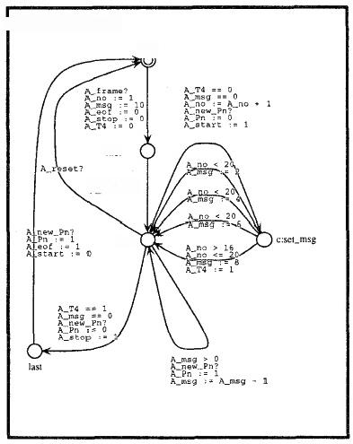

> **Figure 13.Generator with** A_stop:=1 **moved**

The modification consists of moving the assignment A_stop :=1 to a later
point,namely to the edge going from node msg to node last.That is,when
the last 0 in the last T₄message is output.Consequently,the previous
assignment to Astop must be removed resulting in the lower right loop
edge leaving and returning to node msg. This edge was before broken into
a number of edges over committed nodes,see figure 8.The observer is also
discon- nected when the collision detection is(is not shown).

With these modifications,the model was verified correct with respect to
the same corectness criteria as presented for the previous model.It
required 30 minutes of computation and 90M bytes of memory on a Sparc
10.The model ver- ified was down-scaled to a version where each sender
only transmitted one frame,and where sender A only transmitted Ti
messages(surrounded by a T₅and aT₄of course),while sender B could
transmit the whole range ofT-messages.

**7.C onclusions**

The case study clearly showed how model checking can be a help in
tracking down undesired behavior in a highly non-deterministic real-time
system.The example illustrated the conditions of a real-life problem in
the sense that the source of the error (that messages were occasionally
lost) was unknown to us,and hence it was not clear at what ab- straction
level the model should be formulated.This ques-

> 12
>
> Authorized licensed use limited to:BEIHANG UNIVERSITY.Downloaded on
> March 21,2026 at 09:02:51 UTC frrom IEEE Xplore.Restrictions apply.

tion of abstraction level was also central in the formulation of the
correctness criteria.Another kind of abstraction,per- formed in a second
round,consisted of reducing the ob- tained model to sub-models that
could be verified within reasonable time and space.It would be useful to
have a workbench which could support easy derivation of verifi- able
sub-models from a single full model.It turned out,that all sub-models
were obtained from the full model by adjust- ing three different
parameters:(1)whether or not a sender transmitted several frames,or just
a single frame;(2)how many messages were sent in a single frame;and
finally(3) what messages could!be transmitted in a single frame.

Choosing the right abstractions were mainly an activ- ity based on
intuition,and the adjustment of the parame- ters mentioned was in
addition based on experiments with the model checker.Of course,with such
abstractions,one cannot ensure that the protocol in its full complexity
is cor- rect even if the moclel is verified to be.However,such a model
can be used to reject the protocol in case errors are found,and this is
what happened.Hence,model check- ing can be seen as a particular
advanced kind of debugging where all execution paths in a limited world
are examined, rather than some execution paths in a complete world,as in
traditional testing.Furthermore,often the abstractions are of such a
harmless kind,that even though the correctness of the model does not
imply the correctness of the protocol,it does increase our confidence in
its correctness.

Concerning the error trace,it contained 1998 transition steps,in fact
guaranteed to the be shortest trace leading to a state breaking the
property to be verified.Examining such a long trace in the simulator
turns out to be impracticable,and hence,it was done in an ad hoc
fashion(using emacs and its facilities).Research has been initiated to
provide means for trace examination,for example by defining a trace
simplifi- cation language.

Concerning the language for writing atomic edges be- tween nodes,one
could consider a Pascal-like programming language,with
functions,procedures,control structures like loop and case
constructs,and,of course,general datatypes like enumerated types,arrays
and records.The Murphi- language \[14\]-applied to a protocol
verification in \[9\]- could be a good candidate for such a language,and
fur- ther research will explore this path.As a general comment on the
graphical language for writing transition systems it was clearly
concluded,that this formalism was ideal in the communication betveen the
toolexpert and the protocol de- signer.The simulator additionally turned
out to be of a good help when developing and validating the model before
ap- plying the verifier.

**References**

> \[1\]R.Alur,C.Courcoubetis,and D.Dill.Model-checking for Real-Time
> Systems.In Proc.of Logic in Computer Science, pages 414-425.IEEE
> Computer Society Press,1990.
>
> \[2\]R.Alur and D.Dill.Automata for Modelling Real-Time Systems.In
> Proc.of ICALP\'90,volume 443 of Lecture *Notes in Computer
> Science,1990.*
>
> \[3\]J.Bengtsson,D.Griffioen,K.Kristoffersen,K.G.Larsen,
>
> F.Larsson,P.Pettersson,and W.Yi.Verification of an Au- dio Protocol
> with Bus Collision Using UPPAAL.In Proc. *of CAV\'96,volume 1102 of
> Lecture Notes in Computer Sci-* ence.Springer-Verlag,1996.
>
> \[4\]J.Bengtsson,K.G.Larsen,F.Larsson,P.Pettersson,and
>
> W.Yi.UPPAAL---A Tool Suite for Symbolic and Compo- sitional
> Verification of Real-Time Systems.In Proc.of the *Ist Workshop on
> Tools and Algorithms for the Construction and Analysis of
> Systems,volume 1019 of Lecture Notes in* Computer
> Science.Springer-Verlag,May 1995.
>
> \[5\]J.Bengtsson,K.G.Larsen,F.Larsson,P.Pettersson,and
>
> *W.Yi. UPPAALin 1995.In Proc.of the 2nd Workshop on Tools and
> Algorithms for the Construction and Analysis of* Systems,number 1055
> in Lecture Notes in Computer Sci- ence,pages
> 431-434.Springer-Verlag,Mar.1996.
>
> \[6\]A.Bouali,A.Ressouche,and V.R.R.de Simone.The *FC2Toolset.Lecture
> Notes in Computer Science,1102,* 1996.
>
> \[7\]P.D\'Arenio,J.-P.Katoen,T.Ruys,and J.Tretmans.Mod- elling and
> Verifying a Bounded Retransmission Protocol.In *Proc.of COST
> 247,International Workshop on Applied For- mal Methods in System
> Design,1996.*
>
> \[8\]C.Daws,A.Olivero,and S.Yovine.Verifying ET-LOTOS programs with
> KRONOS.In Proc.of7th International Con- ference on Formal Description
> Techniques,1994.
>
> \[9\]K.Havelund and N.Shankar.Experiments in Theorem Prov- ing and
> Model Checking for Protocol Verification.In M.-C. Gaudel and
> J.Woodcock,editors,FME'96:Industrial Ben- *eft and Advances in Formal
> Methods,volume 1051 of Lec- ture Notes in Computer Science,pages
> 662-681.Springer-* Verlag,1996.

\[10\]P.-H.Ho and H.Wong-Toi.Automated Analysis of an Audio Control
Protocol.In Proc.of CAV\'95,volume 939 of Lecture Notes in Computer
Science.Springer-Verlag,1995.

\[11\]G.Holzmann.The Design and Validation of Computer Pro-
*tocols.Prentice Hall,1991.*

\[12\]H.Jensen,K.Larsen,and A.Skou.Modelling and Analy- sis of a
Collision Avoidance Protocol Using SPIN and UP- *PAAL.In The Second
Workshop on the SPIN Verification* System,volume 32 of DIMACS,Series in
Discrete Mathe- *matics and Theoretical Computer Science.American Math-*
ematical Society,1996.

\[13\]M.Lindahl,P.Pettersson,and W.Yi.Formal Design and Analysis of a
Gear-Box Controller:an Industrial Case Study using UPPAAL.In
preparation.,1997.

\[14\]R.Melton,D.Dill,C.N.Ip,and U.Stern.Murphi Annotated Reference
Manual,Release 3.0.Technical report,Stanford University,Palo
Alto,California,USA,July 1996.

*\[15\]R.Milner.Communication and Concurrency.Prentice Hall,* Englewood
Cliffs,1989.

> 13
>
> Authorized licensed use limited to:BEIHANG UNIVERSITY.Downloaded on
> March 21,2026 at 09:02:51 UTC from IEEE Xplore.Restrictions apply.
