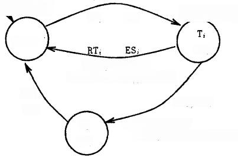
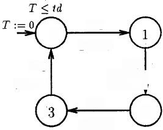

**4 The FDDI communication protocol**

FDDI(Fiber Distributed Data Interface)\[12\]is a high performance fiber
optic token ring Local Area Network.In this section we show the
verification of the temporal mechanism that limits the possession time
of the token by each station.

**4.1 Protocol Description**

We consider a network conposed by N identical stations S₁,....Sy and a
ring, where the stations can communicate by synchronous messages with
high priority and asynchronous messages with low priority.

Station.Each station Si can be either waiting for the token(Idle;),in
posses- sion of the token and executing the synchronous
transmission(T;,ST;)or in possession of the token and executing the
asynchronous transmission(T;,AT;).

The two clocks a station uses to control the possession time of the
token are called TRT;(Token Rotation Timer)and THT;(Token Holding
Timer).

> -TRT;counts the time since the last reception of the token by the
> station. This clock is reset to zero each time the station S;takes the
> token.
>
> -THT;counts the time since the last reception of the token,added to
> the time elapsed since the precedent one,given by the value of the
> clock TRT; just before it is re-initialized.

When the station S;receives the token(action TT;),the clock THT;takes
the value of the clock TRTi.TRT;is reset to zero,and the station Si
starts sending synchronous messages(BS;).The duration of the synchronous
transmission(ST;) is given.for each station Si.by a constant
SA;(Synchronous Allocation).

When the synchronous transmission ends(action ES;),the station has the
possibility of starting the transmission of asynchronous messages(action
BA) if the current value of THT;minus the time of synchronous
transmission SA; is greater than a global constant of the system called
TTRT(Target Token Rotation Timer).Before THT;-S4;reaches the value
TTRT,the station must release the token(RT;),ending the asynchronous
transmission(EA;)if this one has began.The behavior of the station S;is
described by the timed automaton Station; of the Figure 1(a).

Ring.The ring controls the transmission of the token between two
consecutive stations Siand Si+1.There is a delay of td(Token Delay)time
units,measured by the clock T,in this transmission.The Figure 1(b)shows
the timed automaton Ring that models the ring for two stations.

System.The timed automaton that models the protocol is obtained as the
par- allel composition **FDDIx=Ring** \| **Station₁** \|...\|\|Stationn
where the

automata synchronize through the actions TT;and RTi.

**4.2 Properties verification**

We verify here two properties of the FDDI protocol.

Bounded time for accessing the ring.The time elapsed within two
consecutives receptions of the token by any station is bounded by a
constant ci.We can express this property in TCTL with the following
formula:

(ST;AT=0)→V≤c₁ **enable(TT;)** (1)

where cr is equal to TTRT+2N.SA;.and **enable(TTi**)characterizes the
sym- bolic states where the edge labeled TT;is enabled.

> *T≤td*
>
> \(a\) (b)
>
> Fig.1.Station,(a):Ring(b)
>
> *Bounded time for sending asynchronous messages.Each idle station will
> send* asynchronous messages before a time c₂.The formula of TCTL that
> describe this property is:

Idle;→V◇≤c₂AT; (2)

> where c₂is equal to (N-1).TTRT+2N.SA₁ .
>
> Table 1 shows the results of the verification of properties(1)and
> (2),for different numbers of stations.applying symbolic
> model-checking(backuard anal- ysis)and symbolic simulation(forward
> analysis).We show the size of the timed automaton,the running times in
> seconds(time),the number of iterations for model-checking(iter)and the
> number of symbolic states generated for simula- tion(symb).