> **Modeling and Verification of a Dual Chamber Implantable Pacemaker\***
>
> Zhihao Jiang, Miroslav Pajic, Salar Moarref, Rajeev Alur,
>
> and Rahul Mangharam
>
> University of Pennsylvania, Philadelphia PA, USA
>
> **Abstract.** The design and implementation of software for medical
> de- vices is challenging due to their rapidly increasing functionality
> and the tight coupling of computation, control, and communication. The
> safety- critical nature and the lack of existing industry standards
> for verification, make this an ideal domain for exploring applications
> of formal modeling and analysis. In this study, we use a dual chamber
> implantable pace- maker as a case study for modeling and verification
> of control algorithms for medical devices in UPPAAL. We begin with
> detailed models of the pacemaker, based on the specifications and
> algorithm descriptions from Boston Scientific. We then define the state
> space of the closed-loop sys- tem based on its heart rate and
> developed a heart model which can non- deterministically cover the
> whole state space. For verification, we first specify unsafe regions
> within the state space and verify the closed-loop system against
> corresponding safety requirements. As stronger assertions are
> attempted, the closed-loop unsafe state may result from healthy open-
> loop heart conditions. Such unsafe transitions are investigated with
> two clinical cases of Pacemaker Mediated Tachycardia and their
> correspond- ing correction algorithms in the pacemaker. Along with
> emerging tools for code generation from UPPAAL models, this effort
> enables model- driven design and certification of software for medical
> devices.
>
> **Keywords:** Medical Devices, Implantable Pacemaker, Software Verifi-
> cation, Cyber-Physical Systems.
>
> **1 Introduction**
>
> {width="0.7883333333333333in"
> height="6.944444444444444e-3in"}Over the past four decades, cardiac
> rhythm management devices such as pace- makers have expanded their
> role from "keeping the patient alive" to "making the patient's life
> comfortable" . The addition of more safety and efficacy features has
> resulted in increased complexity, inevitably leading to more safety
> violations. From 1996-2006, the percentage of software-related causes
> in medical device re- calls have grown from 10% to 21%
> [\[1](#bookmark1)\]. During the first half of 2010, the US Food and
> Drug Administration (FDA) issued 23 recalls of defective devices, all
>
> \* This research was partially supported by NSF research grants MRI
> 0923518, CNS 0931239, CNS 1035715 and CCF 0915777.
>
> C. Flanagan and B. Knig (Eds.): TACAS 2012, LNCS 7214, pp.
> 188---[203,](#bookmark2) 2012.
>
> oc Springer-Verlag Berlin Heidelberg 2012

Modeling and Verification of a Dual Chamber Implantable Pacemaker 189

of which are categorized as Class I, meaning there is a "reasonable
probabil- ity that use of these products will cause serious adverse
health consequences or death." At least six of the recalls were caused
by software defects [\[2](#bookmark3)\]. Unlike other industries such as
aviation and automotive, the safety concern in the medical device domain
is focused on the physical plant, the patient in this case, rather than
the controller. As a result, although in aviation and automotive
industries, standards are enforced during software development,
manufacturing, and post- market change [\[3,4](#bookmark4)\], there are
no well-established standards for development of software for medical
devices. There is a pressing need for standards and tools to certify and
verify the safety of software in medical devices. For device man-
ufacturers, this has prompted recent interest in applying formal
modeling and verification techniques in medical devices software
development [\[5,6](#bookmark5)\].

In this effort, we propose a Timed Automata representation of the heart
and a dual chamber pacemaker. Our models and specifications are designed
based on descriptions available from Boston Scientific
[\[7,8](#bookmark2)\], a leading manufacturer of pacemakers, and
extensive medical literature on this topic. We then demonstrate how a
model checker, like UPPAAL [\[9](#bookmark2)\], can be used to find
safety violations and prove the correctness of medical device
algorithms. We define the state space of the closed-loop system based on
its heart rate. Unsafe regions can then be specified and the closed-loop
system is verified against corresponding safety re- quirements. We also
define unsafe transitions as the controller drives the open- loop plant
from a safe state into an unsafe closed-loop state. We focus on two
cases of unsafe transitions which are referred to as "Pacemaker Mediated
Tachy- cardia (PMT)". Modern pacemakers are equipped with correction
algorithms to terminate these behaviors. We demonstrate how to identify
known unsafe tran- sitions and prove the correctness of corresponding
correction algorithms using model checker. The UPPAAL model developed in
this paper is freely available online [\[10](#bookmark2)\]. These models
can be used as a starting point for many purposes (e.g. to build models
with costs and probabilities for quantitative analysis of the efficacy of
pacemaker algorithms; development of patient-specific algorithms). In
particular, the verified pacemaker model can be automatically translated
into Stateflow charts in Simulink for test generation and code generation
[\[11](#bookmark9)\].

> The paper is organized as follows: In Section 2, we introduce the
> physiological and timing basics of the heart and pacemaker. Section 3
> presents UPPAAL models of the basic DDD pacemaker and the heart. In
> Section 4, we define unsafe regions and verify the basic pacemaker
> model against corresponding safety requirements. In Section 5, we
> proposed a procedure for identifying and verifying unsafe transitions
> and demonstrated using two cases of PMT.
>
> **2 Heart and Pacemaker Basics**

The coordinated contraction of the heart is governed by its Electrical
Conduction System (see Fig. [1](#bookmark10)). The Sinoatrial (SA) node,
which is a collection of specialized tissue at the top of the right
atrium, periodically spontaneously generates elec- trical pulses that
can cause muscle contraction. The SA node is controlled by the

> 190 Z. Jiang et al.

nervous system and acts as the natural pacemaker of the heart. The
electrical pulses first cause both atria to contract, forcing the blood
into the ventricles. The electrical conduction is then delayed at the
Atrioventricular (AV) node, allowing the ventricles to fill fully.
Finally the fast-conducting His-Pukinje system spreads the electrical
activation within both ventricles, causing simultaneous contraction of
the ventricular muscles, and pumps the blood out of the heart.

> Due to aging and/or diseases, the conduc-

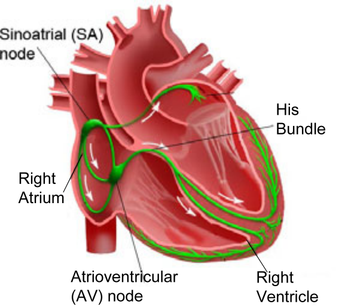{width="1.9208333333333334in"
height="1.7119706911636046in"}tion properties of heart tissue may
change. These changes may cause timing anomalies in heart rhythm, thus
decrease the blood pumping efficiency of the heart. These tim-
[]{#bookmark10 .anchor}ing anomalies are referred to as arrhythmias, and
are categorized into Tachycardia and Bradycardia. Tachycardia features
undesir- able fast heart rate which impairs hemody- namics. Bradycardia
features slow heart rate which results in insufficient blood supply.
Bradycardia maybe due to failure of impulse generation with anomalies in
the SA node,

> or failure of impulse propagation where the
>
> conduction from atria to the ventricles is delayed or blocked.

Since the heart tissue can be activated by external electrical pulses,
Brady- cardia can be treated by providing electrical pulses when the
heart rate is low. Implantable Pacemakers have been developed to deliver
timely electrical pulses to the heart to maintain an appropriate heart
rate and Atrial-Ventricular syn- chrony. Implantable pacemakers normally
have two leads fixed on the wall of the right atrium and the right
ventricle respectively. Activation of local tissue is sensed by the
leads, triggering Atrial Sense (AS) and Ventricular Sense (VS) events.
Atrial Pacing (AP) and Ventricular Pacing (VP) are delivered if no
sensed events occur within deadlines.

In order to deal with different heart conditions, modern pacemakers are
able to operate in different modes. The modes are labeled using a three
character system. The first character describes the pacing locations, the
second charac- ter describes the sensing locations, and the third
character describes how the pacemaker software responds to sensing. In
this work we describe the most com- monly used mode of pacemaker, the
dual-chamber DDD mode that paces both the atrium and the ventricle,
senses both chambers, and sensing can both activate or inhibit further
pacing. Similarly, the VDI mode paces only in the ventricle, senses both
chambers, and inhibits pacing if event is sensed. [\[12](#bookmark11)\]

> **3 System Modeling**
>
> **3.1 Timed Automata and UPPAAL**
>
> Timed automaton [\[13](#bookmark12)\] is an extension of a finite
> automaton with a finite set of real-valued clocks. It has been used for
> modeling and verifying systems which are

Modeling and Verification of a Dual Chamber Implantable Pacemaker 191

triggered by events and have timing constraints between events. From the
Boston Scientific pacemaker specification [\[7](#bookmark2)\], the
pacemaker can be modeled using this Extended Timed Automata notation,
which is a subset of formal semantics in UPPAAL. UPPAAL (
[\[9,14](#bookmark2)\]) is a standard tool for modeling and verification
of real-time systems, based on networks of timed automata. The graphical
and text- based interface makes modeling more intuitive. Requirements
can be specified using Computational Tree Logic (CTL)
[\[15](#bookmark13)\] and violations can be visualized in the simulation
environment.

> **3.2 System Overview**

The function of a pacemaker is to manage the timing relationship between
the atrial and ventricular events. Thus Timed Automata is suitable for
modeling both the deterministic behavior of a pacemaker and the
non-deterministic behav- ior of the heart. The overview of the
closed-loop system is showed in Fig. [2(a)](#bookmark14). The heart and
the pacemaker communicate with each other using broadcast channels. The
heart generates Aget! and Vget! actions, representing atrial and
ventricular events that the pacemaker take as inputs. The pacemaker
processes the signals and generates pacing actions AP! and VP! to the
corresponding components in the heart.

> **3.3 Basic DDD Pacemaker Modeling**
>
> The DDD pacemaker has 5 basic timing cycles triggered by events, as
> shown in Fig. [2(b)](#bookmark15). We decomposed our pacemaker model
> into 5 components which correspond to the 5 counters. These components
> communicate with each other []{#bookmark14 .anchor}using broadcast
> channels and shared variables (as shown in Fig. [3](#bookmark16)).

**Lower Rate Interval (LRI):** This component keeps the heart rate above
a minimum value. In DDD mode, the LRI component models the basic timing
cycle which defines the longest interval between two ventricular events.
The clock is reset when a ventricular event (VS, VP) is received. If no
atrial event has been sensed (AS), the component will deliver atrial
pacing (AP) after TLRI-TAVI. []{#bookmark15 .anchor}The UPPAAL design of
LRI component is shown in Fig. [3](#bookmark16)(a).

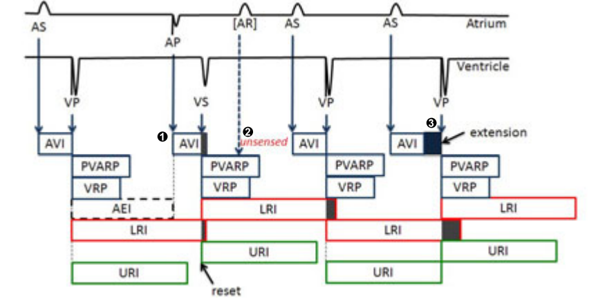{width="2.881943350831146in"
height="1.461152668416448in"}

> 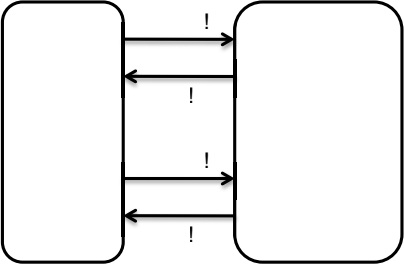{width="1.3421937882764654in"
> height="0.877597331583552in"}Aget
>
> AP
>
> Pacemaker
>
> Vget
>
> VP
>
> **Fig. 2.** (a) System Overview, (b) Basic 5 timing cycles of DDD
> pacemaker

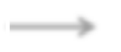{width="0.4963888888888889in"
height="0.15574912510936134in"}{width="1.687445319335083e-2in"
height="0.20666666666666667in"}

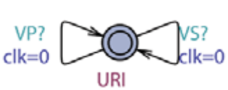{width="1.0940409011373577in"
height="0.43474956255468067in"}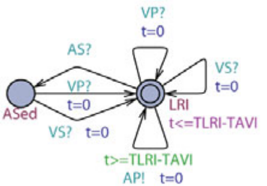{width="1.4793602362204725in"
height="1.0337620297462817in"}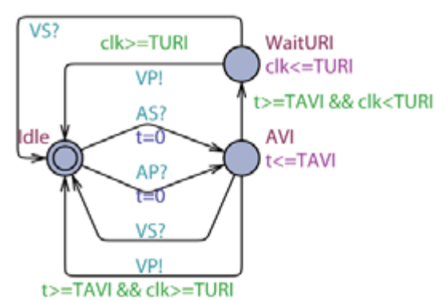{width="1.863526902887139in"
height="1.2475273403324585in"}

> **(a) LRI component (b) AVI component (c) URI component**

{width="0.4072353455818023in"
height="0.13068132108486438in"}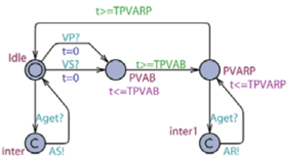{width="1.9025831146106738in"
height="1.0222080052493439in"}

{width="0.4396522309711286in"
height="0.13776793525809275in"}{width="0.4396522309711286in"
height="0.20666666666666667in"}

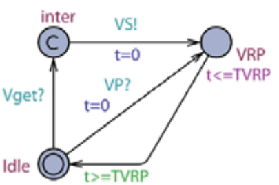{width="1.3451662292213473in"
height="0.8927220034995625in"}

> {width="1.186208442694663in"
> height="0.4232764654418198in"}{width="0.8418186789151356in"
> height="0.4763112423447069in"}**(d) PVARP component (e) VRP
> component**
>
> **Fig. 3.** Components of the pacemaker model in UPPAAL

**Atrio-Ventricular Interval (AVI) and Upper Rate Interval (URI):** The
function of the AVI component is to maintain the appropriate delay
between the atrial activation and the ventricular activation. It defines
the longest interval between an atrial event and a ventricular event. If
no ventricular event has been sensed (VS) within TAVI after an atrial
event (AS, AP), the component will deliver ventricular pacing (VP). In
order to prevent the pacemaker from pacing the ventricle too fast, a URI
component uses a global clock clk to track the time after a ventricular
event (VS, VP). The URI limits the ventricular pacing rate by enforcing
a lower bound on the times between consecutive ventricle events. If the
global clock value is less than TURI when the AVI component is about to
deliver VP, AVI will hold VP and deliver it after the global clock
reaches TURI. The UPPAAL design of AVI and URI component is shown in
Fig. [3](#bookmark16)(b) and (c).

**Post Ventricular Atrial Refractory Period (PVARP) and Post Ventric-
ular Atrial Blanking (PVAB):** Not all atrial events (Aget!) are
recognized as Atrial Sense (AS!). After each ventricular event, there is
a blanking period (PVAB) followed by a refractory period (PVARP) for the
atrial events in order to filter noise. Atrial events during PVAB are
ignored and atrial events dur- ing PVARP trigger AR! event which can be
used in some advanced diagnostic algorithms. The UPPAAL design of PVARP
component is shown in Fig. [3](#bookmark16)(d).

Modeling and Verification of a Dual Chamber Implantable Pacemaker 193

> **Ventricular Refractory Period (VRP):** Correspondingly, the VRP
> follows each ventricular event (VP, VS) to filter noise and early
> events in the ventricular channel which could otherwise cause
> undesired pacemaker behavior. Fig. [3](#bookmark16)(e) shows the
> UPPAAL design of VRP component.

**Parameter Selection:** Each timing parameter of the pacemaker has a
feasible range. However, after those parameters are programmed, they are
fixed during pacemaker operation. Consider all possible combinations of
feasible parameter values is infeasible. In this work, we only verify
one instance of a DDD pacemaker []{#bookmark17 .anchor}with nominal
values in clinical settings [\[8](#bookmark2)\]. The values we choose
are TAVI=150, TLRI=1000, TPVARP=100, TVRP=150, TURI=400, TPVAB=50.

> 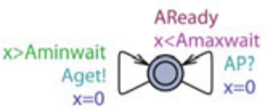{width="1.1156933508311462in"
> height="0.45581911636045497in"}**3.4 Random Heart Model (RHM)**

{width="0.27631889763779527in"
height="0.148332239720035in"}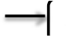{width="0.27630468066491687in"
height="0.148332239720035in"}In order to verify pacemaker algorithm, we
need to first define the state space for the closed-loop system. The state
space definition should not only cover all pos-

> sible pacemaker operations, but also be

physiologically intuitive for safety requirement specification. To this
end, we define the state space of the closed-loop system by the atrial
interval (interval between atrial events ∈ {AS, AP}) and ventricular
interval (interval between ventricular events ∈ {VS, VP}). This heart
rate representation enables us to define unsafe regions for bradycardia
and tachycardia.

The Random Heart Model (RHM) is designed to cover open-loop heart be-
haviors. It non-deterministically generates an intrinsic heart event
Xget! within \[Xminwait, Xmaxwait\] after each intrinsic heart event
Xget or pacing XP. Here we use two RHMs for the atrial and ventricular
channel where X can be atrial (A) or ventricular (V). RHM covers all
possible input to the pacemaker if the interval \[Xminwait, Xmaxwait\]
is set to \[0, ∞\]. It can also cover subset of pos- sible heart
conditions by assigning appropriate values to those two parameters. The
UPPAAL model of the atrial RHM is shown in Fig. [4](#bookmark17).

> **4 Verification Regarding Unsafe Regions**

In this section, we define unsafe regions regarding bradycardia and
tachycardia and specify two basic safety properties. These two basic
safety properties are strict so that they must be satisfied by any
pacemaker under all heart conditions. We then discuss refinement of the
safe regions and make stronger assertions.

> **4.1 Lower Rate Limit**

The most essential function for the pacemaker is to treat bradycardia by
main- taining the ventricular rate above a certain threshold. We define
the region where the ventricular rate is slow, as unsafe. The monitor
Pvv is designed to measure interval between ventricular events and is
shown in Fig. [5(a)](#bookmark19). The property A\[\] (Pvv.two
{width="4.3333333333333335e-2in"
height="6.665573053368329e-3in"} a imply Pvv.t≤TLRI) is satisfied by the
basic DDD pacemaker.

> 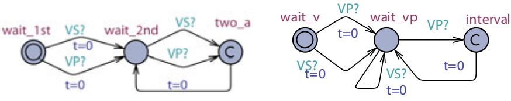{width="2.909566929133858in"
> height="0.5752821522309711in"}
>
> \(a\) (b)
>
> **Fig. 5.** (a) Monitor for LRL: Interval between two ventricular
> events should be less than TLRI, (b) Monitor for URL: Interval between
> a ventricular event and a VP should be longer than TURI
>
> []{#bookmark19 .anchor}**4.2 Upper Rate Limit**

The pacemaker is not designed to treat tachycardia so it can only pace
the heart to increase its rate and cannot slow it down. However, it is
still important to guarantee it does not pace the ventricles beyond a
maximum rate to ensure safe operation. To this effect, an upper rate
limit is specified such that the pacemaker can increase the ventricular
rate up to this limit.

We require that a ventricle pace (VP) can only occur at least TURI after
a ventricle event (VS, VP). The monitor for the property is shown in
Fig. [5(b)](#bookmark19) and the property A\[\]
(PURI{width="3.55336832895888e-2in"
height="6.666666666666667e-3in"} test.interval imply P
URI{width="3.55336832895888e-2in"
height="6.666666666666667e-3in"} test.t≥TURI) is satisfied by the basic
DDD pacemaker model.

> **5 Verification Regarding Unsafe Transitions**

The two unsafe regions, introduced above, are intuitive but provide for
loose safety properties. One may wonder if we can further reduce the
safe region. When the closed-loop system is in some unsafe state, there
are two possible scenarios. One is when, the open-loop plant without the
controller, is also in unsafe state. In our case, if the heart is in
tachycardia, the pacemaker is not supposed to react so that this case is
of little value to us. The other scenario is that the open-loop plant is
in a safe state and the controller is driving the closed- loop system
into some unsafe states. We call this scenario Unsafe Transition. In our
case, the pacemaker may increase the heart rate inappropriately, which
is referred to as Pacemaker Mediate Tachycardia (PMT).

We now introduce two cases of PMT and their corresponding correction
algorithms. Since one closed-loop state may correspond to multiple
execution traces, these PMT scenarios will not be returned by the model
checker as counter- examples of safety requirements. However, we can
still identify known PMT by adding constraints to the heart model or
developing more complex requirements.

> **5.1 Verification Procedure**

The pacemaker manufacturers have developed anti-PMT algorithms to termi-
nate different PMT scenarios. In this section, we propose a general
procedure to identify PMT scenarios and verify the safety and
correctness of anti-PMT algorithms. The general steps for the procedure
include:

[]{#bookmark20 .anchor}Modeling and Verification of a Dual Chamber
Implantable Pacemaker 195

> {width="3.766622922134733e-2in"
> height="3.766622922134733e-2in"}{width="0.5393460192475941in"
> height="8.587379702537183e-2in"}SVT Bradycardia

{width="0.802985564304462in"
height="8.436132983377077e-2in"}

> AS ASASAS ASASASAS AS AS

{width="1.6977209098862642in"
height="3.766622922134733e-2in"}

> 0 1000 2000 3000 4000 ms
>
> \(a\)
>
> {width="0.5411100174978127in"
> height="8.615157480314961e-2in"}PMT Appropriate

{width="0.8140966754155731in"
height="9.340223097112861e-2in"}

> \[AR\] \[AR\] \[AR\]
>
> AS AS AS AS
>
> {width="1.3622222222222222in"
> height="3.584864391951006e-2in"}
>
> [I I I I]{.underline}
> {width="6.291557305336833e-3in"
> height="0.11443678915135608in"}
> {width="6.291557305336833e-3in"
> height="0.11443678915135608in"}
> {width="6.291557305336833e-3in"
> height="0.11443678915135608in"}
> {width="6.291557305336833e-3in"
> height="0.11443678915135608in"}
> {width="6.291557305336833e-3in"
> height="0.11443678915135608in"}
>
> {width="6.291557305336833e-3in"
> height="0.11426290463692039in"}
> {width="6.291557305336833e-3in"
> height="0.11426290463692039in"} l l
> {width="6.291557305336833e-3in"
> height="0.11427712160979878in"}
> {width="6.291557305336833e-3in"
> height="0.11426290463692039in"}
>
> vVP VVP VVP VVP VVS V VS
>
> {width="4.725503062117236e-3in"
> height="3.779090113735783e-2in"}
> {width="4.725503062117236e-3in"
> height="3.779090113735783e-2in"}
> {width="4.725503062117236e-3in"
> height="3.779090113735783e-2in"}
> {width="4.725503062117236e-3in"
> height="3.779090113735783e-2in"} b
>
> 0 1000 2000 3000 4000 ms
>
> \(b\)
>
> **Fig. 6.** (a) SVT with ODO pacemaker (b) SVT with DDD pacemaker
>
> 1\. Show existence of PMT behaviors in the closed-loop system
>
> 2\. Introduce anti-PMT algorithms and check whether the two basic
> safety re- quirements still hold
>
> 3\. Prove correctness of anti-PMT algorithms by showing the
> non-existence of PMT scenarios
>
> Here we use two well-identified PMT cases to demonstrate the
> methodology.
>
> **5.2 Verification of the Mode-Switch Algorithm**

**Supraventricular Tachycardia (SVT):** SVT is an arrhythmia which fea-
tures an abnormally fast atrial rate. Typically the AV node, which has a
long refractory period, can filter most of the fast atrial activations
during SVT thus the ventricular rate remains relatively normal. Fig.
[6(a)](#bookmark20) demonstrates a pace- maker event trace during SVT,
with a ODO mode pacemaker which just sensing in both channels. In this
particular case, every 3 atrial events (AS) correspond to 1 ventricular
event (VS) during SVT.

As an arrhythmia, SVT is still considered as a safe heart condition
since the ventricles operate under normal rate can still maintain
adequate cardiac output. However, the AVI component of a dual chamber
pacemaker is equivalent to a virtual pathway in addition to the
intrinsic conduction pathway between the atria and the ventricles. The
pacemaker tries to maintain 1:1 A-V conduction and thus increases the
ventricular rate inappropriately. Fig. [6(b)](#bookmark20) shows the
pacemaker trace of the same SVT case with DDD pacemaker. Although half
of the fast atrial events are filtered by the PVARP period (\[AR\]s), the
DDD pacemaker still drives the closed-loop system into 2:1 A-V
conduction with faster ventricular rate, which is inappropriate. This
problem can be resolved by switching pacemaker into single chamber mode
to maintain appropriate ventricular rate.

[]{#bookmark21 .anchor}**Existence of PMT during SVT:** Since PMT during
SVT is an unsafe tran- sition, we need to first adjust the heart model so
that the open-loop behaviors covers SVT and are in the safe region. To
this end, the interval for the ventricular RHM is set to \[500,800\].
This rate is slow enough not to be considered as tachycar- dia, but
faster than the Lower Rate Limit

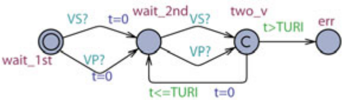{width="1.920832239720035in"
height="0.5606244531933509in"}

**Fig. 7.** Monitor for SVT: Check exis- tence of an endless sequence
where the ventricular event interval ≤TURI

of the pacemaker so that pacemaker should not intervene. The monitor Pv
{width="4.3332239720035e-2in"
height="6.665573053368329e-3in"} v is designed to show existence of PMT
during SVT. It goes to the error state if the ventricular rate drops
below the Upper Rate Limit (Fig. [7](#bookmark21)).

> The existence property E\[\](notPv
> {width="4.1666666666666664e-2in"
> height="6.665573053368329e-3in"} v.err) is specified, which verifies if
> there exists an execution in which the ventricular interval is always
> less or equal to TURI. The property is first verified on pacemaker
> without the mode-switch algorithm. The property is satisfied during
> verification.
>
> **Mode-Switch Algorithm:** Intuitively, the mode-switch algorithm first
> detects SVT. After confirmed detection, it switches the pacemaker from
> a dual-chamber mode to a single-chamber mode. During the
> single-chamber mode, the A-V syn- chrony function of the pacemaker is
> deactivated thus the ventricular rate is decoupled from the fast
> atrial rate. After the algorithm determines the end of SVT, it will
> switch the pacemaker back to the dual chamber mode.

The mode-switch algorithm specification we use is the same as the one
used in Boston Scientific pacemakers [\[8](#bookmark2)\]. The algorithm
first measures the interval between atrial events outside the blanking
period (AS, AR). The interval is considered as fast if it is above a
threshold (Trigger Rate) and slow otherwise (see Fig. [8](#bookmark22)
(1)). A counter increments for fast events and decrement for slow events
(see Fig. [8](#bookmark22) (2)). After the counter value reaches the
Entry Count, the algorithm will start a Duration which is a time
interval used to confirm the detection of SVT (see Fig. [8](#bookmark22)
(3)). In the Duration, the counter keeps counting. If the counter value
is still positive after the Duration, the pacemaker will switch to the
VDI mode (Fallback mode). In the VDI mode, the pacemaker only senses and
paces the ventricle. At any time if the counter reaches zero, the
Duration will terminate and the pacemaker is switched back to DDD mode.

> In our UPPAAL model of the mode-switch algorithm, we use nominal
> param- eter values from the clinical setting. We define trigger rate at
> 170bpm (350ms), entry count at 8, duration for 8 ventricular events
> and fallback mode as VDI.

In order to model both DDD and VDI modes and the switching between them,
we made modifications to the AVI and LRI components. In each component

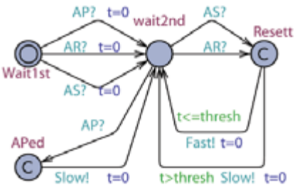{width="1.4151520122484689in"
height="0.8649857830271216in"}

> {width="0.48812445319335085in"
> height="0.4408880139982502in"}{width="0.3571106736657918in"
> height="0.193665791776028in"}{width="0.3571106736657918in"
> height="0.1927351268591426in"}Interval
> {width="3.1124234470691164e-2in"
> height="0.19139654418197724in"}Slow!

{width="0.34956255468066494in"
height="6.990923009623796e-2in"}{width="1.5749125109361328e-2in"
height="0.14738845144356955in"}

> {width="0.5318886701662292in"
> height="0.10329615048118986in"}{width="0.5318886701662292in"
> height="4.6291557305336836e-2in"}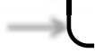{width="0.34955489938757656in"
> height="0.193665791776028in"}VDI!

{width="0.5318886701662292in"
height="4.629046369203849e-2in"}

{width="0.3353882327209099in"
height="7.841754155730533e-2in"}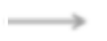

> 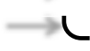{width="0.3353882327209099in"
> height="0.19273622047244093in"} ~~\>~~
>
> 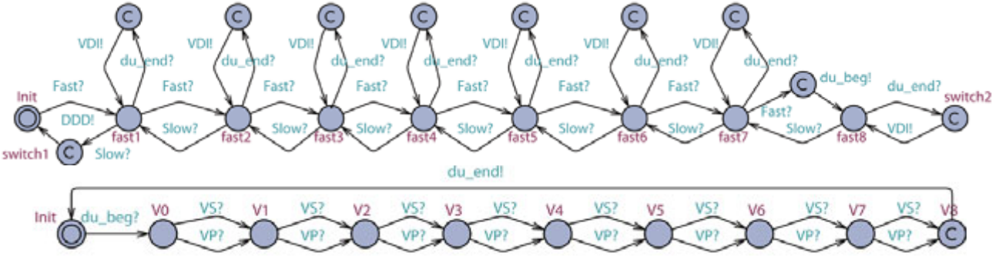{width="4.31926290463692in"
> height="1.1359022309711286in"}**2**
>
> **3**
>
> **Fig. 8.** Mode-Switch algorithm

Modeling and Verification of a Dual Chamber Implantable Pacemaker 197

two copies for both modes are modeled, and switch between each other
when switching events (DDD, VDI) are received. During VDI mode, VP is
delivered by the LRI component instead of the AVI component. The clock
values are shared between both copies in order to preserve essential
intervals even after switching. The modified AVI and LRI components are
shown in Fig. [9](#bookmark23).

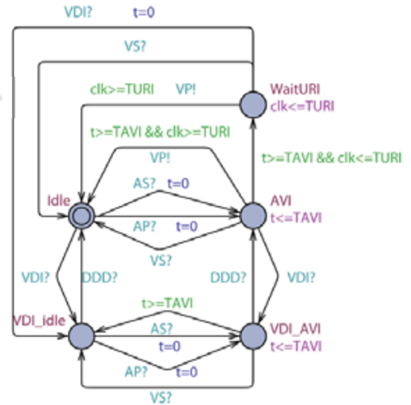{width="1.9675831146106737in"
height="1.9369706911636047in"}

> 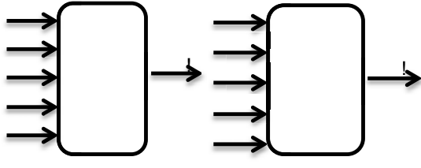{width="1.7801520122484689in"
> height="0.7062150043744532in"}AS?
>
> VS?
>
> AP?
>
> DDD?
>
> []{#bookmark23 .anchor}VDI?

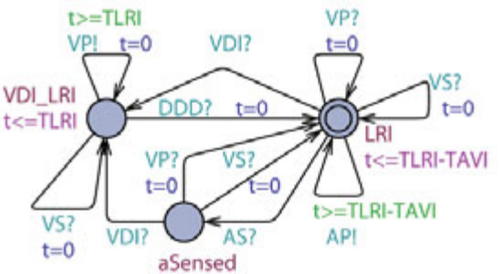{width="1.8280129046369205in"
height="0.9966797900262467in"}

> **Fig. 9.** New LRI & AVI components

**Verification Against Basic Safety Requirements:** We verify the same
basic safety requirements on the pacemaker model with mode-switch
algorithm. The Upper Rate Limit property still holds but the Lower Rate
Limit property is violated. When the pacemaker is switching from VDI
mode to DDD mode, the responsibility to deliver VP switched from LRI
component to AVI component. Since the clock reference is different
(Ventricular events in LRI and Atrial events in AVI), the clock value
for delivering the next VP is not preserved. As a result, if an atrial
event which triggered the mode-switch from VDI to DDD happens within
\[TLRI-TAVI, TLRI) after the last ventricular event, the next
ventricular pacing will be delayed by at most TAVI time, which violates
the Lower Rate Limit property (Fig. [11(a)](#bookmark24)).

**Verification of the Algorithm:** We now present the verification of the
cor- rectness of the mode-switch algorithm by checking the same
existence property E\[\] (not Pv
{width="4.3333333333333335e-2in"
height="6.665573053368329e-3in"} v.err) on pacemaker with mode-switch
algorithm. We expect the vi- olation of this property, since during VDI
mode the ventricular rate of the heart model is less than the Upper Rate
Limit and will not trigger ventricular pacing. The counter example of
the violation should show that mode-switch algorithm successfully
switches the mode of the pacemaker to VDI mode. However, this property
is still satisfied, indicating the mode-switch algorithm failed to elim-
inate the PMT scenario. Then we further restrict the atrial interval of
RHM to \[100, 200\]. Since the atrial rate for the new heart model is
always above the trigger rate, mode switch to VDI mode should always
eventually happen. The monitor PMS for the new property is shown in Fig.
[10](#bookmark25).

The property A\<\> (PMS.err) is not satisfied. The counter-example shows
that some of the atrial events fall into the Post Ventricular Atrial
Blanking period

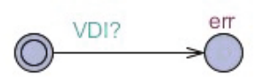{width="0.9557917760279965in"
height="0.30679133858267715in"}

> []{#bookmark25 .anchor}**Fig. 10.** Monitor for Mode-Switch: Check if
> mode-switch to VDI mode will always eventually happen
>
> (PVAB) and got ignored. As a result, two fast intervals may be
> considered as one slow interval (see Fig. [11(b)](#bookmark26)). If
> this happens more than one out of the Entry Count, mode-switch from
> DDD to VDI may never happen.

**Discussion:** We demonstrated that model checking techniques can be
used to identify unknown violations which cannot be identified during
open-loop testing, showing the necessity and usefulness of formal
verification in medical device software development and certification. We
also showed that adding new features to the verified system is a
potential source for safety violations.

> **5.3 Verification of Endless Loop Tachycardia (ELT) algorithm**

**ELT overview:** The AVI component of a dual-chamber pacemaker
introduces a virtual A-V pathway which forms a loop with the intrinsic
A-V conduction pathway (see Fig. [12(a)](#bookmark27)). In this
scenario, a ventricular event (VS) triggers a V-A conduction through the
intrinsic pathway (Marker 1 in Fig. [12(b)](#bookmark27)). The pacemaker
registers this signal as an Atrial Sense (AS) (Marker 2 in Fig.
[12(b)](#bookmark27)). This event triggers VP after TAVI, as if the
signal conducts through the virtual A-V pathway (Marker 3 in Fig.
[12(b)](#bookmark27)). The VP will trigger another V-A con- duction and
this VP-AS-VP-AS looping behavior will continue (see Fig.
[12(b)](#bookmark27)). The interval between atrial events is TAVI plus
the V-A conduction delay, which will drive the ventricular rate as high
as the Upper Rate Limit.

> From the pacemaker's point of view, the pacemaker paces the ventricles
> as []{#bookmark24 .anchor}specified for every AS. That is why open-loop
> testing is unable to detect this closed-loop behavior. Modern
> pacemakers are equipped with anti-ELT algo- rithms to identify and
> terminate potential ELT. One common algorithm identi- fies ELT by the
> ELT pattern and terminates ELT by increasing TPVARP time once to block
> the AS caused by the V-A conduction.

[]{#bookmark26 .anchor}**Existence of ELT:** As another case of unsafe
transition, we again constrain the open-loop heart model into healthy
heart. We set both the atrial interval

> 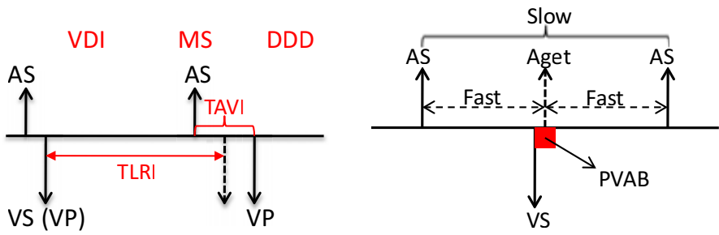{width="2.94797353455818in"
> height="0.9612325021872266in"}
>
> \(a\) (b)

**Fig. 11.** (a) Safety Violation: VP is delayed due to the reset of
timer during mode- switch, (b) Correctness Violation: The blocking
period may block some atrial events, turning two Fast events to one Slow
event

[]{#bookmark27 .anchor}Modeling and Verification of a Dual Chamber
Implantable Pacemaker 199

{width="0.16862423447069116in"
height="0.5396653543307086in"}

> 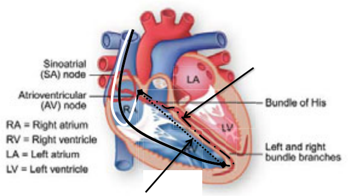{width="1.9192902449693787in"
> height="1.08163823272091in"}**pathway**
>
> {width="0.32673556430446193in"
> height="0.14323600174978127in"}**Fast "pathway": pacemaker**
>
> **A-V synchrony**
>
> \(a\) Virtual circuit formed by the pacemaker and the heart
>
> {width="2.1565135608048993in"
> height="0.7640409011373578in"}2
>
> AS AS AS AS AS AS
>
> 1 3
>
> VS VP VP VP VP VP
>
> 0 1000 2000 3000 4000

\(b\) Pacemaker trace for ELT initialized by a early ventricular signal

> **Fig. 12.** Endless Loop Tachycardia case study demonstrating the
> situation when the pacemaker drives the heart into an unsafe state
> [\[16](#bookmark29)\]
>
> and the ventricular interval above TURI so that ELT behavior is not
> covered by the heart model. Two monitors were designed to show the
> existence of ELT. One monitor,
> PELT{width="3.829615048118985e-2in"
> height="6.666666666666667e-3in"} det, shows the persistence of the
> VP-AS pattern and the other monitor, Pvv, shows that the ventricular
> rate is always no slower than the upper rate limit (Fig.
> [13](#bookmark30)). The existence property E\[\] ((not
> PELT{width="3.828630796150481e-2in"
> height="6.666666666666667e-3in"} det.err) && (not Pvv.err)) fails on
> pacemaker without an anti-ELT algorithm.

The reason for the failure is that in our closed-loop system, AS can
only be triggered by Aget signal from the atrial heart model, where in
ELT case the AS is triggered by backward V-A conduction, which is not
covered by our heart model. In order to solve this problem, we model the
A-V conduction of the heart in addition to the orignal RHM. The adjusted
RHM and the conduction component is shown in Fig. [14](#bookmark31). For
each atrial event Aget, the conduction com- ponent generates
V{width="3.469925634295713e-2in"
height="6.666666666666667e-3in"} act after certain delay and vice versa.
The conduction is non-deterministic so that the old RHM is a special
case for the new RHM. The PVARP and VRP components are also modified to
accommodate new events A
{width="3.90255905511811e-2in"
height="6.666666666666667e-3in"} act and
V{width="3.90255905511811e-2in"
height="6.666666666666667e-3in"} act.

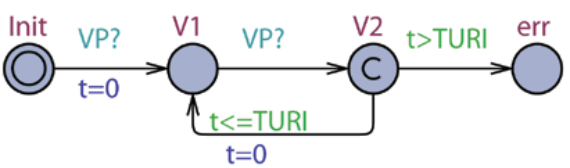{width="1.8951804461942257in"
height="0.5594160104986876in"}

> 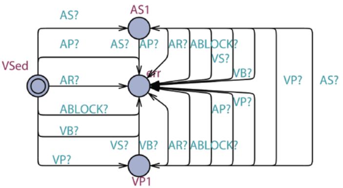{width="2.337998687664042in"
> height="1.2791797900262467in"}[]{#bookmark30 .anchor}PELT_det Pv_v
>
> **Fig. 13.** Monitor for ELT: VP-AS pattern detection and Upper Rate
> detection
>
> After introducing the conduction component, the existence property
> holds, indicating the closed-loop system with new heart model covers
> ELT.
>
> **The ELT-termination Algorithm:** The ELT detection algorithm by
> Boston Scientific [\[7](#bookmark2)\] utilizes these three features:

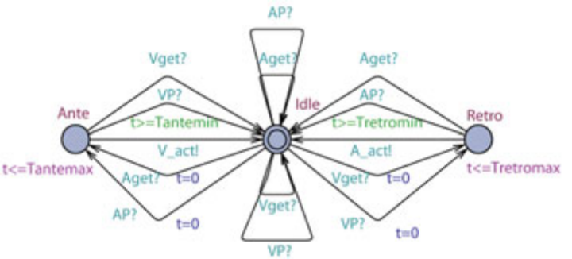{width="2.396096894138233in"
height="1.0837215660542432in"}

{width="0.3041524496937883in"
height="0.16327755905511812in"}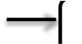{width="0.30415682414698164in"
height="0.16327755905511812in"}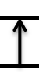{width="0.1632917760279965in"
height="0.30416666666666664in"}

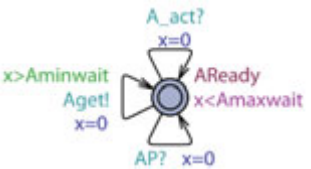{width="1.0352351268591427in"
height="0.5615419947506561in"}

{width="0.30495734908136485in"
height="0.16327865266841646in"}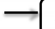{width="0.3041524496937883in"
height="0.16327865266841646in"}

> **(a) Adjusted RHM (b) New heart model (c) Conduction component**
>
> **Fig. 14.** Modified heart model and the conduction component
>
> **---** Ventricular rate at Upper Rate Limit
>
> **---** VP-AS pattern
>
> **---** Fixed V-A conduction delay

The pacemaker first monitors VP-AS pattern with ventricular rate at upper
rate limit. Then it compares the VP-AS interval with previous intervals.
ELT is confirmed if the difference between the current VP-AS interval and
the first VP-AS interval are within ±32ms for 16 consecutive times. Then
the pacemaker increases the PVARP period to 500ms once so that the next
AS will be blocked and will not trigger a VP. ELT will then be
terminated.

As the V-A conduction delays are patient-specific, the algorithm compares
VP-AS interval to a previously sensed value instead of an absolute
value. Since we can not store past clock values in UPPAAL, we can not
explicitly model this ELT detection algorithm. However, since the
conduction delay in our heart model is within a known range, we can
compare the VP-AS interval with this range. The VP-AS pattern detection
module for our anti-ELT algorithm is shown in Fig. [15](#bookmark32)
(1). It detects the VP-AS pattern with ventricular rate at upper rate
limit and sends out
VP{width="4.382874015748032e-2in"
height="6.666666666666667e-3in"} AS event if the interval qualifies.

> A counter counts the number of qualified VP-AS patterns. It increases
> the PVARP period to 500ms if eight consecutive VP-AS patterns are
> detected. (Fig. [15](#bookmark32) (2)) The PVARP component is also
> modified so that the PVARP period can only be changed once by the
> anti-ELT algorithm. (Fig. [15](#bookmark32) (3))

**Verification Against Bottom-Line Safety Requirements:** The two
bottom-line safety requirements still hold when the anti-ELT algorithm
is in- troduced.

**Verification ofthe Algorithm:** The existence property E\[\]((not
PELT{width="3.817804024496938e-2in"
height="6.665573053368329e-3in"} det.err) && (not Pvv.err)) is not
satisfied after the anti-ELT algorithm is introduced, in- dicating the
algorithm successfully terminates ELT. We successfully reproduced the
case when the algorithm works in the simulation environment of UPPAAL.

**Discussion:** In this case study, we showed that we may require the
heart model to provide more physiological details when verifying more
complex properties. We also observed some limitations of Timed Automata
when modeling more complex algorithms.

Modeling and Verification of a Dual Chamber Implantable Pacemaker 201

> 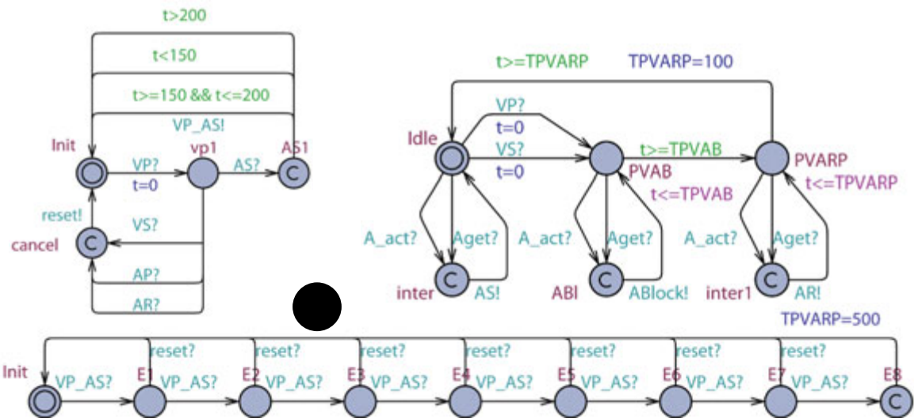{width="3.841665573053368in"
> height="1.7599715660542432in"}**2**
>
> **Fig. 15.** Counter for VP-AS pattern
>
> []{#bookmark32 .anchor}**6 Related Work**

Jee et. al present a safety assured development approach of real-time
software using pacemaker as their case study in [\[17](#bookmark33)\].
They formally model and verify a single chamber VVI pacemaker using
UPPAAL and then implement it and check the preservation of properties
transferred from model to implementation code. Tuan et. al propose an
RTS formal model for pacemaker and its environment and verified it
against number of safety properties and timed constraints using PAT
model checker [\[18](#bookmark34)\]. They have modeled the pacemaker for
all 18 operating modes as described in Boston scientific, but their work
lacks specification and analysis os complex behaviors of the pacemaker,
such as mode-switch.

> Wiggelinkhuizen uses mCRL2 and UPPAAL to formally model the pacemaker
> from the firmware design of Vitatron's DA+ pacemaker
> [\[19](#bookmark35)\]. Two main ap- proaches have been used to
> investigate the feasibility of applying formal model checking to the
> design of device firmware. The main approach consists of verify- ing
> the firmware model in context of a formal heart model and a formal
> model of a hardware module which fails for high heart rates because of
> the state explo- sion. Another approach is to verify a part of firmware
> design which was feasible and was able to detect a known deadlock
> rather soon.

Macedo et. al have developed a concurrent and distributed real-time
model for a cardiac pacemaker through a pragmatic incremental approach.
The models are expressed using the VDM and are validated primarily by
scenario-based test, where test scenarios are defined to model
interesting situations such as the absence of input pulses
[\[20](#bookmark36)\]. The models cover 8 modes of pacemaker operation.

Gomes et. al present a formal specification of pacemaker system using the
Z notation in [\[21](#bookmark37)\]. They have also tried to validate
that the formal specification satisfies the informal requirements of
Boston Scientific by using a theorem prover, ProofPower-Z. They have
partially checked the consistency of their specification through
reasoning. No validation experiment regarding safety conditions were
performed yet. [\[21](#bookmark37)\]

> Mery et. al in [\[22](#bookmark38)\], formally model all operational
> modes of a single electrode pacemaker system using event-B and prove
> them. They use an incremental proof- based approach to refine the basic
> abstract model of the system and add more functional and timing
> properties. They use the ProB tool to validate their models in
> different situations such as absence of input pulses.
>
> **7 Conclusion and Future Work**

In this paper, we modeled a dual-chamber pacemaker with advanced
features us- ing Timed Automata. Timed automaton captures key features
of the closed-loop system and enables the use of tools like UPPAAL in
verification. We then ver- ified one instance of a dual chamber pacemaker
model with nominal parameter values since it is impossible to consider
all possible combinations. We defined a heart rate representation of
closed-loop state space and identified unsafe regions and unsafe
transitions. We demonstrated that model checking techniques can be used
to reveal safety violations which cannot be identified during open-loop
testing. We also showed that adding features to previously verified
system may result in safety violations. Furthermore, we showed that more
complex heart model is need to provide more physiological insights
during property specifica- tion. The UPPAAL model developed in this paper
is freely available online [\[10](#bookmark2)\]. We hope that these
models can be used as a starting point for many purposes (e.g. to build
models with costs and probabilities for quantitative analysis).

In this paper, we only verified the safety and correctness of pacemaker
algo- rithms. However, the ultimate goal for a pacemaker is to maintain
the efficiency of the heart. As future work, we would like to evaluate the
efficiency of those al- gorithms by assigning costs for different heart
conditions. The evaluation can be used to develop better treatment for
general and specific patients. More complex heart models are therefore
needed to provide physiological insights. However, rig- []{#bookmark1
.anchor}orous heart model refinement should be considered to ensure model
consistency. While Timed Automata is a good fit for the problem studied
here, it also has []{#bookmark3 .anchor}some drawbacks as it can not
capture certain behaviors of some advanced algo- []{#bookmark4
.anchor}rithms like memorizing difference of clocks, and is also not
scalable enough. Our future work will also focus on improving the
efficiency of verification toolchain []{#bookmark5 .anchor}for medical
device certification.

> **References**
>
> \[1\] List of Device Recalls, U.S. Food and Drug Admin. (last visited
> July 19, 2010)
>
> \[2\] Sandler, K., Ohrstrom, L., Moy, L., McVay, R.: Killed by Code:
> Software Trans- parency in Implantable Medical Devices. Software
> Freedom Law Center (2010)
>
> \[3\] AUTOSAR website: <http://www.autosar.org/>
>
> \[4\] AVSI website: <http://www.avsi.aero>
>
> \[5\] Alur, R., Arney, D., Gunter, E.L., Lee, I., Lee, J., Nam, W.,
> Pearce, F., Van Albert, S., Zhou, J.: Formal Specifications and
> Analysis of the Computer-Assisted Resuscitation Algorithm (CARA)
> Infusion Pump Control System. Intl. Journal on Software Tools for
> Technology Transfer (STTT) 5, 308--319 (2004)

[]{#bookmark2 .anchor}Modeling and Verification of a Dual Chamber
Implantable Pacemaker 203

> []{#bookmark9 .anchor}\[6\] ten Teije, A., et al.: Improving medical
> protocols by formal methods. Artificial Intelligence in Medicine 36(3),
> 193--209 (2006)
>
> \[7\] PACEMAKER System Specification. Boston Scientific (2007)
>
> \[8\] The Compass - Technical Guide to Boston Scientific Cardiac Rhythm
> Management []{#bookmark11 .anchor}Products (2007)
>
> \[9\] Larsen, K.G., Pettersson, P., Yi, W.: Uppaal in a Nutshell.
> International Journal []{#bookmark12 .anchor}on Software Tools for
> Technology Transfer (STTT), 134--152 (1997)

\[10\] Jiang, Z., Pajic, M., Moarref, S., Alur, R., Mangharam, R.:
Pacemaker UPPAAL model download:
<http://www.seas.upenn.edu/~zhihaoj/VHM/PM_verify.zip>

\[11\] Pajic, M., Jiang, Z., Sokolsky, O., Lee, I., Mangharam, R.: From
Verification to Implementation: A Model Translation Tool and a Pacemaker
Case Study. In: 18th []{#bookmark13 .anchor}IEEE Real-Time and Embedded
Technology and Applications Symposium, IEEE RTAS (2012)

\[12\] Barold, S., Stroobandt, R., Sinnaeve, A.: Cardiac Pacemakers Step
by Step. Black- []{#bookmark29 .anchor}well Futura (2004)

\[13\] Alur, R., Dill, D.L.: A Theory of Timed Automata. Theoretical
Computer Sci- []{#bookmark33 .anchor}ence 126, 183--235 (1994)

\[14\] Behrmann, G., David, A., Larsen, K.G.: A Tutorial on Uppaal. In:
Bernardo, M., Corradini, F. (eds.) SFM-RT 2004. LNCS, vol. 3185, pp.
200--236. Springer, Heidelberg (2004)

\[15\] Clarke, E.M., Allen Emerson, E.: Design and synthesis of
synchronization skeletons []{#bookmark34 .anchor}using branching-time
temporal logic. In: Logic of Programs, Workshop, pp. 52--71 (1982)

\[16\] Jiang, Z., Pajic, M., Mangharam, R.: Model-based Closed-loop
Testing of Im- []{#bookmark35 .anchor}plantable Pacemakers. In: ICCPS
2011: ACM/IEEE 2nd Intl. Conf. on Cyber- []{#bookmark36 .anchor}Physical
Systems (2011)

\[17\] Jee, E., Wang, S., Kim, J.K., Lee, J., Sokolsky, O., Lee, I.: A
Safety-Assured Development Approach for Real-Time Software. In: The
Proceedings of 16th IEEE International Conference on Embedded and
Real-Time Computing Systems and Applications, pp. 133--142 (2010)

[]{#bookmark37 .anchor}\[18\] Tuan, L.A., Zheng, M.C., Tho, Q.T.:
Modeling and Verification of Safety Critical Systems: A Case Study on
Pacemaker. In: Fourth International Conference on Secure Software
Integration and Reliability Improvement, pp. 23--32 (2010)

[]{#bookmark38 .anchor}\[19\] Wiggelinkhuizen, J.E.: Feasibility of
Formal Model Checking in the Vitatron En- vironment. Master thesis,
Eindhoven University of Technology (2007)

\[20\] Macedo, H.D., Larsen, P.G., Fitzgerald, J.S.: Incremental
Development of a Dis- tributed Real-Time Model of a Cardiac Pacing
System Using VDM. In: Cuellar, J., Sere, K. (eds.) FM 2008. LNCS, vol.
5014, pp. 181--197. Springer, Heidelberg (2008)

\[21\] Gomes, A.O., Oliveira, M.V.M.: Formal Specification of a Cardiac
Pacing System. In: Cavalcanti, A., Dams, D.R. (eds.) FM 2009. LNCS, vol.
5850, pp. 692--707. Springer, Heidelberg (2009)

\[22\] Mery, D., Singh, N.K.: Pacemaker's Functional Behaviors in
Event-B. Research report, INRIA (2009)
