> **Verification of an Audio Protocol with Bus Collision Using
> UPPAAL\***
>
> *Johan Bengtsson²* W.O.David Griffioen³,4 *Kare J.Kristoffersen¹*
>
> Kim G.Larsen¹ Fredrik Larsson² *Paul Pettersson²* Wang Yi2
>
> IBRICS#,Aalborg University,Denmark.E-mail:{jelling,kgl}@iesd.auc.dk
>
> 2 Department of Computer Systems,Uppsala University,Sweden.
>
> E-mail:{johanb,fredrikl,paupet,yi}@docs.uu.se
>
> ³CWI,Amsterdam,The Netherlands.E-mail:griffioe@cwi.nl
>
> 4 Computing Science Institute,University of Nijmegen,The Netherlands.
>
> Abstract. In this paper we apply the tool UPPAAL¹to an automatic
> analysis of a version of the Philips Audio Control Protocol with two
> senders and bus collision handling.This case study is significantly
> larger than the real-time/hybrid systems previously analysed by
> automatic tools.During the case study the tool UPPAAL was extended
> with a new feature,committed locations,allowing efficient modelling of
> broadcast communication.

**1 Introduction**

During the last few years a number of tools for automatic verification
of hybrid and real-time systems have emerged
\[DY95,HHWT95,BLL+95,HRP94\].These tools have by now reached a
state,where they are mature enough for application on realistic
case-studies;a claim we hope to substantiate in this paper.

We present an application of our tool UPPAAL to an automatic analysis of
a version of the Philips Audio Control Protocol with two senders and the
con- sequently caused problem of bus collision.The case study is
comprehensive compared with previous verification efforts of real-time
and hybrid systems, e.g.the node-space is 10³times larger than the case
with only one sender \[BPV94,HWT95,DY95,LPY95\].Also,the number of
clocks,variables and channels has increased considerably.The bus
collision version studied in this paper has previously been verified in
\[Gri94\]without tool support.

UPPAAL is a tool for automatic verification of safety and bounded
liveness properties of networks of timed automata and certain hybrid
automata.UPPAAL

\*This work has been supported by the European Communities(under CONCUR2
and REACT),NUTEK(Swedish Board for Technical Development)TFR(Swedish
Technical Research Council)and Netherlands Organization for Scientific
Research (NWO)under contract SION 612-316-125.

#Basic Research in Computer Science,Centre of the Danish National
Research Foundation.

1 The current version of UPPAAL is available on the World Wide Web via
the UPPAAL home page <http://www.docs.uu.se/docs/rtmv/uppaal.>

> 245

contains a number of features including a graphical interface and
automatic generation of diagnostic traces,and applies a combination of
on-the-fly state- space examination together with efficient constraint
solving techniques \[YPD94, BLL+95\].

In modelling the Audio Protocol with bus collision it turned out to be
conve- nient in certain situations to apply broadcast communication.An
extension of UPPAAL with so-called committed locations allows broadcasts
to be modelled as atomic sequences of two-process synchronizations,and
yields in addition perfor- mance improvements.

The verification of Philips Audio Protocol with Bus Collision was
carried out using the extended version of UPPAAL installed on a SGI ONYX
machine.As results we have verified the correctness of the protocol for
an error tolerance of 5%on the timing,demonstrated that correctness
fails if the error tolerance is increased to 6%,and analysed an
incorrect version of the protocol which is actually implemented by
Philips.

**2 The Committed UPPAAL model**

The basis of the UPPAAL model for real-time systems is networks of timed
au- tomata AD90\]with data variables \[YPD94\].However,to meet
requirements arising from various case studies,the UPPAAL model has been
extended with various new features such as urgent transitions
\[BLL+95\]etc.The present case study indicates that we need to further
extend the UPPAAL model with com- mitted locations to model behaviours
such as atomic broadcasting in real-time systems.Our experiences with
UPPAAL show that the notion of committed lo- cations introduced in
UPPAAL is not only useful in modelling but also yields significant
improvements in performance.

We assume that a real-time system consists of a fixed number of
sequential processes communicating with each other via channels.We
further assume that each communication synchronizes two processes as in
CCS.Broadcasting com- munication can be implemented in such systems by
repeatedly sending the same message to all the receivers.To ensure
atomicity of such \'broadcast\'sequences, we mark the intermediate
locations of the sender as so-called committed loca- tions which are to
be left immediately.

An Example. To introduce the notion of committed locations in timed au-
tomata,consider the scenario shown in Figure 1:A sender S is to
broadcast a message m to two receivers R₁and R₂.As this requires
synchronization between three processes this can not directly be
expressed in UPPAAL where synchroniza- tion,as in CCS,is between two
processes based on complementarity of actions. However,as an initial
attempt we may model the broadcast as a sequence of two two-process
synchronizations,where first S synchronizes with R₁on m₁and then with
R₂on m2.However,this is not an accurate modelling as the intended
atomicity of the broadcast is not preserved(i.e.other processes may
interfere during the\'broadcast\'sequence).To ensure atomicity,we mark
the intermediate location S2 of the sender S as a so-called committed
location (indicated by the

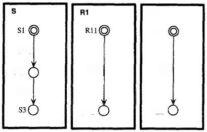

> Fig.1.Broadcasting Communication and Committed Locations.

C:-prefix).The atomicity of the action sequence m₁!m₂!is now achieved by
insist- ing that a committed location must be left immediately!This
behaviour is quite similar to what has been called "urgent
transitions"\[HHWT95,DY95,BLL+95\] which insists that the next
transition taken must be an action(and not a delay). The precise
semantics of committed locations will be formalized in the transition
rules for networks of timed automata with data variables in the
following.

Preliminaries.W e assume a finite set of clock variables C ranged over
by x,y,z and a finite set of data variables V ranged over by i,j,k.We
use G(C,V)to stand for the set of formulas ranged over by g,generated by
the following syntax: g::=a\|g 人g,where a is a constraint of the
form:x～n or i～n for a∈C, i∈V,\~∈{≤,≥,=}and n being a natural number.We
shall call elements of G(C,V)guards.To manipulate clock and data
variables,we use reset-set of the form:w:=ewhich is a set of
assignment-operations in the form w:=e where u is a clock or data
variable and e is an expression.A reset-set is a proper reset-set when
the variables are assinged a value at most once,we use R to denote the
set of all proper reset-sets.A reset-operation on a clock variable
should be in the form x :=n where n is a natural number and a
reset-operation on an integer variable should be in the
form:i:=c\*i+c\'where c,c\'are integer constants.We assume that
processes synchronize with each other via channels.Let A be a set of
channel names with a subset U of urgent channels on which processes
should synchronize whenever possible.We use A={α?\|a∈A}U{α!\|α∈A}u{7}to
denote the set of actions that processes can perform to synchronize with
each other,where r is a distinct symbol representing internal actions.We
use name(a) to denote the channel name of a,defined by
name(α?)=name(a!)=α .

The UPPAAL Model with Committed Locations. An automaton A over actions
A,clock variables C and data variables V is atuple(N,Lo,E,No)where N is
a finite set of locations(control-locations)with a subset Nc CN being
the set of committed locations,lo is the initial location,and
ECN×G(C,V)×A× R×N corresponds to the set of edges.To model urgency,we
require that the guard of an edge with an urgent action should always
bet,i.e.if name(a)∈U and (l,g,a,r,l\'\>∈E then gt,

> In the case,(1,g,a,r,l\'〉∈E we shall write,l⁹,2,I\'which represents a
> transi- tion from the location l to the location \'with guard g(also
> called the enabling condition of the edge),action a to be performed
> and a set of reset-operations r to update the variables.Also,we shall
> write C(1)whenever l∈Nc.
>
> To model networks of processes,we introduce a CCS-like parallel
> composition operator for automata.Assume that A1...An are automata.We
> use Ato denote their parallel composition.The intuitive meaning of A s
> similar to the CCS parallel composition of A1...An with all actions
> being restricted,that is,A= (A₁\|....An)\\A.Thus only synchronization
> between the components Ai is possible. We shall call A a network of
> automata.We simply view A as a vector and use Ai to denote its ith
> component.
>
> Informally,a process modelled by an automaton starts at location lo
> with all its variables initialized to 0.The values of the clocks
> increase synchronously with time at location l.At any time,the process
> can change location by following an edge
> 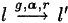{width="0.46525918635170604in"
> height="0.15965441819772527in"} provided the current values of the
> variables satisfy the enabling condition g.With this transition,the
> variables are updated by r.
>
> A variable assignment is a mapping which maps clock variables C to the
> non- negative reals and data variablesV to integers.For a variable
> assignment v and a delay d,v田d denotes the variable assignment such
> that(v田d)(z)=v(z)+d for
>
> any clock variable z and(v田d)(i)=v(i)for any integer variablei.This
> definition of reflects that all clocks operate with the same speed and
> that data variables are time-insensitive.For a reset-operation r(a set
> of assignment-operations),we use r(v)to denote the variable assignment
> v\'with v\'(w)=val(e,v)whenever w:=e ∈r and
> v\'(w′)=v(w\')otherwise,where val(e,v)denotes the value of e in
> v.Given a guard g∈G(C,V)and a variable assignment v,g(v)is a boolean
> value describing whether g is satisfied by v or not.
>
> A control vector l of a network A is a vector of locations where li is
> a location of A₂.We shall write
> 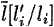{width="0.36808070866141734in"
> height="0.1805599300087489in"} to denote the vector where the ith
> element li of l is replaced by I.
>
> A state of a network Ais a configuration (I,v)where l is a control
> vector of A and v is a variable assignment.The initial state of A
> is\<To,vo)where Io is the initial control vector whose elements are
> the initial locations of
> 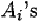{width="0.25002624671916013in"
> height="0.13893482064741908in"} and vo is the initial variable
> assignment that maps all variables to 0.
>
> To model progress properties,we use the following notion of maximal
> delay:

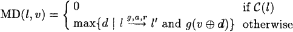{width="3.3477220034995625in"
height="0.3554133858267717in"}

So if l is a committed location,there willbe no delay at l.We extend the
notion of maximal delay to networks of automata such that
synchronization on urgent channels happens immediately:

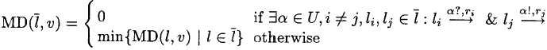{width="4.777791994750656in"
height="0.43743219597550304in"}

> The semantics of a network of automata A is given in terms of a
> transition

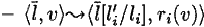{width="1.4027974628171478in"
height="0.18055883639545056in"}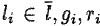{width="0.6875120297462817in"
height="0.1736220472440945in"}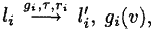{width="1.0693886701662292in"
height="0.20137248468941382in"}system with the set of states being the
set of configurations and the transition relation defined as follows:

> such that
>
> 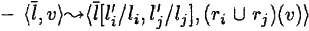{width="2.1388998250218725in"
> height="0.2014643482064742in"}and for all k if C(lk)then k=i.

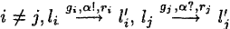{width="1.750003280839895in"
height="0.2221839457567804in"}if there exist
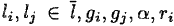{width="1.208319116360455in"
height="0.1804669728783902in"} and Tj

,g;(v),g;(v),r;UT;∈R and for all

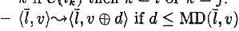{width="2.0625360892388453in"
height="0.25696412948381453in"}

Thus,if a state{I,v)contains a committed location no delays can take
place. Moreover,any component with committed location must participate
in the next (action-)transition.

**3 The Committed UPPAAL Implementation**

In the following,we present the notion of committed locations in terms
of the UPPAAL model and its implementation in UPPAAL.In the current
version \[BLL+95\],UPPAAL is able to check for invariance
properties,VOβ,and reacha- bility properties,3◇β,with respect to
constraints,β,on the admissible locations of the various components and
the values of the clock and data variables.

The model-checking is performed using backwards reachability analysis
to- gether with an efficient constraint-solving technique.Also,UPPAAL
adopts on- the-fly generation of the state space in order to avoid
explicit construction of the product automaton and the immediately
caused memory problems.

The model-checking is based on a partitioning of the(otherwise
infinite)state- space into finitely many symbolic states of the form
\[l,U\],where U is a simple constraint system(i.e.a conjunction of
atomic clock and data constraints²).The backwards reachability algorithm
checks if a symbolic state \[lg,Uf\]is reachable from the initial
state\[l₀,Uo\],where Uo expresses that all clocks and data variables

are initialized to 0.

The algorithm essentially performs a backwards,breadth-first search of
the symbolic states.The search is guided and pruned by two
buffers:Wait,holding the symbolic states waiting to be explored and
Passed holding the symbolic states under exploration and already
explored.Initially Passed is empty and Wait holds the single symbolic
state \[f,U+\].The algorithm then repeats the following:

> 1.Pick a state \[m,U\'\]from the Wait buffer.
>
> 2.Check ifm=loand U₀ U\'.If this is the case,return the answer yes.

3.If m=π and U\'CU\",for some \[π,U\"\]in the Passed buffer,drop \[m,U\'
and go to step 1.Otherwise save \[m,U\'\]in the Passed buffer.

4.Find all symbolic states \[ō,Z\]that lead to \[m,U\'\]in one step and
store them in the Wait buffer.

{width="0.8194838145231846in"
height="6.944444444444444e-3in"}5.If the Wait buffer is not empty go to
step 1,otherwise return the answer no.

2 Simple constraint systems are also know under the term zone.

> We will not treat the algorithm in more detail here,but refer the
> reader to to \[YPD94,BL96\].

Despite its on-the-fly examination of the symbolic state space the above
algo- rithm is bound to run into space problems for sufficiently large
systems witnessed by an explosion in the size of the Passed buffer,which
is used to record the states already visited in order to enable pruning
of redundant examinations(in 3)and eventually ensure termination.The key
question is how to limit the growth of this buffer?When using committed
locations to ensure atomicity of finite transi- tion sequences of one
component(as in modelling broadcast)it obviously suffices to save the
symbolic state at the beginning of the sequence.Hence,our proposed
solution is simply not to save symbolic states in the Passed buffer
which involves committedlocations.We therefore modify step 3 of the
algorithm in the following way:

> *3\'.a.If committed(m)go directly to step 4.*
>
> b.Ifm=n and U\'CU\",for some \[n,U\"\]in the Passed buffer,drop
> \[m,U\' and go to step 1.
>
> c.If neither of the above steps are applicable,save \[m,U\'\]in the
> Passed buffer.
>
> 4 The Audio Control Protocol with Bus Collision
>
> In this section an informal introduction to the audio protocol with
> bus collision is given.The audio control protocol is a bus
> protocol,all messages are received by all components on the bus.If a
> component receives a message not addressed to it,the message is just
> ignored.Philips allows up to 10 components.

Messages are transmitted using Manchester encoding.Time is divided into
bit-slots of equal length,a bit\"1\"is transmitted by an up-going edge
halfway a bit-slot,a bit"0"by a down-going edge halfway a bit-slot.If
the same bit is transmitted twice in a row the voltage changes at the
end of the first bit-slot. Note that only a single wire is used to
connect the components,no extra clock wire is needed.This is one of the
properties that makes it a nice (read cheap) protocol.

The protocol has to cope with some problems:(a)The sender and the
receiver must agree on the beginning of the first bit-slot,(b)the length
of the message is not known in advance by the receiver,(c)the down-going
edges are not detected by the receiver.To resolve these problems the
following is required:Messages must start with a bit"1"and messages must
end with a down-going edge.This ensures that the voltage on the wire is
low between messages.Furthermore the senders must respect a \'radio
silence\'between the end of a message and the beginning of the next
one.This radio silence marks the end of a message and the receiver knows
that the next up-going edge is the first edge of a new message. It
is(almost)possible to decode a Manchester encoded message by only
looking to the up-going messages(problem c)only the last zero bit of a
message can not be detected (consider messages"10"and"1").To resolve
this it is required that all messages are of odd length.

It is possible that two or more components start transmitting at the
same time.The behavior of the electric circuit is such that the voltage
on the wire will be high as long as one of the senders pulls it high.In
other words:The wire implements the or-function.This makes it possible
for a sender to notice that someone else is also transmitting.If the
wire is high while it is transmitting a low,a sender can detect a bus
collision.This collision detection happens at certain points in
time.Just before each up-going transition,and at one and three quarters
of a bit-slot after a down going edge(if it is still transmitting a
low).When a sender detects a collision it will stop transmitting and
will try to retransmit its message later,

If two messages are transmitted at the same time and one is a prefix of
the other,the receiver will not notice the prefix message.To ensure
collision detection it is not allowed that a message is a prefix of an
other message in transit.In the Philips environment this restriction is
met by embedding the source address in each message(and assigning each
component a unique source address).

In Figure 2 an example is depicted.Two senders start transmitting at
exactly the same time.Because two lines on top of each other is hard to
distinguish from one line,they are shifted slightly.The thick sender
starts transmitting "11 ..." and the other"101....".At the end of the
first bit-slot the thick sender does a down,to prepare for the next
up-going edge.But one quarter after this down it detects a collision and
stops transmitting.The thin sender did not notice the other and
continues transmitting.Note that the receiver will decode the message of
the thin sender correctly.

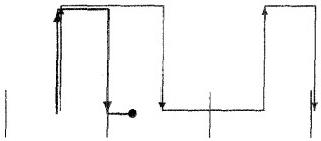{width="2.2222211286089237in"
height="0.9712084426946632in"}

> Fig.2.an example

The protocol has to cope with one more thing:timing uncertainty.Because
perfect clocks do not exist in the physical world and because the
protocol is implemented on a processor that also has to execute a number
of other time critical tasks,a quite large timing uncertainty is
allowed.A bit-slot is 888 mi- croseconds,so the ideal time between two
edges is 888 or 444 microseconds.On the generation of edges a timing
uncertainty of±5%is allowed.That is:between 844 and 932 for one bit-slot
and between 422 and 466 for half a bit-slot.The collision detection just
before an up-going edge and the actual generation of this up-going edge
must be at most 20 microseconds.The timing uncertainty on the collision
detection on one and three quarters after the generation of a down-going
edge is ±22 microseconds.Also the receiver has a timing uncertainty of
±5%. And,to complete the timing information,the distance between the end
of one

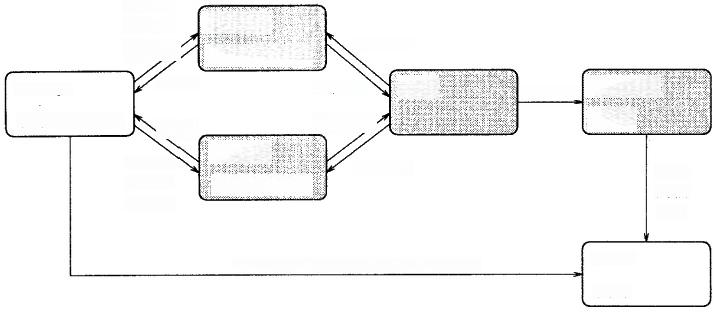

> Fig.3.Philips Audio-Control Protocol with Bus Collision.
>
> message and the beginning of the next must be at least 8000
> microseconds(8 milliseconds).
>
> **5 A Formal Model of the Protocol**
>
> To analyze the behavior of the protocol we model the system as a
> network of six timed automata.The network consists of two parts:a core
> part and a testing environment.The core part models the components of
> the protocol to be imple- mented:two senders,a wire and a receiver.The
> testing environment,consisting of a message generator and an output
> checker,is used to model assumptions about the environment of the
> protocol and for testing the behavior of the core part.Figure 3 shows
> a flow-graph of the network where nodes represent timed automata and
> edges represent synchronization channels or shared variables (en-
> closed within parenthesis).
>
> The general idea of the specification is as follows.The automaton
> **Message** generates messages for both senders,and also informs the
> Check automaton on the bits it generated for SenderA.The senders
> transmit the messages via the wire to the receiver.The receiver
> communicates the bits it decoded to the checker. Thus the Check
> automaton is able to compare the bits generated by Message and the
> bits received by Receiver.If this matches the protocol is correct.
>
> The senders A and B are,modulo renaming(all A\'s in identifiers to
> B\'s), exactly the same.Because of this symmetry,it is enough to check
> that the messages transmitted by sender A are received correctly.We
> will proceed with a short description of each automaton.The definition
> of these uses a number of constants that are declared in Figure 4.
>
> The Senders.Sender A is depicted in Figure 5.It takes input actions
> Ahead0?, Ahead1?and Aempty?.The output actions UP!and DOWN!will be the
> Manch- ester encoding of the message.The clock Ax is used to measure
> the time between

UP!and DOWN!actions.The idea behind the specification(taken from
\[DY95\]) is that the sender changes location each half of a
bit-slot.The locations HS (wire is high in second half of bit-slot)and
HF(high in first half of bit-slot) refer to this idea.Extra locations
are needed because of the collision detection.

The clock Ad is used to measure the time elapsed between the detection
just be- fore UP!action and the corresponding UP!action.Furthermore the
time elapsed since the last DOWN!action is measured.The system is in the
locations ar_Qfirst and ar_Qlast when the next thing to do is the
collision test at one or three quar- ters of a bit-slot.When Volt is
greater than zero,at that moment,the sender detects a collision,stops
transmitting and returns to the idle location.The clock w is used to
ensure the\'radio silence\'between messages.This variable is checked on
the transition from idle to ar_first up.

The Wire. This small automaton keeps track of the voltage on the wire
and generates VUP!actions when appropriate,that is when a UP?action is
received when the voltage is low.

The Receiver.Receiver (Figure 6)decodes the bit sequence using the
up-going (modeled as VUP?)changes of the wire.Decoded bits are signaled
to the environ- ment using output actions Add0!,Add1!and OUT!(OUT!is
used for signaling the end of a decoded message).The decoding algorithm
of the receiver is a direct translation of the algorithm in the Philips
documentation of the protocol.In the automaton each VUP?transition is
followed by a transition modeling the decod- ing.This decoding
happens\'at once\'therefore these intermediate locations are modeled as
committed locations.The automaton has two important locations, L1 and
L0.When the last received bit is a bit"1"the receiver is in location L1,
after receiving a bit"0"it will be in location L0.The error location is
entered when a VUP?is received much to early.In the complete
specification the error location is not reachable,see Section 6.The
receiver keeps track of the parity of the received message using the
integer variable odd.When the last received bit is a bit"1"and the
message is even,a bit"0"is added to make the complete message of odd
length.

The Message Generator.The message generator generates messages of odd
length for both sender A and B.Furthermore,the messages generated for
sender A, are communicated to the checker.When a collision is detected
by sender A this is communicated to the message generator via Acoll?.The
message generator will communicate this on his turn to the checker via
CAcoll!.Generating messages of odd length is quite simple.The only
problem is that it is not allowed that a message for one sender is a
prefix of the message for the other sender.To be more precise:If only
one sender is transmitting there is no prefix restriction. Only when the
two senders start transmitting at the same time,it is not allowed that
one sender transmits a prefix of the message transmitted by the other.As
mentioned before the reason for this restriction is that the prefix
message is not received by the receiver and it is possible that the
senders do not notice the collision.In other words:The prefix message
can be lost.

**The Checker.** This automaton keeps track of the bits in transit',that
is the

bits that are generated by the message generator but not yet decoded by
the receiver.Whenever a bit is decoded or the end of the message is
detected not conform the generated message the checker enters an error
location.Furthermore when sender A detects a collision the checker
returns to its initial location.

**6 Verification in UPPAAL**

In this section we verify correctness of the protocol described in
previous sections. Recall,that the system is modelled as a network of
the six timed automata: Message SenderA,SenderB,Wire,Receiver and
Check,and that properties are specified as logical formulas.

The Correctness Criteria. The correct behaviour of the protocol is
ensured whenever the control of the automaton Check is in location a or
start.If an incorrect behaviour is detected the Check-automaton enters
the error-location, consequently property(1)requires that the
Check-automaton is always in loca- tion start or a:

VO(Check.start V Check.a) (1)

For the property to be satisfied it is required that the bit sequence
received by the Receiver matches the bit sequence sent by
SenderA.Furthermore,it is also required that the entire bit sequence is
received by Receiver (and communicated to the Check-automaton).This is
ensured since the error-location of the Check- automaton is reachable if
the end of a bit sequence is signalled by Receiver(i.e. OUT!)when
unmatched bits exists in the Check-automaton.

If the Receiver-automaton observes changes of the wire too early in
location L1 or L0 control is changed to location error.It is imaginable
that error recovery can be implemented from this location.However,if the
other components of the protocol conform to the specification this
location should not be reachable,thus property(2)requires that the
error-location in Receiver is never reachable.

VO┐ **Receiver.error** (2)

**Incorrectness.** Unfortunately the protocol described in this paper is
not the protocol that Philips has implemented.The original sender
checked less often for bus collisions.The \'just before the up going
edge'collision detection was only performed before the first up.(In our
modelling this corresponds to modi- fying SenderA and **SenderB** in the
following way:delete the outgoing transitions of location ar_Qlast_ok
and use the outgoing transitions of location ar-up_ok in- stead.)This
version is incorrect.In general the problem is that if both senders are
transmitting and one is slow and the other fast,the distance can
cumulate to a high value and this can confuse the receiver.UPPAAL
generated a counter example trace.

Although this problem was known by Philips is it interesting to see how
pow- erful the diagnostic traces can be.It enables us not only to find
mistakes in the model of a protocol,but also to find design mistakes in
real life protocols.

**The Verification Results**.UPPAAL successfully verifies the
correctness prop- erties(1)and(2)for an error tolerance of 5%on the
timing.Recall that SenderA and SenderB are,modulo renaming,exactly the
same,implying that the verified properties for **SenderA** also applies
to the symmetric case for SenderB.Prop- erty(1)was verified in 7.5 hrs
using 527.4 MB of memory,property(2)in 1.32 hrs using 227.9 MB of
memory.

The analysis of the incorrect version of the protocol with less
collision detection (discussed above)uses UPPAAL\'s ability to generate
diagnostic traces whenever a certain property is not satisfied by the
system.The trace,consisting of 46 transitions,was generated in 13.0 min
using 290.4 MB of memory.Also,attempts to verify Property(1)for the ull
protocol with an error tolerance of 6%on the timing failed.The scenario
is similar to the one found by Bosscher et al. in \[BPV94\]for the one
sender protocol.

The properties(above)were verified using the verification algorithm for
han- dling committed locations,described in Section 3,implemented in a
new proto- type version of UPPAAL,installed on a SGI ONYX.

**7 Conclusion**

In this paper it is shown to be possible to verify properties of a
realistic case study using UPPAAL.The tool is able to verify the
correctness properties of the Philips Audio Protocol,that is:the
receiver only receives messages that are transmitted.Furthermore the
ability of UPPAAL to generate diagnostic traces proved very useful.When
writing formal specifications(some)humans tend to make mistakes.These
mistakes are much easier to locate using a tool that can generate
scenarios.This in contrast with using a tool that only provides Yes/No
answers to queries.

We proposed the use of committed locations in UPPAAL
specifications.Using these provides a significant efficiency
improvement.Furthermore the memory consumption decreases when using
committed locations.

Even more important than the efficiency improvement is that committed
loca- tions sometimes allow a more natural specification.If a system
does a broadcast or multi-way synchronization,this can be modelled much
nicer using committed locations.Without committed locations it is not
possible in UPPAAL to prohibit other components to perform actions
during the broadcast.With committed locations these multi communications
can be modelled as a single atomic action.

Another option to model broadcast synchronization is to use another
synchro- nization mechanism than handshake as used in UPPAAL.We prefer
the use of committed locations because it is easier to embed in the
model and easier to im- plement.We also think that committed locations
and handshake synchronization provide a flexible and expressive model
for specifying protocols.

**References**

\[AD90\] R.Alur and D.Dill.Automata for Modelling Real-Time Systems.In
Proc.

> of ICALP\'90,LNCS 443,1990.
>
> \[BL96\] Johan Bengtsson and Fredrik Larsson.UPPAAL a Tool for
> Automatic Ver-
>
> ification of Real-time Systems.Master\'s thesis,Uppsala
> University,1996.
>
> \[BLL+95\] Johan Bengtsson,Kim G.Larsen,Fredrik Larsson,Paul
> Pettersson,and Wang Yi.UPPAAL---a Tool Suite for Automatic
> Verification of Real- Time Systems.In Proc.of the Lth DIMACS Workshop
> on Verification and Control of Hybrid Systems,1995.To appear in
> LNCS,1996.
>
> \[BPV94\] D.J.B.Bosscher,I.Polak,and F.W.Vaandrager.Verification of an
> Audio-
>
> Control Protocol.In Proc.of FTRTFT\''94,LNCS 863,pages 170-192, 1994.
>
> \[DY95\] C.Daws and S.Yovine.Two examples of verification of multirate
> timed
>
> automata with KRONOS.In Proc.of the 16th IEEE Real-Time Systems
> Symposium,pages 66-75,December 1995.
>
> \[Gri94\] W.O.D.Griffioen.Analysis of an Audio Control Protocol with
> Bus Col-
>
> lision.Master\'s thesis,University of Amsterdam,Programming Research
> Group,1994.
>
> \[HHWT95\] Thomas A.Henzinger,Pei-Hsin Ho,and Howard
> Wong-Toi.HYTECH:The Next Generation.In Proc.of the 16th IEEE Real-Time
> Systems Sympo- sium,pages 56-65,December 1995.
>
> \[HRP94\] N.Halbwachs,P.Raymond,and Y.-E.Proy.Verification of linear
> hybrid
>
> systems by means of convex approximations.In Static Analysis
> Symposium, LNCS 864,pages 223-237,1994.
>
> \[HWT95\] Pei-Hsin Ho and Howard Wong-Toi.Automated Analysis of an
> Audio
>
> Control Protocol.In Proc.of CAV95,LNCS 939,1995.
>
> \[LPY95\] Kim G.Larsen,Paul Pettersson,and Wang Yi.Diagnostic
> Model-Checking
>
> for Real-Time Systems.In Proc.of the 4th DIMACS Workshop on Verifi-
> *cation and Control of Hybrid Systems,1995.To appear in LNCS,1996.*
>
> \[YPD94\] Wang Yi,Paul Pettersson,and Mats Daniels.Automatic
> Verification of
>
> Real-Time Communicating Systems By Constraint-Solving.In Proc.of the
> *7th International Conference on Formal Description Techniques,1994.*

+----------:+----------------:+----------:+
| The constants in the automata           |
+-----------+-----------------+-----------+
| > W       | > w             | > 80000   |
+-----------+-----------------+-----------+
| > D       | > d             | > 200     |
+-----------+-----------------+-----------+
| > Almin   | > q-g           | > 2000    |
+-----------+-----------------+-----------+
| > A1max   | > q+g           | > 2440    |
+-----------+-----------------+-----------+
| > A2min   | > 3\*q-g        | > 6440    |
+-----------+-----------------+-----------+
| > A2max   | > 3\*q+g        | > 6880    |
+-----------+-----------------+-----------+
| > Q2      | > 2\*q          | > 4440    |
+-----------+-----------------+-----------+
| > Q2minD  | > 2\*q\*(1-t)-d | > 4018    |
+-----------+-----------------+-----------+
| > Q2min   | > 2\*q\*(1-t)   | > 4218    |
+-----------+-----------------+-----------+

> Fig.4.Declaration of Constants.

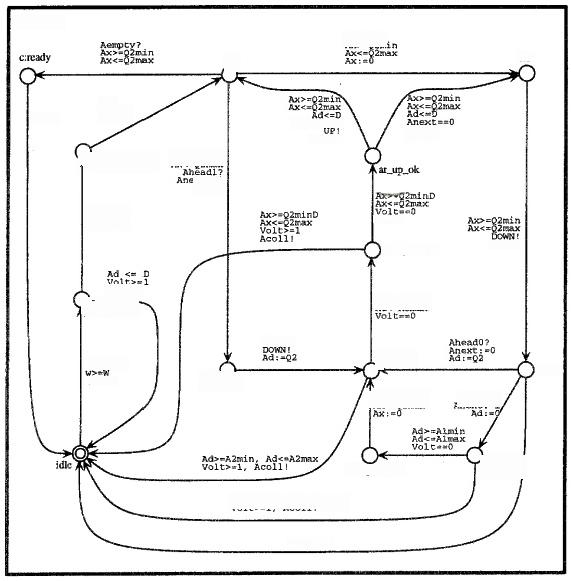

> Fig.5.The SenderA Automaton.

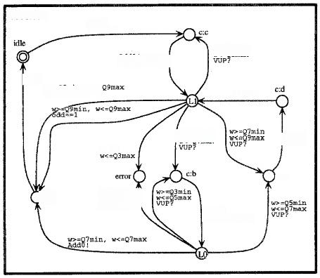

> Fig.6.The Receiver Automaton.
