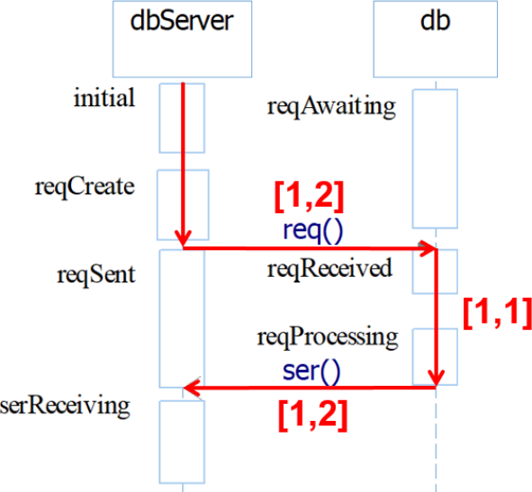
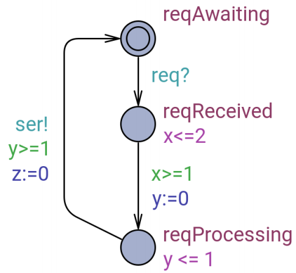
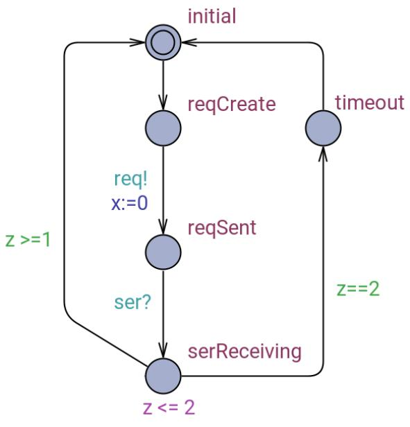
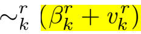
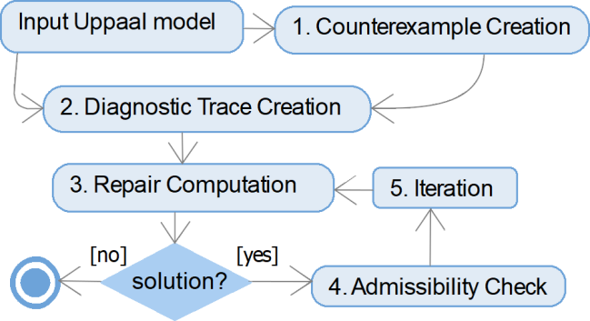

> **Clock Bound Repair for Timed Systems**
>
> Martin Ko"lbl1 , Stefan Leue1 , and Thomas Wies2
>
> 1 University of Konstanz, Konstanz, Germany
>
> {Martin.Koelbl,Stefan.Leue}@uni-konstanz .de
>
> 2 New York University, New York, NY, USA
>
> wies@cs .nyu .edu
>
> {width="4.015708661417323in"
> height="0.26429133858267717in"}**Abstract.** We present algorithms and
> techniques for the repair of timed system models, given as networks of
> timed automata (NTA). The repair is based on an analysis of timed
> diagnostic traces (TDTs) that are computed by real-time model checking
> tools, such as UPPAAL, when they detect the violation of a timed
> safety property. We present an encoding of TDTs in linear real
> arithmetic and [use the]{.mark} [MaxSMT capabilities of the SMT solver
> Z3 to compute possible repairs to clock]{.mark} [bound values that
> minimize the necessary changes to the automaton]{.mark}. We then
> present an [admissibility criterion, called functional
> equivalence,]{.mark} that assesses whether a proposed repair is
> admissible in the overall context of the NTA. We have implemented a
> proof-of-concept tool called TARTAR for the repair and ad- missibility
> analysis. To illustrate the method, we have considered a number of
> case studies taken from the literature and automatically injected
> changes to clock bounds to generate faulty mutations. Our technique is
> able to compute a feasible repair for 91% of the faults detected by
> UPPAAL in the generated mutants.
>
> **Keywords:** Timed Automata · Automated repair · Admissibility of
> repair · TAR - TAR tool.
>
> **1 Introduction**
>
> The analysis of system design models using model checking technology
> is an important step in the system design process. It enables the
> automated verification of system prop- erties against given design
> models. The automated nature of model checking facilitates the
> integration ofthe verification step into the design process since it
> requires no further intervention of the designer once the model has
> been formulated and the property has been specified.
>
> Often it is sufficient to [abstract from real time aspects when
> checking system prop-]{.mark} [erties, in particular when the focus is
> on functional aspects of the system]{.mark}. However, when
> non-functional properties, such as response times or the timing of
> periodic be- havior, play an important role, it is necessary to
> incorporate real time aspects into the models and the specification, as
> well as to use specialized real-time model checking tools, such as
> UPPAAL \[[6](#bookmark1)\], Kronos \[[31](#bookmark2)\] or opaal
> \[[11](#bookmark3)\] during the verification step.
>
> Next to the automatic nature of model checking, the ability to return
> counterexam- ples, in real-time model checking often referred to as
> [timed diagnostic traces (TDT)]{.mark}, is a further practical benefit
> of the use of model checking technology. A TDT describes a timed
> sequence of steps that lead the design model from the initial state of
> the system
>
> 2 M. Ko"lbl et al.
>
> into a state violating a real-time property. A TDT neither constitutes
> a causal explana- tion of the property violation, nor does it provide
> hints as to how to correct the model.
>
> In this paper we describe an automated method that computes proposals
> for possi- ble repairs of a network of timed automata (NTA) that avoid
> the violation of a timed safety property. Consider the TDT depicted as
> a time annotated sequence diagram \[[5](#bookmark30)\] in Figure
> [1](#bookmark5). This scenario describes a simple message exchange
> where the process dbServer sends a message req to process db which,
> after some processing steps returns a message ser to dbServer. Assume
> a requirement on the system to be that [the time from sending req to
> receiving ser is not to be more than 4 time units.]{.mark} Assume that
> the timing interval annotations on the sequence diagram represent the
> minimum and maximum time for the message transmission and processing
> steps that the NTA, from which the diagram has been derived, permits.
> It is then easy to see that it is possible to execute the system in
> such a way that this property is violated.
>
> Various changes to the underlying NTA model, depicted in Figure
> [2](#bookmark6), may avoid this property violation. For instance, the
> maximum time it takes to transmit the req and ser messages can be con-
> strained to be at most 1 time unit, re- spectively. Alternatively, it
> may be pos- sible to avoid the property violation by reducing two of
> the three timings by 0.5 time units. In any case, proposing such
> changes to the model may either serve to correct clerical mistakes
> made during the editing of the model, or point to necessary
> []{#bookmark5 .anchor}changes in the dimensioning ofits time re-
> sources, thus contributing to improved de- sign space exploration.

{width="1.9685837707786527in"
height="1.8212029746281715in"}

**Fig. 1.** TDT represented as a Sequence Diagram with Timing
Annotations

> The repair method described in this paper relies on an encoding of a
> TDT as a
>
> constraint system in linear real arithmetic. [This encoding provides a
> symbolic abstract]{.mark} [semantics for the TDT by constraining the
> sojourn time of the NTA in the locations]{.mark} [visited along the
> trace.]{.mark} The constraint system is then augmented by auxiliary
> model variation variables which represent syntactic changes to the NTA
> model, for instance the variation of a location invariant condition or
> a transition guard. We assert that the thus modified constraint system
> implies the non-reachability of a violation. At the same time, we
> assert that the model variation variables have a value that implies
> that no change of the NTA model will occur, for instance by setting a
> clock bound variation variable to 0. This renders the resulting
> constraint system unsatisfiable.
>
> In order to compute a repair, we derive a partial MaxSMT instance by
> turning the constraints that disable any repair into soft constraints.
> We solve this MaxSMT instance using the SMT solver Z3
> \[[25](#bookmark7)\]. If the MaxSMT instance admits a solution, the
> resulting model provides values of the model variation variables.
> These values indicate a repair
>
> Clock Bound Repair for Timed Systems 3
>
> of the NTA model which entails that along the sequence of locations
> represented by the TDT, the property violation will no longer be
> reachable.
>
> In a next step it is necessary to check whether the computed repair is
> an admissi- ble repair in the context of the full NTA. [This is
> important since the repair was com-]{.mark} [puted locally with
> respect to only a single given TDT.]{.mark} Thus, it is necessary to
> define a notion of admissibility that is reasonable and helpful in this
> setting. To this end, we propose the notion of *functional
> equivalence* which states that as a result of the com- puted repair,
> neither erstwhile existing functional behavior will be purged, nor
> will new functional behavior be added. [Functional behavior in this
> sense is represented by lan-]{.mark} [guages accepted by the untimed
> automata of the unrepaired and the repaired NTAs.]{.mark} [Functional
> equivalence is then defined as equivalence of the languages accepted
> by]{.mark} [these automata.]{.mark} We propose a [zone-based automaton
> construction]{.mark} for implementing the functional equivalence test
> that is efficient in practice.
>
> We have implemented our proposed method in a proof-of-concept tool
> called TAR - TAR[3](#bookmark8). Our evaluation of TARTAR is based on
> several [non-trivial NTA]{.mark} models taken from the literature,
> including the frequently considered [Pacemaker model]{.mark}
> \[[19](#bookmark9)\]. For each model, we automatically generate
> mutants by injecting clock bound variations which we then model check
> using UPPAAL and repair using TARTAR. The evaluation shows that our
> technique is able to compute an admissible repair for 91% of the
> detected faults.
>
> *Related Work.* There are relatively few results available on a formal
> treatment of TDTs. The zone based approach to real-time model
> checking, which relies on a constraint- based abstraction of the state
> space, is proposed in \[[14](#bookmark10)\]. The use of constraint
> solving to perform reachability analysis for NTAs is described in
> \[[30](#bookmark11)\]. This approach ultimately leads to the on-the-fly
> reachability analysis algorithm used in UPPAAL \[[7](#bookmark12)\].
> \[[12](#bookmark13)\] de- fines the notion of a time-concrete UPPAAL
> counterexample. [Work documented in \[[27](#bookmark14)\]]{.mark}
> [describes the computation of concrete delays for symbolic
> TDTs]{.mark}. The above cited ap- proaches address neither fault
> analysis nor repair for TDTs. Our use of MaxSMT solvers for computing
> minimal repairs is inspired by the use MaxSAT solvers for fault local-
> ization in C programs, which was first explored in the BugAssist tool
> \[[20](#bookmark15), [21](#bookmark16)\]. Our approach also shares
> some similarities with syntax-guided synthesis
> \[[2](#bookmark29),[28](#bookmark18)\], which has also been deployed
> in the context of program repair \[[22](#bookmark19)\]. One key
> difference is how we determine the admissibility of a repair in the
> overall system, which takes advantage of the semantic restrictions
> imposed by timed automata.
>
> *Structure of the Paper.* We will introduce the automata and real-time
> concepts needed in our analysis in § [2](#bookmark8). In §
> [3](#bookmark21) we present the logical formalization of TDTs. The
> repair and admissibility analyses are presented in § [4](#bookmark22)
> and [5](#bookmark23), respectively. We report on tool development,
> experimental evaluation and case studies in §[6](#bookmark24) and
> §[7](#bookmark25)concludes.
>
> []{#bookmark8 .anchor}**2 Preliminaries**
>
> The timed automaton model that we use in this paper is adapted from
> \[[7](#bookmark12)\]. Given a set of *clocks* C, we denote by B(C) the
> set of all *clock constraints* over C, which are
>
> 3 TARTAR and links to all models used in this paper can be found at
> URL <https://github.com/sen-uni-kn/tartar>.
>
> conjunctions of *atomic clock constraints* of the form c ∼ n, where c
> ∈ C, ∼∈ {\<, ≤ , =, ≥, \>} and n ∈ N. A *timed automaton (TA)* T is a
> tuple T = (L, l0 , C, Σ, Θ, I) where L is a finite set of locations, l0
> ∈ L is an initial location, C is a finite set of clocks, [Σ is a set of
> action labels,]{.mark} Θ ⊆fin L × B(C) × Σ × 2C × L [is a set of
> *actions*,]{.mark} and I : L → B(C) denotes a labeling of locations
> with clock constraints, referred to as location invariants. For θ ∈ Θ
> with θ = (l, g, a, r, l, ) we refer to g as the *guard* of θ and to r
> as its *clock resets*.
>
> [The operational semantics of T is given by a timed transition system
> consisting of]{.mark} [states s = (l, u) where l is a location and u :
> C → R+ is a *clock valuation*]{.mark}. The initial state s0 is (l, u0
> ) where u0 maps all clocks to 0. For a clock constraint B we write u
> \|= B iff B evaluates to true in u. There are two types of
> transitions. [An *action tran-*]{.mark} [*sition* models the execution
> of an action whose guard is satisfied.]{.mark} These transitions are
> instantaneous and reset the specified clocks. [The passing of time in a
> location is mod-]{.mark} [eled by *delay transitions*]{.mark}. Both
> types of transitions guarantee that location invariants are satisfied
> in the pre and post state. Formally, we have (l, u)
> −{width="0.10737423447069117in"
> height="0.18568022747156607in"} (l, , u, ) iff
>
> **一** [(action transition)]{.mark} t = (l, g, a, r, l, ) ∈ Θ , u \|=
> I(l) ∧ g, u, \|= I(l, ) and for all clocks c ∈ C, u, (c) = 0 if c ∈ r
> and u, (c) = u(c) otherwise; or
>
> **一** [(delay transition)]{.mark} t ∈ R+ , u \|= I(l), u, \|= I(l)
> and u, = u + t.
>
> **Definition 1.** *A* symbolic timed trace *(STT) of* T *is a sequence
> of actions* S = θ0 , . . . , θn- 1*. A* realization *of* S *is a
> sequence of delay values* δ0, . . . , δn *such that there exists
> states* s0 , . . . , sn , sn+1 *with* si
> {width="0.20991141732283464in"
> height="0.18720800524934383in"}{width="0.20991141732283464in"
> height="0.18720800524934383in"} si+1 *for all* i ∈ \[0, n) *and* sn
> {width="0.20991141732283464in"
> height="0.18720800524934383in"} sn+1 *. [We]{.mark} [say that a STT is
> ]{.mark}*[feasible *if it has at least one realization.*]{.mark}
>
> *Property Specification.* We focus on the analysis of timed safety
> properties, which we characterize by an invariant formula that has to
> hold for all reachable states of a TA. [These properties state, for
> instance, that there are certain locations in which the value
> of]{.mark} [a clock variable is not above, equal to or below a certain
> (integer) bound]{.mark}. Formally, let T = (L, l0 , C, Σ, Θ, I) be a
> TA. A *timed safety property* Π is a [Boolean combination of]{.mark}
> [atomic clock constraints and *location predicates*]{.mark} \@l where
> l ∈ L. A location predicate \@l holds in a state (l, , u) of T iff l,
> = l. We say that a STT S witnesses a violation of Π in T if there
> exists a realization of S whose induced final state does not satisfy Π
> . We refer to such an STT as a *timed diagnostic trace* of T for Π .
>
> T satisfies Π iff all its reachable states satisfy Π . This problem can
> be decided us- ing model checking tools such as Kronos
> \[[31](#bookmark2)\] and UPPAAL \[[6](#bookmark1)\]. UPPAAL in
> particular computes a finite abstraction of the state space of an NTA
> using a zone graph con- struction. Reachability analysis is then
> performed by an on-the-fly search of the zone graph. If the property is
> violated, the tool generates a feasible TDT that witnesses the
> violation. The objective of our work is to analyze TDTs and to propose
> repairs for the property violation that they represent. We use TDTs
> generated by the UPPAAL tool in our implementation, but we maintain
> that our results can be adapted to any other tool producing TDTs.
>
> We further note that UPPAAL takes a *network of timed automata* (NTA)
> as in- put, which is a CCS \[[24](#bookmark26)\] style parallel
> composition of timed automata T1 \| . . . \| Tn.
>
> Since our analysis and repair techniques focus on timing-related
> errors rather than syn- chronization errors, [we use TAs rather than
> NTAs in our formalization. However, our]{.mark} []{#bookmark27
> .anchor}[implementation works on NTAs.]{.mark}
>
> *Example 1.* The running example that we use throughout the paper
> consists of an NTA of two timed automata, depicted in Figure
> [2](#bookmark6). As alluded to in the introduction, the TAs dbServer
> and db synchronize via the exchange of messages modeled by the pairs
> of send and receive actions req! and req?, respectively, ser! and
> ser?. The trans- mission time of the req message is controlled by the
> clock variable x and can range between 1 and 2 time units. This is
> achieved by the location invariant x\<=2 on the reqReceived location
> in db together with the transition guard x\>=1 on the tran- sition
> from reqReceived to reqProcessing. A similar mechanism using clock
> variable z is used to constrain the timing of the transfer of message
> ser to be within 1 and 2 time units. The processing time in dbServer
> is constrained to exactly 1 time unit by the location invariant y\<=1
> and the transition guard y\>=1. In dbServer, a transition to location
> timeout can be triggered when the guard z==2 is satisfied in location
> serReceiving. T[he clock variable x, which is not reset until the next
> req]{.mark} [message is sent, is recording the time that has elapsed
> since sending req and is used]{.mark} [in location serReceiving in
> order to verify if more than 4 time units have passed]{.mark} [since
> req was sent]{.mark}. The timed safety property that we will consider
> for our example is Π = ¬@dbServer.serReceiving ∨ (x \< 4). For the
> violation of this property, UPPAAL produces the TDT S = θ0 . . . θ3
> where
>
> θ0 = ((initial, reqAwaiting), ∅, τ, ∅, (reqCreate, reqAwaiting))
>
> θ 1 = ((reqCreate, reqAwaiting), ∅, τ, {x}, (reqSent, reqReceived))
>
> θ2 = ((reqSent, reqReceived), {x ≥ 1}, τ, {y}, (reqSent, reqProc.))
>
> θ3 = ((reqSent, reqProc.), {y ≥ 1}, τ, {z}, (serReceiving,
> reqAwait.)).
>
> []{#bookmark21 .anchor}**3 Logical Encoding of Timed Diagnostic
> Traces**
>
> Our analysis relies on a logical encoding of TDTs in the theory of
> quantifier-free linear real arithmetic. For the remainder of this
> paper, we fix a TA T = (L, l0 , C, Σ, Θ, I) with a safety property Π
> and assume that S = θ0, . . . , θn- 1 is an STT of T. We use the
> following notation for our logical encoding where j ∈ \[0, n + 1\] is
> a position in a realization of S and c ∈ C is a clock:
>
> **一** lj denotes the location of the pre state of θj for j \< n and
> the location of the post state of θj-1 for j = n.
>
> **一** cj denotes the value of clock variable c when reaching the
> state at position j.
>
> **一** δj denotes the delay of the delay transition leaving the state
> at position j ≤ n.
>
> **一** *reset*j denotes the set of clock variables that are being
> reset by action θj for j \< n.
>
> **一** *ibounds*(c, l) denotes the set of pairs (β, \~) such that the
> atomic clock constraint c \~ β appears in the location invariant I(l).
>
> **一** *gbounds*(c, θ) denotes the set of pairs (β, \~) such that the
> atomic clock constraint c \~ β appears in the guard of action θ .

{width="1.6141852580927385in"
height="1.4847331583552057in"}{width="1.9684448818897637in"
height="2.049339457567804in"}

> []{#bookmark6 .anchor}(a) Timed Automaton dbServer (b) Timed Automaton
> db
>
> **Fig. 2.** Network of Timed Automata - Running Example
>
> To illustrate the use of *ibounds*, assume location l to be labeled
> with invariants x \> 2 ∧ x ≤ 4 ∧ y ≤ 1, then *ibounds*(x, l) = {(2,
> \>), (4, ≤)}. The usage of *gbounds* is accordingly.
>
> **Definition 2.** *The* timed diagnostic trace constraint system
> *associated with STT*S *is the conjunction* T *of the following
> constraints:*
>
> {width="4.035898950131234in"
> height="0.32101924759405076in"}
>
> {width="4.001291557305337in"
> height="0.32746391076115483in"}
>
> R 三 \^ cj+1 = 0 *(clock resets)*
>
> {width="0.38724628171478565in"
> height="0.1206266404199475in"}
>
> {width="4.002233158355206in"
> height="0.3343930446194226in"}
>
> {width="3.983292869641295in"
> height="0.3343930446194226in"}
> {width="3.9789851268591425in"
> height="0.3343930446194226in"}
>
> {width="3.985706474190726in"
> height="0.32901793525809275in"}
>
> *Let further* [Φ 三 Π\[**c**n+1/**c**\] *where* Π\[**c**n+1/**c**\]
> *i*]{.mark}*s obtained from* Π *by substituting all occurrences of
> clocks* c ∈ C *with* cn+1 *. Then the* Π *-extended TDT constraint
> system associated with* S *is defined as* TΠ = T ∧ ¬Φ*.*
>
> To illustrate the encoding consider the transition Θ3 of the TDT in
> Example [1](#bookmark27) corre- sponding to the transition from state
> (reqSent, reqProcessing) to state (serReceiving, reqAwaiting) while
> resetting clock z in the NTA of Figure [2](#bookmark6). The encoding
> for the constraints on the clocks x, y and z is as following: y3 + d3
> ≥ 1, z4 = 0, x4 = x3 + d3 and y4 = y3 + d3.
>
> **Lemma 1.** δ, . . . , δ *is a realization of an STT* S *iff there
> exists a satisfying variable assignment* ι *for* T *such that for all*
> j ∈ \[0, n\]*,* ι(δj ) = δ *.*
>
> **Theorem 1.** *An STT* S *witnesses a violation of* Π *in* T *iff* TΠ
> *is satisfiable.*
>
> []{#bookmark22 .anchor}**4 Repair**
>
> We propose a repair technique that analyzes the
> [responsibility]{.mark} of clock bound values occurring in a single
> TDT for causing the violation of a specification Π . The analysis
> suggests possible syntactic repairs. In a second step we define an
> admissibility test that assesses the admissibility of the repair in
> the context of the complete TA model. Throughout this section, we
> assume that S is a TDT for T and Π .
>
> *Clock Bound Variation.* We introduce *bound variation variables* v
> that stand for *correc- tion values* that the repair will add to the
> clock bounds occurring in location invariants and transition guards.
> The values are chosen such that none of the realizations of S in the
> modified automaton still witnesses a violation of Π . [This is done by
> defining a new]{.mark} [constraint system that captures the conditions
> on the variable v under which the viola-]{.mark} [tion of Π will not
> occur in the corresponding trace of the modified automaton.]{.mark}
> Using this constraint system, we then define a maximum satisfiability
> problem whose solution minimizes the number of changes to T that are
> needed to achieve the repair.
>
> Recall that the clock bounds occurring in location invariants and in
> transition guards are represented by the *ibounds* and *gbounds* sets
> defined for the TDT S. Notice that each clock variable c may be
> associated with mc,l different clock bounds in the loca-
>
> tion invariant of l, denoted by the set *ibounds*(c, l) =
> {(β{width="0.12062445319335083in"
> height="0.20020778652668417in"} , \~,l ), . . . ,
> (β{width="9.412401574803149e-2in"
> height="0.18122156605424322in"}, l ,
> \~{width="9.412401574803149e-2in"
> height="0.18122156605424322in"}lc, l )}.
>
> Similarly, we enumerate the bounds in *gbounds*(c, θ) as
> (β{width="0.14086286089238845in"
> height="0.1911832895888014in"} , \~,θ ). To reduce nota-
>
> tional clutter, [we let the meta variable r stand for the pairs of the
> form c, l or c, θ]{.mark} . We
>
> then introduce bound variation variables v describing the possible
> static variation in
>
> the TA code for the clock bound β and modify the TDT constraint system
> accordingly.
>
> [A variation of the bounds only affects the location invariant
> constraints I and the tran-]{.mark} [sition guard constraints
> G.]{.mark} We thus define an appropriate invariant variation constraint
> I*bv* and guard variation constraint G*bv* that capture the clock
> bound modifications:
>
> I*bv* 三 \^ cj \~ (β + v) ∧ cj + δj \~ (β + v)
>
> (β ,\~)∈*ibounds*(c,lj )
>
> G*bv* 三 {width="0.5985837707786527in"
> height="0.3540409011373578in"}*unds*(c,θj ) cj + δj
> {width="0.7698064304461942in"
> height="0.1881375765529309in"}
>
> We also need constraints ensuring that the modified clock bounds remain
> positive:
>
> Z*bv* 三 \^ β + v ≥ 0
>
> (β ,\~)∈*ibounds*(c,lj ) U *gbounds*(c,θj )
>
> Putting all of this together we obtain the *bound variation TDT
> constraint system*
>
> T*bv* 三 C0 ∧ A ∧ R ∧ D ∧ I*bv* ∧ G*bv* ∧ Z*bv* ∧ L
>
> which captures all realizations of S in TAs T*bv* that are obtained
> from T by modifying the clock bounds β by some semantically consistent
> variations v .
>
> Consider the bound variation for the guard y ≥ 1 of transition Θ3 in
> Example [1](#bookmark27). The
>
> modified guard constraint, a conjunct in G*bv* , is y3 + d3 ≥ 1 + v .
> The corresponding
>
> non-negativity constraint from Z*bv* is 1 + v ≥ 0.
>
> *Repair by Bound Variation Analysis.* The objective of the bound
> variation analysis is to provide hints to the system designer
> regarding which minimal syntactic changes to the considered model
> might prevent the violation of property Π . Minimality here is
> considered with respect to the number of clock bound values in
> invariants and guards that need to be changed.
>
> {width="4.803194444444444in"
> height="0.45773622047244095in"}We implement this analysis by using the
> bound variation TDT constraint system T*bv* to derive an instance of
> the partial MaxSMT problem whose solutions yield candidate repairs for
> the timed automaton T. The partial MaxSMT problem takes as input a
> finite set of assertion formulas belonging to a fixed first-order theory.
> These assertions are partitioned into *hard* and *soft* assertions.
> The hard assertions FH are assumed to hold and the goal is to find a
> maximizing subset F/ ≤ FS of the soft assertions such that F/ ∪ FH is
> satisfiable in the given theory.
>
> For our analysis, the hard assertions consist of the conjunction
>
> F 三 (∃δj , cj. T*bv* ) ∧ (∀δj , cj. T*bv* ⇒ Φ).
>
> Note that the free variables of F are exactly the bound variation
> variables v . Given a satisfying assignment ι for F, let Tι be the
> timed automaton obtained from T by adding to each clock bound β the
> according variation value ι(v) and let Sι be the TDT corresponding to
> S in Tι . Then F guarantees that
>
> 1\. Sι is feasible, and
>
> 2\. Sι has no realization that witnesses a violation of Π in Tι .
>
> We refer to such an assignment ι as a *[local clock bound
> repair]{.mark}* for T and S. To obtain a minimal local clock bound
> repair, we use the soft assertions given by the conjunction
>
> F 三 \^ v = 0.
>
> (β , )∈*ibounds*(c,lj ) U *gbounds*(c,θj )
>
> Clearly F ∧ F is unsatisfiable because T*bv* ∧ F is equisatisfiable with
> T, and T ∧ ¬Φ is satisfiable by assumption. [However, if there exists
> at least one local clock]{.mark} [bound repair for T and S, then F
> alone is satisfiable.]{.mark} In this case, the MaxSMT
>
> instance F ∪ F has at least one solution. Every satisfying assignment
> of such a solution corresponds to a local repair that minimizes the
> number of clock bounds that need to be changed in T.
>
> Note that hard and soft assertions remain within a decidable logic.
> Using an SMT solver such as Z3, we can enumerate all the optimal
> solutions for the partial MaxSMT instance and obtain a minimal local
> clock bound repair from each of them.
>
> *Example 2.* We have applied the bound variation repair analysis to
> the TDT from Ex- ample [1](#bookmark27), using TARTAR, which calls Z3.
> The following repairs were computed:
>
> 1\. v{width="0.13488517060367455in"
> height="0.1966065179352581in"}5 = -1. This corresponds to a variation
> of the location invariant regarding clock
>
> z in location 5 of the TDT, corresponding to location
> dbServer.serReceiving, to read z ≤ 1 instead of z ≤ 2. This indicates
> that the violation of the bound on the total duration of the
> transaction, as indicated by a return to the serReceiving location and
> a value greater than 4 for clock x, can be avoided by ensuring that
> the time taken for transmitting the ser message to the dbServer is
> constrained to take exactly 1 time unit.
>
> 2\. A further computed repair is
> v{width="0.1058267716535433in"
> height="0.19687773403324585in"}l2 = -1. Interpreting this variation in
> the context of Example [1](#bookmark27)means that location db
> .reqReceived will be left when the clock
>
> x has value 1. In other words, the transmission of the message Req to
> the db takes exactly one time unit, not between 1 and 2 time units as
> in the unrepaired model.
>
> 3\. Another possible repair implies the modification of two clock
> bounds. This is no longer an optimal solution and no further optimal
> solution exists. Notice that even non-optimal solutions might provide
> helpful insight for the designer, for instance if [optimal repairs
> turn out not to be implementable, inadmissible or leading to a
> prop-]{.mark} [erty violation]{.mark}. It is therefore meaningful to
> allow a practical tool implementation to compute more than just the
> optimal repairs.
>
> []{#bookmark23 .anchor}**5 Admissibility of Repair**
>
> The synthesized repairs that lead to a TA Tι change the original TA T
> in fundamen- tal ways, both syntactically and semantically. This
> brings up the question whether the synthesized repairs are admissible.
> In fact, one of the key questions is what notion of
> [admissibility]{.mark} is meaningful in this context.
>
> A *timed trace* \[[7](#bookmark12)\] is a sequence of timed actions ξ
> = (t1 , a1 ), (t2 , a2 ), . . . that is generated by a run of a TA,
> where ti ≤ ti+1 for all i ≥ 1. [The timed language for a TA]{.mark} [T
> is the set of all its timed traces, which we denote by LT (T).]{.mark}
> [The untimed language of]{.mark} [T consists of words over T's
> alphabet Σ so that there exists at least one timed trace of]{.mark} [T
> forming this word.]{.mark} Formally, for a timed trace ξ = (t1 , a1 ),
> (t2 , a2 ) . . . , the untime operator μ(ξ) returns an untimed trace
> ξμ = a1 a2 \... . We define the untimed language Lμ (T) of the TA T as
> Lμ (T) = {μ(ξ) j ξ ∈ LT (T)}.
>
> {width="4.803166010498687in"
> height="0.29984580052493437in"}Let B be a Bu"chi automaton (BA)
> \[[10](#bookmark28)\] over some alphabet Σ . We write L(B) ≤ Σω for
> the language accepted by B. Similarly, we denote by Lf (B) ≤ Σ \* the
> language accepted by B if it is interpreted as a nondeterministic
> finite automaton (NFA). Further, we write *pref*(L(B)) to denote the
> set of all finite prefixes of words in L(B).
>
> For a given NFA or BA M, the *closure* cl(M) denotes the automaton
> obtained from M by [turning all of its states into accepting
> states]{.mark}. We call M closed iff M = cl(M). [Notice that a Bu"chi
> automaton accepts a safety language if and only if it is
> closed]{.mark} \[[1](#bookmark29)\].
>
> *Admissibility Criteria.* From a *syntactic* point of view the repair
> obtained from a sat- isfying assignment ι of the MaxSMT instance
> ensures that Tι is a [syntactically valid]{.mark} TA model by, for
> instance, placing non-negativity constraints on repaired clock bounds.
> In case repairs alter right hand sides of clock constraints to
> rational numbers, this can easily be fixed by normalizing all clock
> constraints in the TA.
>
> From a *semantic* perspective, the impact of the repairs is more
> profound. Since [the]{.mark} [repairs affect time bounds in location
> invariants and transition guards, as well as clock]{.mark} [resets,
> the behavior of Tι may be fundamentally different from the behavior of
> T.]{.mark}
>
> **一** First, the computed repair for one property Π may render
> another property ΠI violated. To check admissibility of the
> synthesized repair with respect to the set of all properties Π- in the
> system specification, [a full re-checking of Π- is necessary]{.mark}.
>
> **一** Second, a repair may have introduced zenoness and timelock
> \[[4](#bookmark30)\] into Tι . As dis- cussed in \[[4](#bookmark30)\],
> [there exists both an over-approximating static test for zenoness
> as]{.mark} [well as a model checking based precise test for timelocks
> that can be used to verify]{.mark} [whether the repair is admissible
> in this regard.]{.mark}
>
> **一** Third, due to changes in the possible assignment of time values
> to clocks, reachable locations in the TA T may become unreachable in
> Tι , and vice versa. On the one hand, this means that some
> functionalities of the system may no longer be provided since part of
> the actions in T will no longer be executable in Tι , and vice versa.
> Further, a reduction in the set of reachable locations in Tι compared
> to T may mean that certain locations with property violations in T are
> no longer reachable in Tι, [which implies that certain property
> violations are masked by a repair instead of]{.mark} [being
> fixed.]{.mark} On the other hand, the repair leading to locations
> becoming reachable in Tι that were unreachable in T may have the
> effect that previously unobserved property violations become visible
> and that Tι possesses functionality that T does not have, which may or
> may not be desirable.
>
> It should be pointed out that we assess admissibility of a repair
> leading to Tι with respect to a given TA model T, and not with respect
> to a correct TA model T\* satisfying Π .
>
> *Functional Equivalence.* While various variants of semantic
> [admissibility]{.mark} may be con- sidered, we are focusing on a
> notion of admissibility that ensures that a repair does [not]{.mark}
> [unduly change the functional behavior of the modeled system while
> adhering to the]{.mark} [timing constraints of the repaired
> system.]{.mark} We refer to this as *[functional equivalence]{.mark}*.
> The functional capabilities of a timed system manifest themselves in
> the sets of action or transition traces that the system can execute.
> For TAs T and Tι this means that we need to consider the languages
> over the action or transition alphabets that these TAs de- fine.
> Considering the timed languages of T and Tι , we can state that LT (T)
> {width="9.976377952755905e-2in"
> height="0.14141294838145232in"} LT (Tι ) since the repair forces at
> least one timed trace to be purged from LT (T). This means that
> [equivalence of the timed languages cannot be an admissibility
> criterion ensuring]{.mark} [functional equivalence.]{.mark} At the
> other end of the spectrum we may relate the de-timed
>
> languages of T and Tι. [The *de-time* operator α(T) is defined such
> that it omits all tim-]{.mark} [ing constraints and resets from any TA
> T.]{.mark} Requiring L(α(T)) = L(α(Tι )) is tempting since it states
> that when eliminating all timing related features from T and from the
> repaired Tι , the resulting action languages will be identical.
>
> However, this admissibility criterion would be flawed, since the repair
> in Tι may imply that unreachable locations in T will be reachable in
> Tι , and vice versa. This may have an impact on the untimed languages,
> and even though L(α(T)) = L(α(Tι )) it may be that Lμ (T)
> {width="9.976377952755905e-2in"
> height="0.14141294838145232in"} Lμ (Tι ). To illustrate this point,
> consider the running example in Fig. [2](#bookmark6) and assume the
> invariant in location dbServer .reqReceiving to be modified from z ≤ 2
> to z ≤ 1 in the repaired TA Tι. Applying the de-time operator to Tι
> implies that the location dbServer .timeout, which is unreachable in
> Tι , becomes reach- able in the de-timed model. Since dbServer
> .timeout is reachable in T, the TA T and Tι are not functionally
> equivalent, even though their de-timed languages are identi- cal.
> Notice that for the untimed languages Lμ (T)
> {width="9.976377952755905e-2in"
> height="0.14141294838145232in"} Lμ (Tι ) holds since no timed trace in
> LT (Tι ) reaches location timeout, even though such a timed trace
> exists in LT (T). In detail, Lμ (Tι ) contains the the untimed trace
> Θ0 Θ 1 Θ2 Θ3 Θ4 that is missing in Lμ (T) and where Θ4 is the
> transition towards the location dbServer .timeout. As con- sequence,
> we resort to considering the untimed languages of T and Tι and require
> [Lμ (T) = Lμ (Tι ).]{.mark} It is easy to see that Lμ (T) = Lμ (Tι ) )
> L(α(T)) = L(α(Tι )). In other words, the equivalence of the untimed
> languages ensures functional equivalence.
>
> {width="4.803180227471566in"
> height="0.4658880139982502in"}*Admissibility Test.* Designing an
> algorithmic admissibility test for functional equiv- alence is
> challenging due to the computational complexity of determining the
> equiv- alence of the untimed languages Lμ (T) and Lμ (Tι ). While
> language equivalence is decidable for languages defined by
> B{width="6.914807524059492e-2in"
> height="0.1667344706911636in"}chi Automata, it is undecidable for
> timed lan- guages \[[3](#bookmark31)\]. For untimed languages,
> however, this problem is again decidable \[[3](#bookmark31)\]. The
> algorithmic implementation of the test for functional equivalence that
> we propose pro- ceeds in two steps.
>
> **一** First, the untimed languages Lμ (T) and Lμ (Tι ) are
> constructed. This requires an [untime transformation of T and Tι
> yielding Bu"chi automata representing Lμ (T)]{.mark} [and Lμ (Tι
> )]{.mark}. While the standard untime transformation for TAs
> \[[3](#bookmark31)\] relies on a region construction, we propose a
> transformation that relies on a zone construction
> \[[14](#bookmark10)\]. This will provide a more succinct
> representation of the resulting untimed languages and, hence, a more
> efficient equivalence test.
>
> {width="4.56788823272091in"
> height="0.30191601049868766in"}**一** Second, it needs to be
> determined whether Lμ (T) = Lμ (Tι ). As we shall see, [the]{.mark}
> [obtained Bu"chi automata are closed]{.mark}. Hence, we can reduce the
> equivalence problem for these W-regular languages to checking
> equivalence of the regular languages obtained by taking the finite
> prefixes ofthe traces in Lμ (T) and Lμ (Tι ). This allows us to
> interpret the
> B{width="6.916994750656168e-2in"
> height="0.16636373578302713in"}chi automata obtained in the first step
> as NFAs, for which the language equivalence check is a standard
> construction \[[15](#bookmark32)\].
>
> *Automata for Untimed Languages.* The construction of an automaton
> representing an untimed language, here referred to as an *untime
> construction*, has so far been proposed based on a region abstraction
> \[[3](#bookmark31)\]. The region abstraction is known to be relatively
> inef- ficient since the number of regions is, among other things,
> exponential in the number of
>
> clocks \[[4](#bookmark30)\]. We therefore propose an untime
> construction based on the construction of a zone automaton
> \[[14](#bookmark10)\] which in the worst case is of the same
> complexity as the region []{#bookmark33 .anchor}automaton, but on the
> average is more succinct \[[7](#bookmark12)\].
>
> **Definition 3 (Untimed Bu... chi Automaton).** *Assume a TA* T *and
> the corresponding zone automaton* \[TIZ = (SZ ,
> s{width="0.2621576990376203in"
> height="0.15988188976377954in"}Z , ΘZ )*. We define the* untimed
> B{width="6.929680664916886e-2in"
> height="0.16561570428696412in"}chi automaton *as the closed BA* BT =
> (S, Σ, → , S0 , F) *obtained from* \[TIZ *such that* S = SZ *,*
>
> Σ = ΣZ \\ {δ} *and* S0 = {s}*. For every transition in* ΘZ *with a
> label* a ∈ Σ *we add*
>
> {width="0.9340277777777778in"
> height="0.2847069116360455in"}*a transition to* → *created by the
> rule* {width="0.9885269028871391in"
> height="0.2976323272090989in"} *with* z↑ = {v + djv ∈ z, d ∈ R ≥0}*.*
> {width="2.4382042869641296in"
> height="0.18844706911636044in"} (l, z) *to every state* (l, z) ∈ SB
> *.*
>
> The following observations justify this definition:
>
> **一** A timed trace of T may [remain forever in the same
> location]{.mark} after a finite number of action transitions. In order
> to enable B to accept this trace, we [add a self-transition]{.mark}
> [labeled with τ to → for each state s ∈ S in BT]{.mark} , and later
> define s as accepting. These τ -self-transitions extend every finite
> timed trace t leading to a state in Sτ to an infinite trace t.τω .
>
> **一** The construction of the acceptance set F is more intricate.
> Convergent traces are often excluded from consideration in real-time
> model checking \[[4](#bookmark30)\]. As a conse- quence, in the untime
> construction proposed in \[[3](#bookmark31)\], only a subset of the
> states in S may be included in F. A repair may render a subgraph of
> the location graph of T that is only reachable by divergent traces,
> into a subgraph in Tι that is only reach- able by convergent traces.
> However, excluding convergent traces is only meaning- ful when
> considering unbounded liveness properties, but not when analyzing
> timed safety properties, which in effect are safety properties. As
> argued in \[[7](#bookmark12)\], unbounded liveness properties appear
> to be less important than timed safety properties in timed systems.
> This is due to the observation that divergent traces reflect
> unrealistic be- havior in the limit, but finite prefixes of infinite
> divergent traces, which only need to be considered for timed safety
> properties, correspond to realistic behavior. This observation is also
> reflected in the way in which, e.g., UPPAAL treats reachabil- ity by
> convergent traces. [In conclusion, this justifies our choice to define
> the zone]{.mark} [automaton in the untime construction as a closed BA,
> i.e., F = S.]{.mark}
>
> **Theorem 2 (Correctness of Untimed Bu... chi Automaton
> Construction).** *For an un- timed
> B*{width="6.916119860017497e-2in"
> height="0.1652121609798775in"}*chi automaton* BT *derived from a TA* T
> *according to Definition [3](#bookmark33) it holds that* L(BT ) = Lμ
> (T)*.*
>
> *Equivalence Check for Untimed Languages.* Given that the zone
> automaton construc- tion delivers closed BAs we can reduce the
> admissibility test Lμ (T) = Lμ (Tι ) defined over infinite languages to
> an equivalence test over the finite prefixes of these languages,
> represented by interpreting the zone automata as NFAs. The following
> theorem justifies this reduction.
>
> **Theorem 3 (Language Equivalence of Closed BA).** *Given closed
> B*{width="6.918416447944006e-2in"
> height="0.1652121609798775in"}*chi automata* B *and* B9*, if* Lf (B) =
> Lf (B9 ) *then* L(B) = L(B9 )*.*
>
> {width="4.803152887139108in"
> height="0.45661089238845143in"}*Discussion.* One may want to adapt the
> admissibility test so that it only considers di- vergent traces, e.g.,
> in cases where only unbounded liveness properties need to be pre-
> served by a repair. This can be accomplished as follows. First, an
> overapproximating non-zenoness test \[[4](#bookmark30)\] can be
> applied to T and Tι . If it shows non-zenoness, then one knows that
> the respective TA does not include convergent traces. If this test
> fails, a more expensive test needs to be developed. It requires a
> construction of the untimed Bu"chi automata using the approach from
> \[[3](#bookmark31)\], and subsequently a language equivalence test of
> the untimed languages accepted by the untimed BAs using, for instance,
> the automata- theoretic constructions proposed in
> \[[9](#bookmark34)\].
>
> []{#bookmark24 .anchor}**6 Case Studies and Experimental Evaluation**
>
> We have implemented the repair computation and admissibility test in a
> proof-of-concept tool called TARTAR. We present the architecture of
> TARTAR and then evaluate the pro- posed method by applying TARTAR to
> several case studies.
>
> *Tool Architecture.* The control loop of TARTAR, depicted in Figure
> [3](#bookmark35), computes repairs for a given UPPAAL model and a
> given property Π using the following steps:
>
> 1\. *Counterexample Creation*. TARTAR calls UPPAAL with parameters to
> compute and store a shortest symbolic TDT in XML format, in case Π is
> violated.
>
> 2\. *Diagnostic Trace Creation*. Parsing the model and the TDT, TARTAR
> creates F Λ
>
> F as defined in Section [4](#bookmark22) . Z3 can only solve the MaxSMT
> problem for quantifier-
>
> free linear real arithmetic. Hence, TARTAR first performs a quantifier
> elimination on the constraints Yδj , cj. 丁*bv* 今 Φ of F .
>
> 3\. *Repair Computation*. Next, TARTAR attempts to compute a repair,
> by using Z3 to solve the generated quantifier-free MaxSMT instance. In
> case no solution is found, TARTAR terminates. Otherwise, TARTAR
> returns the repair that has been computed from the model of the MaxSMT
> solution.
>
> 4\. *Admissibility Check*. Using adapted routines provided by the
> opaal model checker \[[11](#bookmark3)\], TARTAR checks the
> admissibility of the computed repair. To do so, TARTAR modifies the
> constraints of the considered UPPAAL model as indicated by the
> computed repair. It calls opaal in order to compute the timed
> transition sys- tem (TTS) of the original and the repaired UPPAAL
> model. TARTAR then checks whether the two TTS have equivalent untimed
> languages, in which case the repair is admissible. [This check is
> implemented using the library AutomataLib included]{.mark} [in the
> package LearnLib]{.mark} \[[16](#bookmark36)\],
>
> 5\. *Iteration*. TARTAR is designed to enumerate all repairs, starting
> with the minimal ones, in an iterative loop. To accomplish this, at
> the end of each iteration i a new
>
> V{width="6.429352580927385e-2in"
> height="0.18351596675415574in"}1 is generated by forcing the bound
> variation variables that were used in the i-th
>
> repair to 0. This excludes the repair computed in iteration i from
> further consider-
>
> ation. Using
> V{width="6.427930883639545e-2in"
> height="0.19541010498687664in"}1 , TARTAR iterates back to Step 3 to
> compute another repair.
>
> {width="2.1613353018372705in"
> height="1.1734930008748907in"}*Evaluation Strategy.* The evaluation of
> our analysis is based on ideas taken from mutation testing
> \[[18](#bookmark37)\]. Mutation testing evaluates a test set by
> systematically mod- ifying the program code to be tested and computing
> the ratio of modifications that []{#bookmark35 .anchor}are detected by
> the test set. Real-time system models that contain violations of
>
> {width="2.8787773403324586in"
> height="0.4566097987751531in"}timed safety properties are not
> available in **Fig. 3.** Control Loop of TARTAR significant numbers. We
> therefore need to
>
> seed faults in existing models and check
>
> whether those can be found by our automated repair. An objective of
> mutation testing is that testing a proportion of the possible
> modification yields satisfactory results \[[18](#bookmark37)\]. In
> order to evaluate repairs for erroneous clock bounds in invariants and
> transition guards we seed modifications to all bounds of clock
> constraints by the amount of {---10; ---1; +1; +0.1·M; +M }, where M
> is the maximal bound a clock is compared against in a given model. If
> a thus seeded modification leads to a syntactically invalid UPPAAL
> model, then UPPAAL returns an exception and we ignore this
> modification. In analogy to mutation testing, we compute the count of
> TDTs for which our analysis finds an admissible repair.
>
> *Experiments.* We have applied this modification seeding strategy to
> eight UPPAAL models (see Table [1](#bookmark38)). Not all of the
> models that we considered have been published with a property that can
> be violated by mutating a clock constraint. [For those models,
> we]{.mark} [suggest a suitable timed safety property specifying an
> invariant condition.]{.mark} In particular, we add a property to the
> Bando \[[29](#bookmark39)\] model which ensures that, for as long as
> the sender is active, its clock never exceeds the value of 28;116 time
> units. In the FDDI token ring protocol \[[29](#bookmark39)\], the
> property that we use checks whether the first member of the ring never
> remains for more than 140 time units in any given state. The Viking
> model is taken from the set of test models of opaal
> \[[26](#bookmark40)\]. For this model we use a property that checks
> whether one of the Viking processes can only enter a safe state during
> the first 60 time units. Note that all of these properties are satisfied
> by the unmodified models.
>
> The results of the clock bound repair computed by TARTAR for all
> considered mod- els are summarized in Table [1](#bookmark38). The
> seeded modifications are characterized quantita- tively by the count
> *#Seed* of analyzed modified models, the count *#TDT* of modified models
> that return a TDT for the considered property, the maximal time T*UP*
> UPPAAL needs to create a TDT per analyzed model, and the length *Len.*
> of the longest TDT found. For the computation of a repair we give the
> count *#Rep.* of all repairs that were computed, the count *#Adm.* of
> computed admissible repairs, the count of TDTs *#Sol.* for which an
> admissible repair was found, the maximal time T*QE* that the quantifier
> elimination required, the number of timeouts *\# TO* of the quantifier
> elimination, the av- erage time effort T*R* to compute a repair, the
> standard deviation *SDR* for the computation time of a repair, the
> time effort T*Adm* for an admissibility check, the maximal count of
>
> variables *#Var*, and the maximal count of constraints *#Con.* used in
> V{width="6.42924321959755e-2in"
> height="0.18352252843394576in"}1. The maximal
>
> memory consumption was at most 17MB for the repair analysis and 478MB
> for the
>
> admissibility test. We performed all experiments on a computer with an
> i7-6700K CPU (4.0GHz), 60GB of RAM and a Linux operating system.
>
> We found 60 TDTs by seeding violations of the timed safety property
> and TARTAR returned 204 repairs for these TDTs. TARTAR proposed an
> admissible repair for 55 (91%) TDTs and at least one repair for 57
> (95%) TDTs. For 3 out of the total of 14 TDTs found for the SBR model
> no repair was computed since the timeout of the quantifier elimination
> was reached after 2 minutes. For all other models, no timeout
> occurred.
>
> Space limitations do not permit us to describe all models and computed
> repairs in detail, we therefore focus on the pacemaker case study. One
> of the modification in- creases a location invariant of this model that
> controls the minimal heart period from 400 to 1;600. The modification
> allows the pacemaker to delay an induced ventricular beat for too long
> so that this violates the property that the time between two
> ventricular beats of a heart is never longer than the maximal heart
> period of 1;000. TARTAR finds three repairs. Two repairs reduce the
> maximal time delay between two ventricular or ar- ticular heart beats
> of the patient. The repairs are classified as inadmissible. In the
> model context this appears to be reasonable since the repairs would
> restrict the environment of the pacemaker, and not the pacemaker
> itself. The third repair is admissible and reduces the bound modified
> during the seeding of bound modifications by 600.5. The minimal heart
> period is then below or equal to the maximal heart period of 1;000.
>
> *Result Interpretation.* Our repair strategy minimizes the number of
> repairs but does not optimize the computed value. For instance, in the
> pacemaker model the computed repair of 600.5 would be a correct and
> admissible repair even if the value was reduced to 600, which would be
> the minimal possible repair value.
>
> A comparison of the values T*QE* and T*R* reveals that, perhaps
> unsurprisingly, the quantifier elimination step is computationally
> almost an order of magnitude more ex- pensive than the repair
> computation. Overall, the computational cost (T*QE* + T*R* ) corre-
> lates with the number of variables in the constraint system, which
> depends in turn on the length of the TDT and the number of clocks
> referenced along the TDT. Consider, for instance, that the pacemaker
> model has a TDT of maximal length 9 with 116 vari- ables, and the
> repair requires 0.193s and 2.070MB. On the other hand, the Bando model
> produces a longer maximal TDT of length 279 with 1;156 variables and
> requires 6.555s and 16.650MB. The impact of the number of clock
> constraints and clock variables on the computation costs can be seen,
> for instance, in the data for the pacemaker and FDDI models. While the
> pacemaker model has a shorter TDT than the Viking model (9 vs.

<table style="width:78%;">
<colgroup>
<col style="width: 13%" />
<col style="width: 5%" />
<col style="width: 5%" />
<col style="width: 5%" />
<col style="width: 3%" />
<col style="width: 4%" />
<col style="width: 5%" />
<col style="width: 4%" />
<col style="width: 5%" />
<col style="width: 5%" />
<col style="width: 4%" />
<col style="width: 5%" />
<col style="width: 4%" />
<col style="width: 5%" />
</colgroup>
<tbody>
<tr>
<td><blockquote>

<em>Model</em> 

</blockquote></td>
<td><blockquote>

<em># Seed</em>

</blockquote></td>
<td><blockquote>

# TDT

</blockquote></td>
<td><blockquote>

T<em>UP</em>

</blockquote></td>
<td><blockquote>

<em>Len.</em>

</blockquote></td>
<td><blockquote>

<em># Rep.</em>

</blockquote></td>
<td><blockquote>

<em># Adm.</em>

</blockquote></td>
<td><blockquote>

<em># Sol.</em>

</blockquote></td>
<td><blockquote>

T<em>QE</em>

</blockquote></td>
<td><blockquote>

T<em>R</em>

</blockquote></td>
<td><blockquote>

<em>SDR</em>

</blockquote></td>
<td><blockquote>

T<em>Adm</em>

</blockquote></td>
<td><blockquote>

<em># Var.</em>

</blockquote></td>
<td><blockquote>

<em># Con.</em>

</blockquote></td>
</tr>
</tbody>
</table>

<table style="width:78%;">
<colgroup>
<col style="width: 12%" />
<col style="width: 5%" />
<col style="width: 5%" />
<col style="width: 5%" />
<col style="width: 3%" />
<col style="width: 5%" />
<col style="width: 5%" />
<col style="width: 4%" />
<col style="width: 5%" />
<col style="width: 5%" />
<col style="width: 4%" />
<col style="width: 5%" />
<col style="width: 4%" />
<col style="width: 5%" />
</colgroup>
<tbody>
<tr>
<td><blockquote>

repaired db Fig. <a href="#bookmark6">2</a>

</blockquote></td>
<td><blockquote>

35

</blockquote></td>
<td style="text-align: right;">6</td>
<td style="text-align: right;">0.006s</td>
<td style="text-align: right;">4</td>
<td style="text-align: right;">12</td>
<td style="text-align: right;">12</td>
<td style="text-align: right;">6</td>
<td style="text-align: right;">0.042s</td>
<td><blockquote>

0.023s

</blockquote></td>
<td><blockquote>

0.001

</blockquote></td>
<td><blockquote>

2.329s

</blockquote></td>
<td><blockquote>

25

</blockquote></td>
<td><blockquote>

40

</blockquote></td>
</tr>
<tr>
<td><blockquote>

CSMA/CD <a href="#bookmark41">[17</a>]

</blockquote></td>
<td><blockquote>

90

</blockquote></td>
<td style="text-align: right;">6</td>
<td style="text-align: right;">0.012s</td>
<td style="text-align: right;">2</td>
<td style="text-align: right;">36</td>
<td style="text-align: right;">16</td>
<td style="text-align: right;">6</td>
<td style="text-align: right;">0.020s</td>
<td><blockquote>

0.021s

</blockquote></td>
<td><blockquote>

0.000

</blockquote></td>
<td><blockquote>

3.060s

</blockquote></td>
<td><blockquote>

16

</blockquote></td>
<td><blockquote>

36

</blockquote></td>
</tr>
<tr>
<td><blockquote>

Elevator <a href="#bookmark42">[8</a>]

</blockquote></td>
<td><blockquote>

35

</blockquote></td>
<td style="text-align: right;">3</td>
<td style="text-align: right;">0.004s</td>
<td style="text-align: right;">1</td>
<td style="text-align: right;">6</td>
<td style="text-align: right;">6</td>
<td style="text-align: right;">3</td>
<td style="text-align: right;">0.071s</td>
<td><blockquote>

0.028s

</blockquote></td>
<td><blockquote>

0.005

</blockquote></td>
<td><blockquote>

2.374s

</blockquote></td>
<td><blockquote>

6

</blockquote></td>
<td><blockquote>

16

</blockquote></td>
</tr>
<tr>
<td><blockquote>

Viking

</blockquote></td>
<td><blockquote>

85

</blockquote></td>
<td style="text-align: right;">3</td>
<td style="text-align: right;">0.009s</td>
<td style="text-align: right;">18</td>
<td style="text-align: right;">6</td>
<td style="text-align: right;">6</td>
<td style="text-align: right;">3</td>
<td style="text-align: right;">0.032s</td>
<td><blockquote>

0.042s

</blockquote></td>
<td><blockquote>

0.002

</blockquote></td>
<td><blockquote>

2.821s

</blockquote></td>
<td><blockquote>

120

</blockquote></td>
<td><blockquote>

140

</blockquote></td>
</tr>
<tr>
<td><blockquote>

Bando <a href="#bookmark39">[29</a>]

</blockquote></td>
<td><blockquote>

740

</blockquote></td>
<td style="text-align: right;">12</td>
<td style="text-align: right;">0.259s</td>
<td style="text-align: right;">279</td>
<td style="text-align: right;">26</td>
<td style="text-align: right;">24</td>
<td style="text-align: right;">12</td>
<td style="text-align: right;"><blockquote>

17.227s

</blockquote></td>
<td><blockquote>

6.555s

</blockquote></td>
<td><blockquote>

1.776

</blockquote></td>
<td><blockquote>

4.067s

</blockquote></td>
<td><blockquote>

1,156

</blockquote></td>
<td><blockquote>

2,441

</blockquote></td>
</tr>
<tr>
<td><blockquote>

Pacemaker <a href="#bookmark9">[19</a>]

</blockquote></td>
<td><blockquote>

240

</blockquote></td>
<td style="text-align: right;">7</td>
<td style="text-align: right;">0.044s</td>
<td style="text-align: right;">9</td>
<td style="text-align: right;">34</td>
<td style="text-align: right;">16</td>
<td style="text-align: right;">7</td>
<td style="text-align: right;">0.670s</td>
<td><blockquote>

0.193s

</blockquote></td>
<td><blockquote>

0.021

</blockquote></td>
<td><blockquote>

3.389s

</blockquote></td>
<td><blockquote>

116

</blockquote></td>
<td><blockquote>

294

</blockquote></td>
</tr>
<tr>
<td><blockquote>

SBR <a href="#bookmark43">[23</a>]

</blockquote></td>
<td><blockquote>

65

</blockquote></td>
<td style="text-align: right;">14</td>
<td style="text-align: right;">0.066s</td>
<td style="text-align: right;">81</td>
<td style="text-align: right;">42</td>
<td style="text-align: right;">26</td>
<td style="text-align: right;">9</td>
<td style="text-align: right;"><blockquote>

20.776s

</blockquote></td>
<td><blockquote>

2.568s

</blockquote></td>
<td><blockquote>

0.441

</blockquote></td>
<td><blockquote>

34.120s

</blockquote></td>
<td><blockquote>

256

</blockquote></td>
<td><blockquote>

410

</blockquote></td>
</tr>
<tr>
<td><blockquote>

FDDI <a href="#bookmark39">[29</a>]

</blockquote></td>
<td><blockquote>

100

</blockquote></td>
<td style="text-align: right;">9</td>
<td style="text-align: right;">0.025s</td>
<td style="text-align: right;">5</td>
<td style="text-align: right;">42</td>
<td style="text-align: right;">30</td>
<td style="text-align: right;">9</td>
<td style="text-align: right;">0.046s</td>
<td><blockquote>

0.029s

</blockquote></td>
<td><blockquote>

0.001

</blockquote></td>
<td><blockquote>

2.493s

</blockquote></td>
<td><blockquote>

59

</blockquote></td>
<td><blockquote>

93

</blockquote></td>
</tr>
</tbody>
</table>

> **Table 1.** Experimental Results for Clock Bound Repair Computation
> using TARTAR
>
> 18), the constraint counts (294 vs. 140) of the pacemaker model are
> higher than for the Viking model, which coincides with a higher
> computation time (0.193s vs. 0.042s) and a higher memory consumption
> (2.070MB vs. 0.910MB) compared to the Viking model.
>
> We analyzed for every TDT the relationship between the length of the
> TDT and the computation time for a repair (Tr = T*QE* + T*R* ), as
> well as the relationship between *#Var* and Tr by estimating
> Kendall\'s tau \[[13](#bookmark44)\]. Kendall\'s tau is a measurement
> for the ordinal association between two measured quantities. A
> correlation is considered signi cant if the probability p that there
> is actually no correlation in a larger data set is below a certain
> threshold. The length of a TDT is signi cantly related (τ1 = 0.673, p
> \< .001) to Tr . Also *#Var* is signi cantly related (τ2 = 0.759, p \<
> .001) to Tr . *#Var* contains clocks for every step of a TDT, hence
> the combination of trace length and clock count tends to correlate
> higher than the trace length on its own. This supports our conjecture
> that the computation time of a repair depends on the trace length and
> the clock count.
>
> The admissibility test appears to be quite ef cient, with a maximum
> computation time of 34.120s for the SBR model, which is one of the
> more complex models that were considered. We observed that most models
> were action-deterministic, which has a positive in uence on the
> language equivalence test used during admissibility checking.
>
> []{#bookmark25 .anchor}**7 Conclusion**
>
> We have presented an approach to derive minimal repairs for timed
> reachability prop- erties of TA and NTA models from TDTs in order to
> facilitate fault localization and debugging of such models during the
> design process. Our approach includes a for- malization of TDTs using
> linear real arithmetic, a repair strategy based on MaxSMT solving, the
> de nition of an admissibility criterion and test for the computed
> repairs, the development of a prototypical analysis and repair tool,
> and the application of the proposed method to a number of case studies
> of realistic complexity. To the best of our knowledge, this is the rst
> rigorous treatment of counterexamples in real-time model checking. We
> are also not aware of any existing repair approaches for TA or NTA
> mod- els. This makes a comparative experimental evaluation impossible.
> We have nonetheless observed that our analysis computes a signi cant
> number of admissible repairs within realistic computation time bounds
> and memory consumption.
>
> Future research will address the development and implementation of
> repair strate- gies for further syntactic features in TAs and NTAs,
> including false comparison op- erators in invariants and guards,
> erroneous clock variable references, super uous or missing resets for
> clocks, and wrong urgent state choices. We will furthermore address
> the interplay between different repairs and develop re ned strategies
> to determine their admissibility. Finally, we plan to extend the
> approach developed in this paper to derive criteria for the actual
> causation of timing property violations in NTA models based on the
> counterfactual reasoning paradigm for causation.
>
> *Acknowledgments.* We wish to thank Nikolaj Bjorner and Zvonimir
> Pavlinovic for ad- vice on the use of Z3. We are grateful to Sarah
> Stoll for helping us with the statistical evaluation of the
> experimental results. This work is in part supported by the National
> Science Foundation (NSF) under grant CCF-1350574.
>
> []{#bookmark29 .anchor}**References**
>
> 1\. Alpern, B., Schneider, F.B.: Recognizing safety and liveness.
> Distributed Computing **2**(3), 117--126 (1987)
>
> 2\. Alur, R., Bodk, R., Dallal, E., Fisman, D., Garg, P., Juniwal, G.,
> Kress-Gazit, H., Madhusu-
>
> dan, P., Martin, M.M.K., Raghothaman, M., Saha, S., Seshia, S.A.,
> Singh, R., Solar-Lezama, A., Torlak, E., Udupa, A.: Syntax-guided
> synthesis. In: Dependable Software Systems Engi- neering, NATO Science
> for Peace and Security Series, D: Information and Communication
> Security, vol. 40, pp. 1--25. IOS Press (2015).
> <https://doi.org/10.3233/978-1-61499-495-4-1>, []{#bookmark31
> .anchor}<https://doi.org/10.3233/978-1-61499-495-4-1>
>
> 3\. Alur, R., Dill, D.L.: A theory of timed automata. Theor. Comput.
> Sci. **126**(2), 183--235 (1994)
>
> []{#bookmark30 .anchor}4. Baier, C., Katoen, J.P.: Principles of Model
> Checking. The MIT Press (2008)
>
> 5\. Ben-Abdallah, H., Leue, S.: Timing constraints in message sequence
> chart specifications. In: []{#bookmark1 .anchor}FORTE. IFIP Conference
> Proceedings, vol. 107, pp. 91--106. Chapman & Hall (1997)
>
> 6\. Bengtsson, J., Larsen, K.G., Larsson, F., Pettersson, P., Yi, W.:
> UPPAAL - a tool suite for automatic verification of real-time systems.
> In: Hybrid Systems. Lecture Notes in Computer []{#bookmark12
> .anchor}Science, vol. 1066, pp. 232--243. Springer (1995)
>
> 7\. Bengtsson, J., Yi, W.: Timed automata: Semantics, algorithms and
> tools. In: Lectures on Concurrency and Petri Nets. Lecture Notes in
> Computer Science, vol. 3098, pp. 87--124. []{#bookmark42
> .anchor}Springer (2003)
>
> 8\. Tiage Brito: Uppaal elevator example.
> <https://github.com/tfbrito/UPPAAL>
>
> []{#bookmark34 .anchor}(2015), accessed: 2019-01-20
>
> 9\. Clarke, E.M., Draghicescu, I.A., Kurshan, R.P.: A unified approach
> for showing language in- clusion and equivalence between various types
> of omega-automata. Inf. Process. Lett. **46**(6), []{#bookmark28
> .anchor}301--308 (1993)
>
> 10\. Clarke, E.M., Henzinger, T.A., Veith, H., Bloem, R. (eds.):
> Handbook of Model Checking. []{#bookmark3 .anchor}Springer (2018)
>
> 11\. Dalsgaard, A.E., Hansen, R.R., Jørgensen, K.Y., Larsen, K.G.,
> Olesen, M.C., Olsen, P., Srba, J.: opaal: A lattice model checker. In:
> NASA Formal Methods. Lecture Notes in Computer []{#bookmark13
> .anchor}Science, vol. 6617, pp. 487--493. Springer (2011)
>
> 12\. Dierks, H., Kupferschmid, S., Larsen, K.G.: Automatic abstraction
> refinement for timed automata. In: FORMATS. Lecture Notes in Computer
> Science, vol. 4763, pp. 114--129. []{#bookmark44 .anchor}Springer
> (2007)
>
> 13\. Field, A.: Discovering statistics using IBM SPSS statistics: and
> sex and drugs and rock 'n' []{#bookmark10 .anchor}roll, 4th Edition.
> Sage (2013)
>
> 14\. Henzinger, T.A., Nicollin, X., Sifakis, J., Yovine, S.: Symbolic
> model checking for real-time []{#bookmark32 .anchor}systems. Inf.
> Comput. **111**(2), 193--244 (1994)
>
> 15\. Hopcroft, J.E., Ullman, J.D.: Introduction to Automata Theory,
> Languages and Computation, []{#bookmark36 .anchor}Second Edition.
> Addison-Wesley (2000)
>
> 16\. Isberner, M., Howar, F., Steffen, B.: The open-source learnlib -
> A framework for active au- tomata learning. In: CAV (1). Lecture Notes
> in Computer Science, vol. 9206, pp. 487--495. []{#bookmark41
> .anchor}Springer (2015)
>
> 17\. Jensen, H.E., Larsen, K.G., Skou, A.: Modelling and analysis of a
> collision avoidance pro- tocol using spin and uppaal. In: The Spin
> Verification System. DIMACS Series in Discrete []{#bookmark37
> .anchor}Mathematics and Theoretical Computer Science, vol. 32, pp.
> 33--50. DIMACS/AMS (1996)
>
> 18\. Jia, Y., Harman, M.: An analysis and survey of the development of
> mutation testing. IEEE []{#bookmark9 .anchor}Trans. Software Eng.
> **37**(5), 649--678 (2011)
>
> 19\. Jiang, Z., Pajic, M., Moarref, S., Alur, R., Mangharam, R.:
> Modeling and verification of a dual chamber implantable pacemaker. In:
> TACAS. Lecture Notes in Computer Science, vol. 7214, pp. 188--203.
> Springer (2012)
>
> []{#bookmark15 .anchor}20. Jose, M., Majumdar, R.: Bug-assist:
> Assisting fault localization in ANSI-C programs. In: []{#bookmark16
> .anchor}CAV. Lecture Notes in Computer Science, vol. 6806, pp.
> 504--509. Springer (2011)
>
> 21\. Jose, M., Majumdar, R.: Cause clue clauses: error localization
> using maximum satisfiability. []{#bookmark19 .anchor}In: PLDI. pp.
> 437--446. ACM (2011)
>
> 22\. Le, X.D., Chu, D., Lo, D., Le Goues, C., Visser, W.: S3: syntax-
> and semantic-guided re- pair synthesis via programming by examples.
> In: Proceedings of the 2017 11th Joint Meet- ing on Foundations of
> Software Engineering, ESEC/FSE 2017. pp. 593--604. ACM (2017).
> <https://doi.org/10.1145/3106237.3106309>,
> [https://doi.org/10.1145/3106237.](https://doi.org/10.1145/3106237.3106309)
> []{#bookmark43
> .anchor}[3106309](https://doi.org/10.1145/3106237.3106309)
>
> 23\. Liu, S.: Analysing Timed Traces using SMT Solving. Master's
> thesis, University of Konstanz []{#bookmark26 .anchor}(2018)
>
> 24\. Milner, R.: A Calculus of Communicating Systems, Lecture Notes in
> Computer Science, []{#bookmark7 .anchor}vol. 92. Springer (1980)
>
> 25\. de Moura, L.M., Bjørner, N.: Z3: an efficient SMT solver. In:
> TACAS. Lecture Notes in []{#bookmark40 .anchor}Computer Science, vol.
> 4963, pp. 337--340. Springer (2008)
>
> 26\. opaal: opaal test folder.
> <http://opaal-modelchecker.com/opaal-ltsmin/>
>
> []{#bookmark14 .anchor}(2011), accessed: 2018-11-08
>
> 27\. Polsen, D.B., van Vliet, J.: Concrete Delays for Symbolic Traces.
> Master's the- sis, Department of Computer Science, Aalborg University
> (2010), available from []{#bookmark18
> .anchor}<https://projekter.aau.dk/projekter/>files/32183338/report.pdf
>
> 28\. Reynolds, A., Kuncak, V., Tinelli, C., Barrett, C., Deters, M.:
> Refutation-based synthesis in smt. Formal Methods in System Design
> (Feb 2017).
> [https://doi.org/10.1007/s10703-017-](https://doi.org/10.1007/s10703-017-0270-2)
> []{#bookmark39
> .anchor}[0270-2](https://doi.org/10.1007/s10703-017-0270-2),
> <https://doi.org/10.1007/s10703-017-0270-2>
>
> 29\. Uppaal: Uppaal benchmarks.
> [http://www.it.uu.se/research/group/darts/](http://www.it.uu.se/research/group/darts/uppaal/benchmarks/#benchmarks)
> []{#bookmark11
> .anchor}[uppaal/benchmarks/#benchmarks](http://www.it.uu.se/research/group/darts/uppaal/benchmarks/#benchmarks)(2017),
> accessed: 2019-01-20
>
> 30\. Yi, W., Pettersson, P., Daniels, M.: Automatic verification of
> real-time communicat- ing systems by constraint-solving. In: FORTE.
> IFIP Conference Proceedings, vol. 6, pp. 243--258. Chapman & Hall
> (1994), full version of the paper is available from
> <http://www.it.uu.se/research/group/darts/papers/texts/wpd-forte94-full.pdf>
>
> 31\. Yovine, S.: KRONOS: A verification tool for real-time systems.
> STTT **1**(1-2), 123--133 []{#bookmark2 .anchor}(1997)
