> **Formal Design and Analysis of a Gear Controller\***
>
> Magnus Lindahl¹ *Paul Pettersson²* **Wang Yi²**
>
> ¹Mecel AB,Göteborg,Sweden.E-mail:magnus.lindahlQmecel.se
>
> 2 Department of Computer Systems,Uppsala University,Sweden.
>
> E-mail:{paupet,yi}Qdocs.uu.se
>
> Abstract. In this paper,we report on an application of the validation
> and verification tool kit UPPAAL in the design and analysis of a
> proto- type gear controller,carried out in a joint project between
> industry and academia.We give a detailed description of the formal
> model of the gear controller and its surrounding environment,and its
> correctness formal- ized according to the informal requirements
> delivered by our industrial partner of the project.The second
> contribution of this paper is a solution to the problem we met in this
> case study,namely how to use a tool like UPPAAL,which only provides
> reachability analysis to verify bounded re- sponse time properties.The
> advantage of our solution is that we need no additional implementation
> work to extend the existing model-checker, but simple manual
> syntactical manipulation on the system description.
>
> **1 Introduction**

Over the past few years,a number of modeling and verification tools for
real-time systems \[5,4,3\]have been developed based on the theory of
timed automata\[1\]. They have been successfully applied in various
case-studies \[2,6,8\].However, the tools have been mainly used in the
academic community,namely by the tool developers.It has been a challenge
to apply these tools to real-sized industrial case-studies.In this paper
we report on an application of the verification tool-kit UPPAAL¹to a
prototype gear controller developed in a joint project between in-
dustry and academia.The project has been carried out in collaboration
between Mecel AB and Uppsala University.

> The gear controller is a component in the real-time embedded system
> that operates in a modern vehicle.The gear-requests from the driver
> are delivered over a communication network to the gear controller.The
> controller implements the actual gear change by actuating the lower
> level components of the system, such as the clutch,the engine and the
> gearbox.Obviously,the behavior of the
>
> \*This work has been supported by ASTEC(Advanced Software TEChnology),
> NUTEK(Swedish Board for Technical Development)and TFR(Swedish
> Technical Research Council).
>
> ¹Installation and documentation is available at the UPPAAL home page
> <http://www.docs.uu.se/docs/rtmv/uppaal/.>
>
> **282**

gear controller is critical to the safety of the vehicle.Simulation and
testing have been the traditional ways to ensure that the behavior of
the controller satisfies certain safety requirements.However these
methods are by no means complete in finding errors though they are
useful and practical.As a complement,formal techniques have been a
promising approach to ensuring the correctness of em- bedded systems.The
project is to use formal modeling techniques in the early design stages
to describe design sketches,and to use symbolic simulators and model
checkers as debugging and verification tools to ensure that the
predicted behavior of the designed controller at each design
phase,satisfies certain require- ments under given assumptions on the
environment where the gear controller is supposed to operate.The
requirements on the controller and assumptions on the environment have
been described by Mecel AB in an informal document,and then formalized
in the UPPAAL model and a simple linear-time logic based on the UPPAAL
logic to deduce the design of the gear controller.

We shall give a detailed description of the formal model of the gear
controller and its surrounding environment in the UPPAAL model and its
correctness in the UPPAAL logic according to the informal requirements
delivered by Mecel AB.Another contribution of this paper is a lesson we
learnt in this case study, namely how to use a tool like UPPAAL,which
only provides reachability analysis to verify bounded response time
properties e.g.if f₁(a request)becomes true at a certain time point,f2(a
response)must be guaranteed to be true within a time bound.We present a
logic and a method to characterize and model- check response time
properties.The advantage of this approach is that we need no additional
implementation work to extend the existing model-checker,but simple
manual syntactical manipulation on the system description.

The paper is organised as follows:In section 2,we present a simple logic
to characterize safety and response time properties.Section 3 develops a
method to model-check such properties.In Section 4 and 5 the gear
controller system and its requirements are informally and formally
described.In Section 6 the formal description of the system and its
requirements are transformed using the technique developed in section 2
for verification by reachability analysis. Section 7 concludes the
paper.Finally,we enclose the formal description of the surrounding
environment of the gear controller in the appendix.

**2 A Logic for Safety and Bounded Response Time Properties**

At the start of the project,we found that it was not so obvious how to
formalize (in the UPPAAL logic)the pages of informal requirements
delivered by the design engineers.One of the reasons was that our logic
is too simple,which can express essentially only invariant
properties.After a while,it became obvious that these requirements could
be described in a simple logic,which can be model-checked by
reachability analysis in combination with a certain syntactical
manipulation on the model of the system to be verified.We also noticed
that though the logic

> is so simple,it characterizes the class of logical properties verified
> in all previous case studies where UPPAAL is applied(see
> e.g.\[2,6,8\]).
>
> 2.1 Timed Transition Systems and Timed Traces
>
> A timed transition system is a labeled transition system with two
> types of labels: atomic actions and delay actions(i.e.positive
> reals),representing discrete and continuous changes of real-time
> systems.
>
> Let Act be a finite set of actions and P be a set of atomic
> propositions.We use R to stand for the set of non-negative real
> numbers,D for the set of delay actions{e(d)\|d∈R},and ∑for the union
> ActUD ranged over by α,α1,α2 etc.
>
> Definition 1.A timed transition system over Act andP is a
> tupleS=(S,so,→ ,V),where S is a set of states,so is the initial
> state,→CS×∑ ×S is a tran- sition relation,andV:S→2P is a proposition
> assignment function. □

A trace o of a timed transition system is an infinite sequence of
transitions in the form:

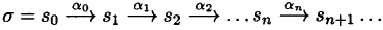{width="2.6527887139107613in"
height="0.20137248468941382in"}

> where αi∈∑ .
>
> A position i of o is a natural number.We use o\[i\]to stand for the
> ith state of o,and o(i)for the ith transition of o,i.e.
> 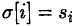{width="0.49996719160104985in"
> height="0.16668416447944007in"} and
> 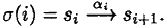{width="1.1666513560804899in"
> height="0.1805599300087489in"}

We use 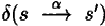{width="0.7153226159230096in"
height="0.16668416447944007in"})to denote the duration of the
transition,defined by
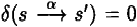{width="0.9382239720034996in"
height="0.1736220472440945in"} if α∈Act or d if α=e(d).Given positions
i,k with i≤k,we use△(o,i,k)to stand for the accumulated delay of o
between the positions i,k, defined by
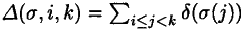{width="1.6666797900262467in"
height="0.1944346019247594in"}.We shall only consider non-zeno traces.

> Definition 2.A trace σ is non-zeno if for all natural number T there
> exists a position k such that D(o,0,k)\>T.For a timed transition
> system S,we denote by Tr(S)all non-zeno traces of S starting from the
> initial state so of S. □
>
> Note that the timed transition system defined above can also be
> represented finitely as a network of timed automata For the definition
> of such networks,we refer to \[7\].Let Abe a network of timed automata
> with components A₁...An. We denote by Tr(A)all non-zeno traces of the
> timed transition system S i.e. Tr(A)=Tr(S).
>
> 2.2 The Logic:Syntax and Semantics
>
> The logic may be seen as a timed variant of a fragement of the linear
> temporal logic LTL,which does not allow nested applications of modal
> operators.It is to express invariant and bounded response time
> properties.
>
> Definition 3.Assume that GV ranged over by g is a set of clock
> constraints as defined in \[7\]and P is a finite set of propositions
> ranged over by p,q etc.Let
>
> 284

+---------------------------------------------------------------------+
| > (l,u)Fg iff g(u)                                                  |
| >                                                                   |
| > (1,u)Fp iffp∈V(1)                                                 |
| >                                                                   |
| > (l,u)卡-f iff(l,u)≠f                                              |
| >                                                                   |
| > (1,u)Ff₁Af2 iff(1,u)Ff₁and(l,u)f₂                                 |
| >                                                                   |
| > σFInv(f)if Vi:o\[i=f                                              |
|                                                                     |
| ol=fi\~≤r f2 iff Vi:(□国)=f₁ →3k≥i:(c\[k\]=f2 and D(σ,i,k)≤T)       |
+---------------------------------------------------------------------+

> Table 1.Definition of satisfiability.
>
> *F₈denote the set of boolean expressions over GVUP ranged over
> byf,f₁,f2 etc, defined as follows:*
>
> f ::=g\|p\|-f\|f₁\^f₂
>
> *where g ∈GV is a constraint.and p ∈P is an atomic proposition. We
> call F₈ state-formulas,meaning that they will be true of states.* □
>
> As usual,we use f₁Vf₂to stand for┐(-f₁A 一f2),and tt and ff for -f Vf
> and f Af respectively.Further,we use f₁→f₂to denote -f₁Vf₂ .
>
> i*f*{width="3.645778652668417e-2in"
> height="0.19381233595800526in"}*s:* set Ft ranged over by f,f₁,f₂of
> trace-formulas over F₈is
>
> φ ::=Inv(f)\|f₁\~≤T f₂
>
> where T is a natural number.
>
> *Iff₁and f2 are boolean combinations of atomic propositions,we call
> f₁\~≤T f2 a bounded response time formula.* □
>
> Inv(f)states that f is an invariant property;a system satisfies
> Inv(f)if all its reachable states satisfy f.It is useful to express
> safety properties,that is,bad things(e.g.deadlocks)should never
> happen,in other words,the system should always behave safely.f₁\~≤T f2
> is similar to the strong Until-operator in LTL, but with an explict
> time bound.In addition to the time bound,it is also an invariant
> formula.It means that as soon as f₁is true of a state,f2 must be true
> within T time units.However it is not necessary that f₁must be true
> continously before f₂becomes true as required by the traditional
> Until-operator.

We shall call formulas of the form f₁\~≤T f2 a bounded response time
for- mula.Intuitively,f₁may be considered as a request and f2 as a
response;thus f₁\~≤T f2 specifies the bound for the response time to be
T.

We interpret Fs and Ft in terms of states and (infinite and
non-zeno)traces of timed automata.We write(l,u)=f to denote that the
state(l,u)satisfies the state-formula f and σFφto denote that the trace
o satisfies the trace-formula φ.The interpretation is defined on the
structure of f and φ,given in Table 1. Naturally,if all the traces of a
timed automaton satisfy a trace-formula,we say that the automaton
satisfies the formula.

> Definition 5.Assume a network of automata A and a trace-formula φ.We
> write AFφ if and only if oFφ for all o∈Tr(A). □
>
> **285**

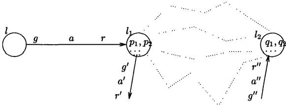{width="4.027760279965005in"
height="1.4791666666666667in"}

> **Fig.1.Illustration of a timed automaton A.**

**3 Verifying Bounded Response Time Properties by Reachability
Analysis**

The current version of UPPAAL can only model-check invariant properties
by reachability analysis.The question is how to use a tool like UPPAAL
to check for bounded response time properties i.e.how to transform the
model-checking problem AFf₁\~≤T f2 to a reachability problem.The
traditional solution is to translate the formula to a testing automaton
t(see e.g.\[6\])and then check whether the parallel system A\|\|t can
reach a designated state of t

We take a different approach.We modify(or rather decorate)the automaton
A according to the state-formulas f₁and f2,and the time bound T and then
construct a state-formula f such that

> M(A) Inv(f)iff A f₁\~≤T f₂

where M(A)is the modified version of A.

We study an example.First assume that each node of an automaton is as-
signed implicitly a proposition at(l)meaning that the current control
node is l. Consider an automaton A illustrated in Figure 1 and a formula
at(l1)\~≤3 at(l2) (i.e.it should always reach l2 from l₁within 3 time
units).To check whether A satisfies the formula,we introduce an extra
clock c∈C and a boolean variable ²v₁into the automaton A,that should be
initiated with ff.Assume that the node l₁has no local
loops,i.e.containing no edges leaving and entering l₁.We modify the
automaton A as follows:

> 1.Duplicate all edges entering node l₁ .
>
> 2.Add-v₁as a guard to the original edges entering l₁ .

3.Add v₁:=tt and c:=0 as reset-operations to the original edges entering
l₁ .

> 4.Add v₁as a guard to the auxiliary copies of the edges entering l₁ .
>
> {width="0.8194520997375329in"
> height="6.944444444444444e-3in"}5.Add v₁:=ff as a reset-operation to
> all the edges entering l₂ .

2Note that a boolean variable may be represented by an integer variable
in UPPAAL.

> 286

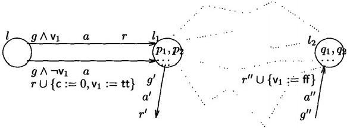{width="4.0416480752405946in"
height="1.486104549431321in"}

> Fig.2.Illustration of a modified timed automaton M(A)of A.

The modified (decorated)automaton M(A)is illustrated in Figure 2.Now we
claim that

> M(A) Inv(v₁→c≤3)iff Aat(l1)\~≤3 at(l2)

The invariant property v₁→c≤3 states that either -v₁or if v₁then c≤3.
There is only one situation that violates the invariant:v₁and c\>3.Due
to the progress property of time(or non-zenoness),the value of c should
always increase.It will sooner or later pass 3.But if l₂is reached
before c reaches 3, V₁will become ff.Therefore,the only way to keep the
invariant property true is that l₂is reached within 3 time units
whenever l₁is reached.

The above method may be generalized to efficiently model-check response
time formulas for networks of automata.Let A(f)denote the set of atomic
propo- sitions occuring in a state-formula f.Assume a network A and a
response time formulaf₁\~≤T f2 For simplicity,we consider the case when
only atomic propo- sitions occur in f₁and f2.Note that this is not a
restriction,the result can be easily extended to the generl case.We
introduce to A:

> 1.an auxiliary clock c∈C and an boolean variable v₁(to denote the
> truth value of f₁)and
>
> 2.an auxiliary boolean variable vp for all p∈A(f₁)UA(f2).
>
> Assume that all the booleans of A(f₁),A(f2)and v₁are initiated to ff.

Let E(f)denote the boolean expression by replacing all p∈A(f)with their
corresponding boolean variable vp.As usual,E(f)\[tt/vp\]denotes a
substitution that replaces vp with tt in E(f).This can be extended in
the usual way to set of substitutions.For instance,the truth value of f
at a given state s may be calculated by
E(f)\[tt/vp\|p∈V(8)\]\[ff/vp\|p∉V(s)\].

Now we are ready to construct a decorated version M(A)for the network A.

> We modify all the components Ai of A as follows:
>
> 1.For all edges of Ai,entering a node l₁such that V(l₁)n A(f₁)≠0:
>
> -Make two copies of each such edge.
>
> -To the original edge,add v₁as a guard.
>
> -To the first copy,add -E(f₁)\^E(f₁)\[tt/vp\|p∈V(l₁)\]as a guard and
> c:=0,v₁:=tt and vp:=tt for all p∈V(l₁)as reset-operations.
>
> -To the second copy,add -v₁\^ 一E(f₁)\[tt/vp\|p∈V(l₁)\]as a guard and
> Vp:=tt for all p∈V(l1)as reset-operations.
>
> 2.For all edges of Ai leaving a nodel₁such that V(l₁)nA(f₁)≠0:add
> vp:=ff for all p∈V(l₁)as reset-operations.
>
> 3.For all edges of Ai entering a node l₂such that V(l2)∩A(f₂)≠0:add
> E(f2)\^E(f₂)\[tt/v₄lq∈V(l2)\]as a guard and v₁:=ff as a
> reset-operation.
>
> 4.Finally,remove vp:=tt and vp:=ff whenever they occur at the same
> edge 3.

Thus,we have a decorated version M(A;)for each Ai of A.We shall take
M(A₁) \|\|...\|M(An)to be the decorated version of A,i.e.M(A)三 M(A₁)

\|\|...\|M(An).

Note that we could have constructed the product automaton of A
first.Then the construction of M(A)from the product automaton would be
much simpler. But the size of M(A)will be much larger;it will be
exponential in the size of the component automata.Our construction here
is purely syntactical based on the syntactical structure of each
component automaton.The size of M(A)is in fact linear in the size of the
component automata.It is particularly appropriate for a tool like
UPPAAL,that is based on on-the-fly generation of the state-space of a
network.For each component automaton A,the size of M(A)can be calculated
precisely as follows:In addition to one auxiliary clock c and \|P(f₁)U
P(f₂) boolean variables in M(A),the number of edges of M(A)is
3×\|EA\|where \|EAI is the number of edges of A(note that no extra nodes
introduced in M(A)).

Note also that in the above construction,we have the restriction that
f₁and f2 contain no constraints,but only atomic propositions.The
construction can be easily generalized to allow constraints by
considering each constraint as a proposition and decorating each
location (that is,the incomming edges)where the constraint could become
true when the location is reached.In fact,this is what we did above on
the boolean expressions(constraints)E(f₁)and E(f2). Finally,we have the
main theoretical result of this paper.

**Theorem** 1.M(A)FInv(v₁→c≤T)iff A=f₁\~≤T f2 for a network of

*timed automata A and a bounded response time formula f₁\~≤T f2.* □

**4 The Gear Controller**

In this section we informally describe the functionality and the
requirements of the gear controller proposed by Mecel AB,as well as the
abstract behavior of the environment where the controller is supposed to
operate.

> {width="0.8124770341207349in"
> height="6.944444444444444e-3in"}3 This means that a proposition p is
> assigned to both the source and the target nodes of the eadge;vp must
> have been assigned tt on all the edges entering the source node.

Functionality. The gear controller changes gears by requesting services
pro- vided by the components in its environment.The interaction with
these com- ponents is over the vehicles communication network.A
description of the gear controller and its interface is as follows.

Interface: The interface receives service requests and keeps information
about the current status of the gear controller,which is either changing
gear or idling.The user of this service is either the driver using the
gear stick or a dedicated component implementing a gear change
algorithm.The interface is assumed to respond when the service is
completed.

Gear Controller: The only user of the gear controller is its
interface.The controller performs a gear change in five steps beginning
when a gear change request is received from the interface.The first step
is to accomplish a zero torque transmission,making it possible to
release the currently set gear. Secondly the gear is released.The
controller then achieves synchronous speed over the transmission and
sets the new gear.Once the gear is set the engine torque is increased so
that the same wheel torque level as before the gear change is achieved.

> Under difficult driving conditions the engine may not be able to
> accomplish zero torque or synchronous speed over the transmission.It
> is then possible to change gear using the clutch.By opening the
> clutch,and consequently the transmission,the connection between the
> engine and the wheels is broken. The gearbox is at this state able to
> release and set the new gear,as zero torque and synchronous speed is
> no longer required.When the clutch closes it safely bridges the speed
> and torque differences between the engine and the wheels.We refer to
> these exceptional cases as recoverable errors.

**Environment.** The environment of the gear controller consists of the
following three components:

Gearbox: It is an electrically controlled gearbox with control
electronics.It provides services to set a gear in 100 to 300 ms and to
release a gear in 100 to 200 ms.If a setting or releasing-operation of a
gear takes more than 300 ms or 200 ms respectively,the gearbox will
indicate this and stop in a specific error state.

Clutch: It is an electrically controlled clutch that has the same sort
of basic services as the gearbox.The clutch can open or close within 100
to 150 ms. If a opening or closing is not accomplish within the time
bounds,the clutch will indicate this and reach a specific error state.

Engine: The engine offers three modes of operation:normal torque,zero
torque, and synchronous speed.The normal mode is normal torque where the
engine gives the requested engine torque.In zero torque mode the engine
will try to find a zero torque difference over the
transmission.Similarly,in synchronous speed mode the engine searches
zero speed difference between the engine and

the wheels⁴.The maximum time bound searching for zero torque is limited
4 Synchronous speed mode is used only when the clutch is open or no gear
is set.

> to 400 ms within which a safe state is entered.Furthermore,the maximum
> time bound for synchronous speed control is limited to 500 ms.If 500
> ms elapse the engine enters an error state.

We will refer the error states in the environment as unrecoverable
errors since it is impossible for the gear controller alone to recover
from these errors.

**4.1 Requirements.**

In this section we list the informal requirements and desired
functionality on the gear controller,provided by Mecel AB.The
requirements are to ensure the cor- rectness of the gear controller.A
few operations,such as gear changes and error detections,are crucial to
the correctness and must be guaranteed within certain time bounds.In
addition,there are also requirements on the controller to ensure desired
qualities of the vehicle,such as:good comfort,low fuel consumption,and
low emission.

> **1.Performance.** These requirements limit the maximum time to
> perform a gear change when no unrecoverable errors occur.
>
> (a)A gear change should be completed within 1.5 seconds.
>
> (b)A gear change,under normal operation conditions,should be performed
> within 1 second.
>
> **2.Predictability.** The predictability requirements are to ensure
> strict syn- chronization and control between components.
>
> (a)There should not be dead-locks or live-locks in the system.
>
> (b)When the engine is regulating torque,the clutch should be closed.
>
> (c)The gear has to be set in the gearbox when the engine is regulating
> torque.
>
> **3.Functionality.** The following requirements are to ensure the
> desired func- tionality of the gear controller.
>
> (a)It is able to use all gears.
>
> (b)It uses the engine to enhance zero torque and synchronous speed
> over the transmission.
>
> (c)It uses the gearbox to set and release gears.
>
> (d)It is allowed to use the clutch in difficult conditions.
>
> (e)It does not request zero torque when changing from neutral gear.
>
> (f)The gear controller does not request synchronous speed when
> changing to neutral gear.

**4.Error Detection.** The gear controller detects and indicates error
only when:

> (a)the clutch is not opened in time, (b)the clutch is not closed in
> time,
>
> (c)the gearbox is not able to set a gear in time,
>
> (d)the gearbox is not able to release a gear in time.

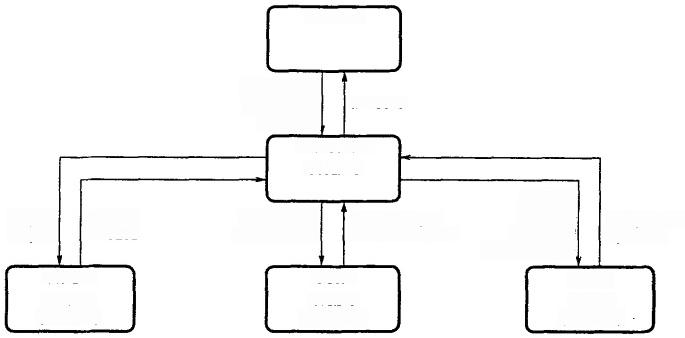

> Fig.3.A Flow-Graph of the Gearbox System.

**5 Formal Description of the System**

To design and analyze the gear controller we model the controller and
its envi- ronment in the UPPAAL model \[7\].The modeling phase has been
separated in two steps.First a model of the environment is created,as
its behavior is spec- ified in advance as assumptions(see Section
4).Secondly,the controller itself and its interface are designed to be
functionally correct in the given environ- ment.Figure 3 shows a
flow-graph of the resulting model where nodes represent automata and
edges represent synchronization channels or shared variables (en- closed
within parenthesis).The gear controller and its interface are modeled by
the automata GearControl (GC)and Interface(I).The environment is modeled
by the three automata:Clutch (C),Engine(E),and GearBox(GB).

The system uses six variables.Four are timers that measure1/1000 of
seconds (ms):GCTimer,GBTimer,CTimer and ETimer.The two other
variables,named FromGear and ToGear,are used at gear change requests⁵.In
the following we describe the five automata of the system.

Environment. The three automata of the environment model the basic func-
tionality and time behavior of the components in the environment.The
compo- nents have two channels associated with each service:one for
requests and one to respond when service have been performed.

Gearbox: In automaton GearBox,shown in Figure 8,inputs on channel ReqSet
request a gear set and the corresponding response on GearSet is output
if the gear is successfully set.Similarly,the channel ReqNeu requests
the neutral

> 5The domains of FromGear and ToGear are bounded to {0,....,6},where
> 1to5 represent gear 1 to gear 5,0 represents gear N,and 6 is the
> reverse gear.
>
> gear and the response **GearNeu** signals if the gear is successfully
> released.If the gearbox fails to set or release a gear the locations
> named ErrorSet and ErrorNeu are entered respectively.
>
> Clutch: The automaton Clutch is shown in Figure 5.Inputs on channels
> Open- Clutch and CloseClutch instruct the clutch to open and close
> respectively. The corresponding response channels are ClutchIsOpen and
> ClutchIsClosed. If the clutch fails to open or close it enters the
> location ErrorOpen and Er- rorClose respectively.
>
> Engine: The automaton Engine,shown in Figure 6,accepts incoming
> requests for synchronous speed,a specified torque level or zero torque
> on the channels ReqSpeed,ReqTorque and ReqZeroTorque respectively.The
> actual torque level or requested speed is not modeled since it does
> not affect the design of the gear controller⁶.The engine responds on
> the channels TorqueZero and SpeedSet when the services have been
> completed.Requests for specific torque levels(i.e.signal ReqTorque)are
> not answered,instead torque is as- sumed to increase immediately after
> the request.If the engine fails to deliver zero torque or synchronous
> speed in time,it enters location CluthOpen with- out responding to the
> request.Similarly,the location ErrorSpeed is entered if the engine
> regulates on synchronous speed in too long time.
>
> Functionality. Given the formal model of the environment,the gear
> controller has been designed to satisfy both the functionality
> requirements given in Sec- tion 4,and the correctness requirements in
> Section 4.1
>
> Gear Controller: The GearControl automaton is shown in Figure 4.Each
> main loop implements a gear change by interacting with the components
> of the environment.The designed controller measures response times
> from the com- ponents to detect errors(as failures are not
> signaled).The reaction of the controller depends on how serious the
> occurred error is.It either recovers the system from the error,or
> terminates in a pre-specified location that points out
> the(unrecoverable)error:COpenError,CCloseError,GNeuError or
> GSetError.Recoverable errors are detected in the locations CheckTorque
> and CheckSyncSpeed.
>
> Interface: The automaton Interface requests gears R,N,1,...,5 from the
> gear controller.A change from gear 1 to gear 2 is shown in Figure
> 7.Requests and responses are sent through channel ReqNewGear and
> channel NewGear respectively.When a request is sent,the shared
> variables FromGear and ToGear are assigned values corresponding to the
> current and the requested new gear respectively.

{width="0.8194520997375329in"
height="6.944444444444444e-3in"}

> ⁶Hence,the time bound for finding zero torque(i.e.400 ms)should hold
> when de- creasing from an arbitrary torque level.
>
> GearControl
>
> ReqNewGear? SyBTimer!=0
>
> c·Initiate
>
> coar!

clutchIsOpen?

> CTimer=280
>
> C:ReqNeuGear
>
> eqieur:
>
> GearNeu?
>
> 89ed。
>
> ToCear\>0
>
> Speedset?
>
> cqS 起 .
>
> GearSet?
>
> eCluchopen2 Begiemer.
>
> *GCTimer\>200.* GCTimer\<=250
>
> 9ae6
>
> GCTimer\<=200
>
> c.ReqSetGiear2 clutehIaOpen?
>
> TeG 0
>
> RegSet!
>
> GcTimer:=0

GCTimer\>300

> GSeiEror
>
> GearSet?
>
> clutchIsClosed? c:ReqTorqueC

&meLuch!

> c:ClutchClose
>
> CTmer\<=28。
>
> ReqTorque!
>
> Tocaecut
>
> clutehIsclosed?
>
> e:GeaChanged

acM9852

> Fig.4.The Gear Box Controller Automaton.

**6 Formal Validation and Verification**

In this section we formalize the informal requirements given in Section
4.1 and prove their correctness using the symbolic model-checker of
UPPAAL.

To enable formalization (and verification)of requirements,we decorate
the system description with two integer variables,ErrStat and
UseCase.The vari- able ErrStat is assigned values at unrecoverable
errors:1 if Clutch fails to close, 2 if Clutch fails to open,3 if
GearBox fails to set a gear,and 4 if GearBox fails to release a gear.The
variable UseCase is assigned values whenever a recover- able error
occurs in Engine:1 if it fail to deliver zero torque,and 2 if it is not
able to find synchronous speed.The system model is also decorated to
enable verification of bounded response time properties,as described in
Section 2.

> GearControl@lnitiate \~≤1500

((ErrStat=0)→GearControl@GearChanged) (1)

> GearControl@lnitiate\~≤1000

((ErrStat=0 UseCase=0)→GearControl@GearChanged) (2)

Clutch@ErrorClose \~≤200 GearControl@CCloseError ([3)](#bookmark1)

Clutch@ErrorOpen \~≤200 GearControl@COpenError ([4)](#bookmark2)

GearBox@Errorldle \~≤350 GearControl@GSetError ([5)](#bookmark3)

GearBox@ErrorNeu \~≤200 GearControl@GNeuError ([6)](#bookmark4)

Inv(GearControl@CCloseError→Clutch@ErrorClose) ([7)](#bookmark5)

Inv(GearControl@COpenError→Clutch@ErrorOpen) ([8)](#bookmark6)

Inv(GearControl@GSetError→GearBox@Errorldle) ([9)](#bookmark7)

Inv(GearControl@GNeuError →GearBoxQErrorNeu) ([10)](#bookmark8)

Inv(Engine@ErrorSpeed→ErrStat≠0) ([11)](#bookmark9)

Inv(Engine@Torque →Clutch@Closed) ([12)](#bookmark10)

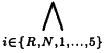{width="0.7152613735783027in"
height="0.3611198600174978in"}

Poss(Gear@Geari)

\(13\)

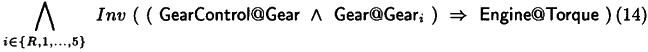{width="4.493038057742782in"
height="0.3541819772528434in"}

> Table 2.Requirement Specification
>
> Before formalizing the requirement specification of the gear
> controller we define negation and conjunction for the bounded response
> time operator and the invariant operator defined in Section 2,
>
> A=41\^φ2 ifAF₄1and A₄2 *A -iffA≠φ*
>
> We also extend the (implicit)proposition at(l)to at(A,1),meaning that
> the control location of automaton A is currently l.Finally,we
> introduce Poss(f)to denote -Inv(一f),f₁☆≤T f2 to denote-(f₁\~≤T
> f2),and A@l to denote at(A,l). We are now ready to formalize the
> requirements.
>
> 6.1 Requirement Specification

The first performance requirement 1a,i.e.that a gear change must be com-
pleted within 1.5 seconds given that no unrecoverable errors occur,is
specified in property 1.It requires the location GearChanged in
automaton GearControl to be reached within 1.5 seconds after location
Initiate has been entered.Only scenarios without unrecoverable errors
are considered as the value of the variable

ErrStat is specified to be zero⁷.To consider scenarios with normal
operation we restrict also the value of variable UseCase to zero (i.e.no
recoverable errors occurs).Property 2 requires gear changes to be
completed within one second given that the system is operating normally

The properties 3 to 6 require the system to terminate in known
error-locations that point out the specific error when errors occur in
the clutch or the gear (re- quirements 4ato 4d).Up to 350ms is allowed
to elapse between the occurrence of an error and that the error is
indicated in the gear controller.The proper- ties 7 to 10 restrict the
controller design to indicate an error only when the corresponding error
has arised in the components.Observe that no specific loca- tion in the
gear controller is dedicated to indicate the unrecoverable error that
may occur when the engines speed-regulation is interrupted (i.e.when
location Engine@ErrorSpeed is reached).Property 11 requires that no such
location is needed since this error is always a consequence of a
preceding unrecoverable error in the clutch or in the gear.

Property 13 holds if the system is able to use all gears(requirement
3a).

Furthermore,for full functionality and predictability,the system is
required to be dead-lock and live-lock free(requirement 2a).In this
report,dead-lock and live- lock properties are not specified due to lack
of space.However,property 1(and 2)guarantee progress within bounded time
if no unrecoverable error causes the system to terminate.The properties
12 and 14 specify the informal predictability requirements 2b and 2c.

A number of functionality requirements specify how the gear controller
should interact with the environment(e.g.3ato 3f).These requirements
have been used to design the gear controller.They have later been
validated using the simulator in UPPAAL and have not been formally
specified and verified.

Time Bound Derivation. Property 1 requires that a gear change should be
performed within one second.Even though this is an interesting property
in itself one may ask for the lowest time bound for which a gear change
is guaranteed.We show that the time bound is 900 ms for error-free
scenarios by proving that the change is guaranteed at 900 ms(property
15),and that the change is possibly not completed at 899 ms(property
16).Similarly,for scenarios when the engine fails to deliver zero torque
we derive the bound 1055 ms,and if synchronous speed is not delivered in
the engine the time bound is 1205 ms.

{width="0.8125382764654419in"
height="6.944444444444444e-3in"}We have shown the shortest time for
which a gear change is possible in the three scenarios to be:150 ms,550
ms,and 450 ms.However,gear changes involv- ing neutral gear may be
faster as the gear does not have to be released(when changing from gear
neutral)or set(when changing to gear neutral).Finally we consider the
same three scenarios but without involving neutral gear by con-
straining the values of the variables FromGear and ToGear.The derived
time bounds are:400 ms,700 ms and 750.

7Recall that the variable ErrStat is assigned a positive value
(i.e.greater than zero) whenever an unrecoverable error occurs.

> GearControl@lnitiate ～\<900

((ErrStat=0 UseCase=0)→GearControl@GearChanged)(15)

> GearControl@lnitiate 4≤899

((ErrStat =0\^UseCase=0)→GearControl@GearChanged)(16)

> Table 3.Time Bounds
>
> Verification Results.We have verified totally 46 properties of the
> system⁸ using UPPAAL installed on a 75 MHz Pentium PC equipped with 24
> MB of primary memory.The verification of all the properties consumed
> 2.99 second.
>
> 7 Conclusion
>
> In this paper,we have reported an industrial case study in applying
> formal techniques for the design and analysis of control systems for
> vehicles.The main output of the case-study is a formally described
> gear controller and a set of formal requirements.The designed
> controller has been validated and verified using the tool UPPAAL to
> satisfy the safety and functionality requirements on the
> controller,provided by Mecel AB.It may be considered as one piece of
> evidence that the validation and verification tools of today are
> mature enough to be applied in industrial projects.
>
> We have given a detailed description of the formal model of the gear
> con- troller and its surrounding environment,and its correctness
> formalized in 46 log- ical formulas according to the informal
> requirements delivered by industry.The verification was performed in a
> few seconds on a Pentium PC running UPPAAL version 2.12.2.Another
> contribution of this paper is a solution to a problem we got in this
> case study,namely how to use a tool like UPPAAL,which only pro- vides
> reachability analysis to verify bounded response time properties.We
> have presented a logic and a method to characterize and model-check
> such properties by reachability analysis in combination with simple
> syntactical manipulation on the system description.

This work concerns only one component,namely gear controller of a
control system for vehicles.Future work,naturally include modelling and
verification of the whole control system.The project is still in
progress.We hope to report more in the near future on the project.

> References
>
> {width="0.8194520997375329in"
> height="6.944444444444444e-3in"}1.R.Alur and D.Dill.Automata for
> Modelling Real-Time Systems.Theoretical Computer
> Science,126(2):183-236,April 1994.
>
> 8A complete list of the verified properties can be found in the full
> version of this paper.

2.Johan Bengtsson,David Griffioen,Kare Kristoffersen,Kim
G.Larsen,Fredrik Lars- son,Paul Pettersson,and Wang Yi.Verification of
an Audio Protocol with Bus Collision Using UPPAAL.In Rajeev Alur and
Thomas A.Henzinger,editors,Proc. *of 8th Int.Conf.on Computer Aided
Verification,number 1102 in Lecture Notes in* Computer Science,pages
244-256.Springer-Verlag,July 1996.

3.Johan Bengtsson,Kim G.Larsen,Fredrik Larsson,Paul Pettersson,and Wang
Yi. UPPAAL in 1995.In Proc.of the 2nd Workshop on Tools and Algorithms
for the Construction and Analysis of Systems,number 1055 in Lecture
Notes in Computer Science,pages 431-434.Springer-Verlag,Mars 1996.

4.C.Daws,A.Olivero,S.Tripakis,and S.Yovine.The tool KRONOS.In Rajeev
Alur,Thomas A.Henzinger,and Eduardo D.Sontag,editors,Proc.of Workshop on
*Verification and Control of Hybrid Systems III,Lecture Notes in
Computer Science,* pages 208-219.Springer-Verlag,October 1995.

5.Thomas A.Henzinger,Pei-Hsin Ho,and Howard Wong-Toi.HYTECH:The Next
Generation.In Proc.of the 16th IEEE Real-Time Systems Symposium,pages
56-65, December 1995.

6.H.E.Jensen,K.G.Larsen,and A.Skou.Modelling and Analysis of a Collision
Avoid- ance Protocol Using SPIN and UPPAAL.In Proc.of 2nd International
Workshop on the SPIN Verification System,pages 1-20,August 1996.

7.Kim G.Larsen,Paul Pettersson,and Wang Yi.UPPAAL in a Nutshell.To
appear *in International Journal on Software Tools for Technology
Transfer,1998.*

8.Thomas Stauner,Olaf Mller,and Max Fuchs.Using hytech to verify an
automotive control system.In Proc.Hybrid and Real-Time
Systems,Grenoble,March 26- 28,1997.Technische Universität
München,Lecture Notes in Computer Science, Springer,1997.

**Appendix:The System Description**

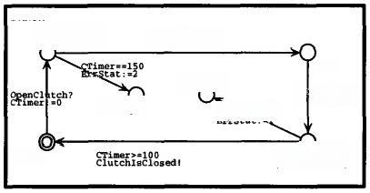

> Fig.5.The Clutch Automaton.

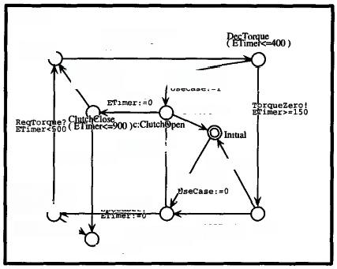

> Fig.6.The Engine Automaton.
>
> ReqNewGear!
>
> FromGear:=1
>
> ToGear:=2
>
> Gear1 chkGear12 Gear2
>
> Fig.7.The Interface Automaton:a gear change.

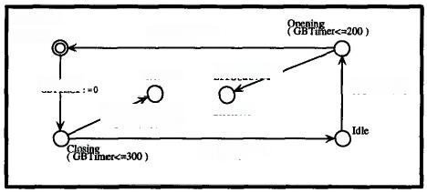

> **Fig.8.The Gearbox Automaton.**
