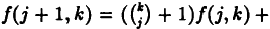
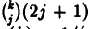
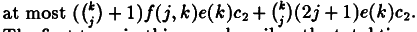
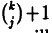
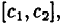

> **Timing-Based Mutual Exclusion\***
>
> Nancy Lyncht Nir Shavit

**Abstract**

Known asynchronous n-process deadlock-free mutual exclusion algorithms
require O(n)read/write registers and O(n)operations to access the
critical region,ren- dering them impractical for large scale
applications. Burns and Lynch have shown that n registers are nec-
essary for solving this problem,in the asynchronous setting.

This paper examines the benefits that can be ob- tained by using timing
information in mutual exclu- sion algorithms.First,a simple and
efficient timing- based mutual exclusion algorithm is given.This algo-
rithm always guarantees mutual exclusion(i.e.,even when run
asynchronously),and also avoids deadlock in case
certain(realistic)inexact timing constraints are met.The algorithm uses
only two shared read/write registers(a total of logn+1
bits),thus"overcom- ing"the n register lower bound for asynchronous al-
gorithms.It is proved that the problem cannot be solved with only one
shared register,so that this algo- rithm is optimal in terms of the
number of registers.

Second,a lower bound is proved for the time com- plexity ofany
deadlock-free mutual exclusion protocol, as a function of the number of
shared registers it em- ploys.This bound shows that the algorithm
described above is near optimal,in terms of time complexity.Fi- nally,it
is shown that two natural ways of weakening the timing assumptions lead
(unfortunately)to an n register lower bound.

{width="1.1735936132983378in"
height="6.944444444444444e-3in"}

\*This work was supported by ONR contracts N00014- 85-K-0168 and
NO0014-91-J-1046,by NSF grants CCR-

8611442 and CCR-8915206,by DARPA contracts N00014- 87-K-0825 and
N00014-89-J-1988,and by Draper Labora- tories grant DL-H-441640

Laboratory for Computer Science,MIT,Cambridge, MA 02139.

\*Laboratory for Computer Science,MIT,and Tel-Aviv University,Tel-Aviv
69978,Israel.

**1 Introduction**

Although current-day multiprocessors provide so- phisticated
synchronization primitives for mu- tual exclusion,situations that
require a register- based exclusion algorithm continue to arise\[1,2\].
Known mutual exclusion algorithms\[3,15,16,18\] require that both the
number of read/write regis- ters and the number of operations a process
per- forms to access the critical region be at least equal to the total
number of processes in the system. The lower bound of Burns and Lynch
\[3\]implies that this linear complexity is optimal for deter- ministic
algorithms,even if multi-writer registers are used.This implies that
such algorithms can- not be expected to perform well in systems that
support thousands of concurrent processes\[1,2\].

Recently,several researchers \[4,5\]have pro- posed ways of overcoming
the linear lower bound on the number of operations a process needs to
perform.For example,employing operating sys- tem support in a
sophisticated way at process cre- ation time,Merritt and Taubenfeld
provide an al- gorithm that limits the number of operations by a process
to depend only on the number of pro- cesses concurrently accessing the
critical region. However,in both of these cases,the number of shared
registers the algorithm requires is still at least equal to the total
number of processes in the system.Also,using randomization,and based on
the work of Lynch and Saias \[13\],Kushilevits and Rabin \[14\]offer a
new(but rather involved)al- gorithm that employs randomization to
achieve fair mutual exclusion using a single O(log log n)- bit shared
register.However,this solution uses a powerful n-process Test-and-Set
shared variable, not a read/write register.

In this paper,we consider the mutual exclusion problem in a real-time
setting.More particularly,

> 2

1052-8725/92 \$3.00 ◎1992 IEEE

we examine the benefits that can be obtained by using available timing
information in mutual ex- clusion algorithms.

Fischer \[10\]appears to have been the first to propose overcoming the
Burns-Lynch lower bound of n shared registers for deadlock-free mu- tual
exclusion by assuming timing constraints. He has presented a truly
simple mutual exclusion algorithm that uses only a single shared multi-
writer register.However,his algorithm has a ma- jor drawback:it fails to
guarantee mutual exclu- sion if the timing constraints are not met.This
is also the drawback of the elegant timing-based algorithm of Alur and
Taubenfeld \[6\].Ideally, a timing-based algorithm should not depend on
its timing constraints to guarantee basic safety properties,but only to
ensure liveness and per- formance properties.

In this paper,we give a simple and efficient timing-based mutual
exclusion algorithm that al- ways guarantees mutual exclusion(i.e.,even
when run asynchronously),and also avoids deadlock in case certain
inexact timing constraints are met. Specifically,we assume that the
times between successive steps of the same process are always in some
known interval,\[c₁,c2\],of real times.This assumption is realistic in
the real-time setting, if processes do not get swapped out during the
time when they are executing the protocol,or even if they do get swapped
out,but the un- derlying processor scheduling algorithm ensures
approximately predictable execution speeds.(In fact,the algorithms we
present require that pro- cesses do not get swapped out only between two
specific lines of code,and not throughout the complete protocol.)The
algorithm uses only two shared read/write registers(a total of log n+1
shared bits),thus "overcoming"the n register lower bound for
asynchronous algorithms.We also prove that the problem cannot be solved
with only one shared register,so that our algorithm is optimal in terms
of the number of registers.

Next,we prove a lower bound for the time com- plexity of any
deadlock-free mutual exclusion pro- tocol,as a function of the number of
shared reg- isters it employs.The proof uses the techniques

> **Process** **i:**
>
> **repeat** **forever**
>
> **remainder** **region** **trying** **region** **critical** **region**
> **ezit** **region**
>
> **end** **repeat;**
>
> Figure 1:Program of Process i.

of \[3\],extended to the real-time setting.This bound shows that our
algorithm is near optimal, in terms of time complexity.

Finally,we show that two natural ways of weakening the timing
assumptions lead,unfor- tunately,to an n register lower bound.Specifi-
cally,if we assume that the time bounds \[c₁,c₂\] are fixed,and always
hold,but are unknown to the processes,or that the timing conditions are
only eventually met,then we obtain a lower bound of n on the number of
read/write registers required.

**2 The Mutual Exclusion Prob- lem**

We consider a system of n sequential threads of control called
processes,which communicate through shared multi-uriter,multi-reader
atomic registers.Communication consists of read and write
operations,each of which is assumed in this paper to be executed
instantaneously.In the usual model for atomic registers each operation
is separated into an invocation event and a response event,concurrent
invocations are allowed,and it is assumed that every invocation
eventually ter- minates in a matching response,in such a way as to
produce the illusion of instantaneous oper- ation.Our work applies to
this setting,but we do not need to deal with this extra complication
here.

Formally,we model each such system as a single timed automaton
\[7\](A,b),where A is a composition of I/O automata \[8\],and b is a
boundmap.We keep the discussion in this ab-

stract informal and refer the interested reader to \[8,9,7,20\]for a
complete presentation of the model and its properties.

We view the program of every process as con- sisting of two
distinguished regions:a remain- der region and a critical region.Each
process al- ternates between executing its remainder and its critical
region.No process remains forever within any particular execution of its
critical region,al- though it may remain forever in its remainder re-
gion.The mutual ezclusion problem is to guaran- tee that the system does
not enter a global state in which more than one process is executing its
critical region \[15\].

To coordinate the entrance to the critical re- gion,a trying region and
an erit region of code are added to the program of each process as in
Figure 1.

The following safety property is required of any solution to the
problem.

Mutual Ezclusion:A system satisfes mutual ez- clusion if in any
reachable system state,at most one user is in its critical region.

We also require that a process running alone will always get access to
the critical region.

*Weak Deadlock-Freedom:A system is weakly* deadlock-free if in any
execution,if a process\' trying region(resp.exit region)is concurrent
only with other processes\'remainder regions, then its trying
region(resp.exit region)ter- minates.

The following property guarantees progress, and will be required to hold
only under certain conditions.

Deadlock-Freedom:A system is deadlock-free if

> the following are true in any execution.
>
> 1.If in some state,some user is in the try- ing region and no user is
> in the critical region,then subsequently some user en- ters the
> critical region.
>
> 2.If in some state,some user is in the exit region then subsequently
> some user en- ters the remainder region.
>
> **z,y:shared** **registers,initially** **y=0;**
>
> **repeat** **forever**
>
> **0b:remainder_ezit;**
>
> **L:z:=i;**
>
> **1:ify≠0** **then** **goto** **L;**
>
> **2:y:=1;**
>
> **3:ifz≠i** **then** **goto** **L;**
>
> **4a:criticalLentry;**
>
> **4b:criticalLezit;**
>
> **5:y:=0;**
>
> **0a:remainder_entry;**
>
> **end** **repeat;**

Figure 2:Algorithm 1:Lamport Style Mutual Exclusion -Code for Process i.

We define a time-bounded version of the deadlock-freedom property.This
involves putting an upper bound on the time processes can spend
executing the added trying and erit regions of code. We define a number
b to be an upper bound for a deadlock-free system providing that the
deadlock freedom definition above holds if we replace
"subsequently"with"within time at most b."

**3 The Asynchronous Case**

The following theorem is due to Burns and Lynch \[3\].

Theorem 3.1 There is no asynchronous algo- *rithm providing mutual
ezclusion with deadlock- freedom for n≥2 processes,using fewer than n
shared read/write registers.*

Since Theorem 3.1 rules out asynchronous so- lutions for deadlock-free
mutual exclusion with fewer than n shared registers,we will consider
timing-based algorithms.A natural requirement for a timing-based mutual
exclusion algorithm is that mutual exclusion and weak deadlock- freedom
be guaranteed always,even if the tim- ing assumptions are violated.We
thus begin our development by showing that there exists an

asynchronous 2-register algorithm for n≥2,giv- ing mutual exclusion and
weak deadlock-freedom. This algorithm,which we call Algorithm 1,has a
structure similar to some described by Lamport in\[17\].The algorithm
uses two shared registers,x and y.Each process Pwrites its index i into
x,to indicate that it wishes to enter the critical region, and then
checks register y to see if it might have just overwritten the value of
some other process P;that is attempting to enter.If there is such a
process(i.e.,if y=1),P;gives up,otherwise, it sets y for other processes
and tests x to see if it has not been overwritten by some later process
P;attempting to enter the critical region.If x is still set to
i,P₁enters the critical region,setting y to 0 before returning to the
remainder region.

The code is presented in Figure 2,in a stan- dard psuedo-code style.
Translating this code into timed automata is a straightforward but te-
dious exercise.The other algorithms in this paper are also presented in
the same style.

To aid in the proof,we describe the program states as a combination of
program counter values as above,local variable values and shared
register values.In any state of the algorithm,we define:

> By I1 of Lemma 3.2 we have:

**Lemma 3.3** Algorithm 1 has the mutual ezclu- ***sion property.***

The following lemma follows from I3 and the fact that the executing the
exit region takes a bounded nember of steps.

Lemma 3.4 Algorithm 1 is weakly deadlock-free.

We now show that Algorithm 1 optimal in terms of the number of
registers.

Lemma 3.5 In any(timed or asynchronous)al- *gorithm providing mutual
erclusion and weak deadlock-freedom for n≥2 processes,using a sin- gle
shared register,every process that moves from its remainder to its
critical region must perform at least one read followed by a write.*

The proof follows since if a process does not write, other processes
cannot tell that it has left the remainder,and if it does not read,it
cannot tell if any one of them left the remainder.Both cases would lead
to a violation of mutual exclusion.

F1:the set of process indices i such that x=i and pc(i)=2,

F2:the set of process indices i such that x =i and pc(i)=3,

CR:the set of process indices i such that pc(i) ∈ {4a,4b,5}.

RM:the set of process indices i such that pc(i) ∈ {0a,0b}.

We prove the following lemma by induction on the length of the
execution.

**Lemma 3.2** The following are true in any reach- *able state of
Algorithm 1.*

*I1:\|F1\|+\|F2\|+\|CR\|≤1.*

I2:If\|F2\|+\|CR\|\>0 then y=1.

*I3:Ify=1 then some process i is not in RM.*

Theorem 3.6 There is no asynchronous al- *gorithm providing mutual
erclusion with weak deadlock-freedom for n≥2 asynchronous pro-
cesses,using only one shared read/write register.*

Proof: Assume by way of contradiction that there exists a one register
algorithm for the prob- lem.Consider two processes,say 1 and 2.From the
system start state s,by the weak deadlock- freedom property,either
process must be able,on its own,to complete an execution leading to a
state in which it is in the critical region;call these executions e₁and
e₂respectively.By Lemma 3.5, each of the two processes must write the
register during its execution.

Now we construct a bad execution.Run pro- cess 1 in e₁just until the
first state s\'at which it is about to write the register,and let it
pause without doing so.States s and s\'differ only in the internal state
of process 1.Then extend the exe- cution by e₂,in which process 2
behaves just as if

{width="4.861986001749781e-2in"
height="4.861986001749781e-2in"}

> z:shared register initially 0;
>
> delay:positive integer constant;
>
> repeat forever
>
> 0b:remainder_ezit;
>
> L:if z≠0 then goto L;
>
> 1:z:=i;
>
> 2:pause(delay);
>
> 3:if z≠ithen goto L;
>
> 4a:criticalLenter;
>
> 4b:criticalezit;
>
> 5:z:=0;
>
> 0a:remainder_enter;
>
> **end** **repeat;**

Figure 3:Algorithm 2:Fischer\'s Timed Mutual Exclusion-Code for Process
i.

it were on its own,eventually entering the critical region.Next,process
1 continues its execution of e₁,first performing its write to the
register, which overwrites whatever process 2 has written. Following
this operation,the state of the system differs from the corresponding
state in e1 only in the internal state of process 2,and so process 1
goes critical,violating muual ezclusion.This is a contradiction.

**4 The Timing-Based Case**

In this section,we consider the real-time ver- sion of the problem,where
we assume bounds in the interval \[c1,c₂\]for the time between
successive steps of a process,when it is in its trying or exit region.We
assume that 0\<c₁≤c₂\<∞.Let C=c₂/c₁;C is a measure of the timing uncer-
tainty.Define a process i to be slow(respectively, fast)in an execution
or execution fragment if the time for any step when the process is in
its trying or exit region is exactly c₂(resp.,c₁).

We begin by presenting,in Figure 3,a timing- based mutual exclusion
algorithm due to Mike Fischer \[10\];we call this Algorithm 2.Algorithm
2 has the property that if the timing constraints are met,and the value
of the delay parameter is

chosen to be strictly greater than the timing un- certainty C,then
mutual exclusion and deadlock- freedom are guaranteed.However,it has the
drawback that if the constraints are not met,then many processes may
enter the critical region con- currently.

The key idea behind Algorithm 2 is to delay each process i for a period
greater than C·c₁af- ter it has written z in Line 1 and before testing
it in Line 3.Thus,by the time process i has reached Line 3,any process j
that has passed the test in Line L and might overwrite x =i with z =j,
has already done so since C·c₁≥c₂,the longest time such a step might
take.If i reads x =i in Line 3,it can safely enter the critical region,
since all other processes are either before Line L and will not pass
it,or after Line 1 with their index in z overwritten by process i,so
they will fail the test on Line 3.To implement the delay, the procedure
pause(delay)causes the process to delay by some number of steps,where a
delay of 1 means skipping no steps at all,and a delay of k amounts to
doing k-1 dummy steps.Specifi- cally,let pause(k)be a shorthand for a
sequence of (k-1)lines of code,each a no-op operation, and let us
accordingly assign program counter val- ues 2.1,2.2,...,2.(k-1)to
those(k-1)lines.

We now outline the correctness proof of the al- gorithm.Let Algorithm
2\'be the same as Algo- rithm 2 but asynchronous.The following lemma
follows by induction on the length of the execu- tion.

**Lemma 4.1** Then in any reachable state of Al- gorithm 2\':

> Ifx=i≠0 then pc;∈{2,3,4a,4b,5}.

To aid in the main proof,let us define several state components
involving time:now,represent- ing the current real time,and for each
process i,ftime(i)and ltime(i),representing the first and
last(absolute)time that the next step of process i is allowed to occur.
From our def- initions,it follows that if pc(i) 丈{0b,4b}then
ltime(i)≤now+C₂ ·

Let CR be defined similarly to before.We prove the following collection
of invariants by in-

duction on the number of steps in an execution. They are similar to
those proposed in \[19\]for a weaker form of the mutual exclusion
problem. Note that the only executions that are considered here are
those in which the timing assumptions are satisfed;the timing
assumptions are required to guarantee these key properties.

**Lemma 4.2 In any reachable state of Algorithm**

***2,the following are true.* I1:Ifi∈CR then**

> **1.x=i,and**
>
> *2.for all j,pc(j)≠1.*

*I2:If pc(i)=2.d,z =i and pc(j)=1 then* ltime(j)\<ftime(i)+(delay-d)c1 ·

I3:If pc(i)=3,x =i and pc(j)=1 then

> *ltime(j)\<ftime(i).*
>
> From I1 of Lemma 4.2 we have:

Lemma 4.3 Algorithm 2 has the mutual ezclu- *sion property.*

> We prove the following based on Lemma 4.1.

Lemma 4.4 Algorithm 2\'is deadlock-free.

The following is an almost tight upper bound on the time b for some
process to enter the critical region.(It can be made tighter by a slight
modi- fication to Algorithm 2,which we will describe in the full version
of the paper.)

Proof: (Sketch)Consider two processes,say 1 and 2.From the system start
state s,by the weak deadlock-freedom property,either process must be
able,on its own,to complete an execution lead- ing to a state in which
it is in the critical region. Call these executions e1 and
e₂,respectively.By Lemma 3.5 each process must first read and then write
the shared register in its execution.Let r¹ and r₂be the number of steps
prior to the first

write of the shared register in e₁and e₂,respec- tively(by Lemma
3.5,r₁and r₂are greater than 0).

Suppose that one of these executions,say e₁, contains at most C steps
after its first write to the shared register.Let t=max{c₁(r₁+1),c₂(r₂)}
and consider the execution e formed by running e₁fast starting at time
t-c₁(r₁+1)and running e2 slowly starting at timet-c₂(r₂).In e,the r₂th
step of e₂occurs at time t,followed immediately (at the same real
time)by the first write of e1, then the rest of e₁until time t+Cc₁and
finally the rest of e₂,starting with the first write in e₂ .

In e,all of e1 occurs before the first write of e₂.Therefore process 1
cannot distinguish be- tween executions e and e₁.Furthermore,all of the
writes of e₁occur between the first write of e₂and the read that
precedes it.Thus process 2 cannot distinguish between executions e and
e2. But e violates mutual exclusion.

It follows that both e₁and e₂contain at least C+3 steps.Then if either
execution is run slowly by itself,at least(C+3)c₂time will elapse before
the critical region is entered.

**Lemma 4.5** Suppose that delay =C+1.Then

*Algorithm 2 has an upper bound of (2C+7)c₂.*

The following theorem proves the near optimal- ity of the time
complexity of Algorithm 2.Our original bound of Cc₂was strengthened by
Faith Fich \[11\].

Theorem 4.6 There is no \[c₁,c₂\]timed al- *gorithm providing mutual
ezclusion with weak deadlock-freedom for n≥2 asynchronous pro-
cesses,that uses only one shared read/write reg-* ister,and that takes
time b\<(C+3)c₂ .

**5 The Combined Algorithm**

In this section we give our first main result: we show how to overcome
the drawbacks of the Fischer algorithm,Algorithm 2,providing an al-
gorithm that always provides mutual exclusion and weak
deadlock-freedom,and also provides deadlock-freedom if the timing
constraints \[c₁,c₂\] are met.The algorithm that accomplishes this uses
only two shared registers and has a "nice" time bound close to that of
Algorithm 2.

> By combining Algorithms 1 and 2,one can cre-
>
> **z,y:shared** **registers** **initially** **0;**
>
> delay:positive integer constant;
>
> **repeat** **forever**
>
> 0b:remainder erit;
>
> L:if z≠0 then goto L;
>
> 1: x:=i;
>
> 2: pause(delay);
>
> 3:if z≠i then goto L;
>
> %Start of Fischer Critical Region 4: if y≠0 then goto L;
>
> 5:y:=1;
>
> 6:ifz≠i**then** goto L;
>
> 7a:critical enter;
>
> 7b:critical_ezit;
>
> 8:y:=0;
>
> %End of Fischer Critical Region 9:x:=0;
>
> Oa:remainder_enter;
>
> **end** **repeat;**

Figure 4:Algorithm 3:Combined Exclusion Al- gorithm-Code for process i.

ate an algorithm that uses three shared registers. The way to do this is
to replace the critical re- gion of Algorithm 2,by Algorithm 1.However,
it is also possible to get a two register algorithm, by combining the
two algorithms in a more elab- orate way,as seen in Figure 4.The
construction is based on the observation,implied immediately by Lemma
4.2,that in Algorithm 2,once a pro- cess i enters the critical
region,the register x re- mains equal to i.This implies that the test of
x in Algorithm 1 will not fail if it is embedded in Algorithm 2\'s
critical region even if Algorithm 2 *allows processes to set the same
register*

To prove correctness of Algorithm 3,we let Al- gorithm 3\'be the same as
Algorithm 3,but with- out the timing constraints.We show the following
by induction on the length of the computation.

***Lemma 5.1 In any reachable state of Algorithm 3\',the following are
true.***

> **1.I1:If\|RM\|=n then x=y=0.**
>
> ***2.I2:If all processes idRM have pc(i)=9,***
>
> **then y=0.**

Then we define a forward simulation mapping \[12\]from Algorithm 3\'to
Algorithm 1.From this we prove that:

**Lemma 5.2 Algorithm 3\'satisfies the mutual**

ezclusion and weak deadlock-freedom properties.

That is,Algorithm 3 has these properties even if the timing constraints
are not satisfied.

We prove the following two lemmas by defining a timed forward simulation
\[12\]from Algorithm 3 (with the timing constraints)to the Fischer algo-
rithm,Algorithm 2,and then proving it and the following invariant by
induction on the length of the computation:

I3:If for all i,pc(i)d{6,7a,7b,8}then y=0.

Lemma 5.3 Algorithm 3(with the timing con-

***straints)is deadlock-free.***

Lemma 5.4 Algorithm 3(with the timing con- straints)has an upper bound
of (2C+10)c₂time.

6 **Adding More Registers**

In this section,we present our second main re- sult,a lower bound on the
time complexity of any deadlock-free mutual exclusion algorithm,in the
timed setting.Our lower bound is expressed as a function of the number k
of shared regis- ters used by the algorithm.Specifically,it is of the
form e(k)Cc₂,where e(k)is a function of k. The value of e(k)decreases
rapidly with k.Thus, the bound is probably only interesting when k is
small and when C,the timing uncertainty,is large.Note that we do not yet
have any cor- responding upper bounds that decrease similarly with
increasing k;finding algorithms exhibiting such upper bounds(or removing
the dependency of the lower bound on the number of registers) remains as
future work.

For a particular k,we define e(k)by means of a recursive definition of a
fast-growing func- tion f(j,k),1≤j≤k.Specifically,we define

{width="1.861159230096238in"
height="0.2012992125984252in"}f(1,k)=1,and

> {width="0.6596850393700787in"
> height="0.18994969378827647in"},1≤j≤k-1.Then

e(k)=1/(f(k,k)+1).Thus,e(k)is

decreasing function ofk.

**Lemma 6.1** 1≥f(j,k)e(k)+e(k)for all j,1≤ *j≤k.*

**Theorem 6.2 Suppose** C≥2. There is no \[c₁,c₂\]timed algorithm
providing mutual ezclu- sion with deadlock-freedom for n ≥2 asyn-
chronous processes,that uses only k\<n shared read/write register,and
that takes time b\< *e(k)Cc₂.*

Proof: (Sketch)Suppose there is such an algo- rithm,with time bound
b\<e(k)Cc₂.We fol- low the main ideas of the construction of Burns and
Lynch \[3\],for the asynchronous impossibility proof (of our Theorem
3.1)to construct a bad ex- ecution.This time,however,the bad execution,
as well as the auxiliary executions used along the way,must satisfy the
timing constraints,which makes the construction considerably harder than
before.

The construction we carry out involves only k +1 of the n
processes,those numbered P₁,P2, ,Pe+1 · For any j=1,\...,k,start- ing
from any configuration in which all processes are in their remainder
regions,we obtain a fi- nite timed execution of P₁...,P;only,satisfy-
ing the timing constraints,and leading to a point at which
p₁...,Pj"nullify"j distinct registers. (The definition of a process
pi"nullifying"a reg- ister v is as in \[3\]:pi is about to write
register v at its next step,and moreover,anything process p;has written
since last leaving its remainder re- gion has already been overwritten
without being read by other processes.)Moreover,the execu- tion has the
additional timing property that for all i,1≤i≤j,Itime(i)≥now+e(k)c₂and
ftime(i)≤now.That is,the timing constraints permit process i to wait at
least time e(k)c₂be- fore taking its next step,but do not impose any
lower bound on the time at which it might take that step.Furthermore,the
total time required for the execution is at most f(j,k)e(k)c₂ .

> We apply this result for the special case where j=k.Now let the last
> process,Pk+1,enter the system,taking steps as fast as it can.We claim
> it should be able to proceed to its critical region before any of the
> other processes take their next steps.This is because of the upper
> bound on the algorithm,the fact that Pk+1 cannot tell that any other
> process is outside its remainder region,and the fact that
> ltime(i)≥now+e(k)c₂for all i, 1≤i≤k.(The upper bound is e(k)Cc₂for all
> computations that satisfy the timing constraints; we can stretch the
> given fast computation of p+1 so that the time between its steps is
> always c₂, and an upper bound of e(k)Cc₂for this slower computation
> implies an upper bound of e(k)c₂ on the fast computation.)But then we
> can let Pk+1 remain in its critical region while the rest of the
> processes proceed normally,still observing the timing assumptions.We
> first allow all the processes to write the registers they are nullify-
> ing.Once they have done this,they have hidden all information about
> pk+1 being in the critical region,so some other process will
> eventually pro- ceed into its critical region,thereby violating mu-
> tual exclusion.This is a contradiction.
>
> It remains to carry out the recursive construc- tion.Basis:j=1.Just
> let p₁enter,going fast. Within time at most e(k)c₂,it must go to the
> crit- ical region,and in order to do so,it must write some
> register,say v. Let p₁stop at a partic- ular point in this
> interval,when it is about to write some v for the first time.It is
> hidden,and ready to write,so it nullifies v.Moreover,stop- ping just
> when time c₁has elapsed after the prior step ensures that
> ftime(1)≤now,and since ltime(1)=now+C₂-C₁,since C≥2 we also have
> ltime(1)≥now+e(k)c₂.The total time re- quired for this is at most
> e(k)c₂=f(1,k)e(k)c₂, which suffices.

Inductive step:Suppose we have the result for j≤k-1. Starting from any
configuration in which all processes are in their remainder re- gions,we
wish to obtain the analogous timed ex- ecution for pi,......,Pj+1·As in
\[3\],we construct a "spine"execution;this time,the spine execution will
satisfy the timing constraints.Constructing

the spine involves applying the inductive hypoth- esis to get
p₁,...,P;nullifying j registers,with all ltime values at least
now+e(k)c₂and all ftime at most now,all within time at most f(j,k)e(k)c₂
. Then we repeatedly do the following:

Allow all of p₁,...,P;to write at time exactly e(k)c₂after the stopping
point,with no other in- tervening steps.Then use the deadlock-freedom
hypothesis to allow all these processes to proceed to their critical
regions,one at a time,and from there,to their remainder regions.(Each
will only spend time 0 in the critical region.)Do this us- ing a fast
execution fragment,so the upper bound for each process to go critical is
e(k)c₂,and then to go to its remainder region is another e(k)c₂ . After
some time,all will be back in their remain- der region.Then apply the
inductive hypothesis once again to get p1...,P;nullifying j registers,
with all ltime values at least now+e(k)c₂and all ftime values at most
now,again within time at most f(j,k)e(k)c₂ .

{width="2.8957797462817148in"
height="0.22219925634295712in"}So,we repeatedly have pi,...,P;nullifying
a set of jregisters.Sometime within the first
{width="0.3610793963254593in"
height="0.22219925634295712in"} times this happens,the same set of j
registers will be nullified.Call this set V.We claim that the time until
the second point where V is nullified is The first term in this sum
describes the total time taken for all the uses of the inductive
hypothesis. The second term describes the total time for the processes
to overwrite and then to proceed back to their remainder regions.Note
that by defini- tion of f,this time bound expression is equal to
f(j+1,k)e(k)c₂ .

Now we use this spine to help us construct the desired execution of
p₁...Pj+1·We run the spine just until the first timeV described above is
nullified.Then we insert some steps of Pj+1,run- ning fast,just until it
is about to write something not in V.This must happen within time
e(k)c₂, since Pj+1 doesn\'t know there is anyone else there and must go
critical by e(k)c₂in a fast execution in which it operates alone.It must
write some- thing not inV,since otherwise its writes could be
overwritten by the nullifying processes P₁, ... ,Pj, who would thereby
hide pj+1 in the critical region

and lead to a violation of mutual exclusion.Just before it writes
something not in V,we stop Pi+1 and now allow the rest of the spine to
proceed as before,just until the second time that V is nullified.We
claim that we are allowed to stop Pi+1 for that length of time,because
the length of time for the spine is at most f(j+1,k)e(k)c2, the upper
bound on step time for Pj+1 is c2,and f(j+1,k)e(k)c₂≤c₂.(This latter
fact follows from the fact that 1≥f(j+1,k)e(k),which in turn follows
from Lemma 6.1.)

We claim that the resulting execution has the required properties.The
inductive hypothesis al- ready tells us that the ftime and ltime values
for processes P₁...P;are as required.We must show that the values for
Pi+1 are also appropri- ate.Since at least two steps have occurred for
some particular process since Pj+1 was stopped, it must be that
ftime(j+1)≤now.It remains to consider the value of Itime(j+1).To see
that ltime(j+1)≥now+e(k)c₂,it suffices to show that
c₂≥f(j+1,k)e(k)c₂+e(k)c₂.But Lemma

6.1 implies that 1≥f(j+1,k)e(k)+e(k),which immediately implies this
inequality.
{width="2.7794181977252842e-2in"
height="8.338035870516186e-2in"}

**7 Weaker Timing Assumptions**

We show that weakening the timing model by assuming that the bounds
\[c₁,c₂\]are unknown, or that the timing conditions are only eventually
met,leads to a lower bound of n on the num- ber of read/write registers
required,just as in the asynchronous case.

In the resilient timing model,we again con- sider a fixed pair,
{width="0.4028138670166229in"
height="0.1527898075240595in"},of bounds for the time between steps in
the trying or exit region,as in the timed model.However,now we only
consider those executions in which the time bounds hold eventually.We
prove the following theorem by a variation of the \[3\]proof.

Theorem 7.1 There is no \[c₁,c₂\]resilient algo- *rithm providing mutual
erclusion with deadlock- freedom for n≥2 asynchronous processes that*
uses fewer than n shared read/write registers.

> In the unknown bound timing model,we con-

sider those executions in which there exist some time bounds
\[c1,c₂\],0\<c₁≤c₂\<∞,that hold throughout the execution. However,the
time bounds are allowed to be different in differ- ent executions,in
other words,unknown to the processes.We prove the following theorem by a
reduction from the previous result.

Theorem 7.2 There is no unknown bound algo- *rithm providing mutual
ezclusion with deadlock- freedom for n≥2 asynchronous processes that*
uses fewer than n shared read/write registers.

**8 Acknowledgments**

Many thanks go to Faith Fich for her inter- est and attention,and for
many helpful sugges- tions on the results and proofs.We also thank
Victor Luchangco who helped with the proof of Lemma 4.2.

> \[9\]N.Lynch and M.Tuttle.An introduction to In- put/Output
> Automata.CWI-Quarterly,No.3,Vol. 2,September,1989,pp.219-246.

\[10\]M.Fischer.Personal communication.

\[11\]F.Fich.Personal communication.

\[12\]N.Lynch and F.Vaandrager.Forward and bckward simulations for
timing-based systems.In Proceedings *of REX Workshop\"Real-Time:Theory
in Practice,\"* Mook,The Netherland,1992.Springer-Verlag LNCS

> 600\.

\[13\]N.Lynch and I.Saias.Proving probabilistic correct- ness
statements:the case of Rabin\'s algorithm for mutual exclusion.In
Proceedings of the 11th Annual *ACM Symposium on Principles of
Distributed Com-* puting,1992.

\[14\]E.Kushilevits and M.Rabin.Randomized mutual exclusion algorithms
revisited.In Proceedings of the *11th PODC,1992.*

\[15\]E.W.Dijkstra.Solution of a problem in concur- rent programming
control.Communications Of The *ACM,8:165,1965.*

**References**

> \[1\]M.R.MacBlane.Source level atomic test-and-set for the TUXEDO
> system source product.UNIX System Laboratories,May 14,1991.
>
> *\[2\]TUXEDO System Release 4.0-Product Overview.* AT&T,1990.
>
> 3\]J.Burns and N.Lynch.Mutual exclusion using indi- visible reads and
> writes.In Proceedings of 18th An- nual Allerton Conference on
> Communications,Con- trol and Computing,1989,pages 833-842.
>
> \[4\]E.Styer. Improving fast mutual exclusion. Manuscript.
>
> \[5\]M.Merritt and G.Taubenfeld.Speeding Lamport\'s fast mutual
> exclusion algorithm.Manuscript.
>
> \[6\]R.Alur and G.Taubenfeld.Results about fast mu- tual exclusion In
> Proceedings of Real Time Systems Symposium,Pheonix,Arizona,1992.

\[16\]H.Katseff.A new solution to the critical section problem.In
Proceedings of the 10ᵗh Annual ACM Symposium on Theory of
Computing,pages 86-88. ACM,1978.

\[17\]L.Lamport. A fast mutual exclusion algorithm. ACM Trans.on
Comp.Systems,5(1):1-11,Feb.87.

\[18\]L.Lamport.A new solution of Dijkstra\'s concur- rent programming
problem.Communications of the ACM,78(8):453-455,1974.

\[19\]M.Abadi and L.Lamport.An old fashioned Recipe for Real Time In
Real Time:Theory in Practice, REX Workshop,Springer Verlag,pp.1-27,1991.

\[20\]H.Attiya and N.Lynch.Time bounds for real-time process control in
the presence of timing uncertainty. In Proceedings of the 10th
RTSS,Santa-Monica,De- cember 1989,pp.268-284.

> \[7\]M.Merritt,F.Modugno and M.Tuttle. Time- Constrained Automata.In
> Proceedings of 2nd CON- CUR,Amsterdam,The Netherland,August,1991,
> Springer-Verlag LNCS 527,pp.408-423.
>
> \[8\]N.Lynch and M.Tuttle.Hierarchical correctness proofs for
> distributed algorithms.In Proceedings of the 6th PODC,August
> 1987,pp.137-151.
