> **Parametric Real-time Reasoning**
>
> Rajeev Alur
>
> AT&T Bell Laboratories
>
> Murray Hill,NJ
>
> Thomas A.Henzinger\*

Department of Computer Science

> Cornell University,Ithaca,NY
>
> Moshe Y.Vardi
>
> IBM Almaden Research Center
>
> San
>
> **Abstract**
>
> Traditional approaches to the algorithmic verification of real-time
> systems are limited to checking program cor- rectness with respect to
> concrete timing properties(e.g., "message delivery within 10
> milliseconds").We address the more realistic and more ambitious
> problem of deriv- ing symbolic constraints on the timing properties
> required of real-time systems(e.g.,"message delivery within the time
> it takes to execute two assignment statements"). To model this
> problem,we introduce parametric timed automata---finite-state machines
> whose transitions are constrained with parametric timing requirements.
>
> The emptiness question for parametric timed automata is central to the
> verification problem.On the negative side,we show that in general this
> question is undecidable. On the positive side,we provide algorithms
> for checking the emptiness of restricted classes of parametric timed
> au- tomata.The practical relevance of these classes is illus- trated
> with several verification examples.There remains a gap between the
> automata classes for which we know that emptiness is decidable and
> undecidable,respectively, and this gap is related to various hard and
> open problems of logic and automata theory.
>
> **1 Introduction**
>
> {width="1.312451881014873in"
> height="6.9641294838145235e-3in"}Over the last fifteen years,an
> extensive amount of research has gone into providing foundations for
> the verification of reactive and concurrent systems (cf.\[27\]).Most
> of this research,however,is focused on the verification of qualitative
> properties such as "safety"and "liveness,"rather than timing proper-
> ties,as is needed for the verification of real-time sys- tems.This
> deficiency has been addressed over the last few years,and numerous
> formal approaches to
>
> \*Supported by the National Science Foundation under
>
> grant CCR-9200794 and by the United States Air Force Of-
>
> fice of Scientific Research under contract F49620-93-1-0056.

Permission to copy without fee all or part of this material s

granted provided that the copies are not made or distributed for

direct commercial advantage,the ACM copyright notice and the

title of the publication and its date appear,and notice is given

that copying is by permission of the Association for Computing

Machinery.To copy otherwise,or to republish,requires a fee

and/or specific permission.

25th ACM STOC\'93-5/93/CA,USA

> 1993 ACM 0-89791-591-7/93/0005/0592....\$1.50

Jose,CA

> the verification of real-time systems have been advo- cated
> (cf.\[21,28,2,16,18,1,29\]).Essentially all al- gorithmic approaches
> suffer,however,from a serious flaw:they are addressed at verifying
> concrete speci- fications,such as "an acknowledgement will be sent 10
> milliseconds after a message has been received."
>
> Concrete timing constraints can be expressed and al- gorithmically
> verified using real-time temporal logics \[7,8,13,15,6,17,32\]or
> time-constrained finite-state machines \[12,25,5,3,9\].
>
> In reality,however,real-time systems are typically embedded in larger
> environments,and the system de- signer has to design the system
> relative to certain parameters of the environment.Thus arises the real
> need for verifying parametric specifications.For ex- ample,"given a
> real-time system S,one may wish to verify a property p of the system
> as long as the dead- line d of an action is less than the delay r in
> receiving an acknowledgement,r\>d"\[20\].The design of a robust system
> requires the verification of the desired behavior of the system
> without concrete values for the parameters r and d.Indeed,when
> studying the liter- ature on real-time protocols,one sees that the
> desired timing properties for protocols are almost invariably
> parametric(cf.\[30,10,33\]),because concrete timing constraints make
> sense only in the context of a given concrete environment.
>
> In this paper,we attempt to lay the foundations for a theory of
> parametric reasoning about real time The main reason that previous
> research has concen- trated on concrete rather than parametric timing
> con- straints is the extreme difficulty of the parametric verification
> problem.In fact,it is not hard to show that standard real-time
> temporal logics become un- decidable even when a single parameter is
> introduced. Hence,rather than temporal logic,we use finite-state
> machines with parametric timing constraints---para- metric timed
> automata ---as a basis for our theory. Our results will be
> threefold.First,we present an algorithm for solving a nontrivial class
> of paramet-

ric verification problems.Second,we prove a large class of parametric
verification problems to be unde- cidable.Third,we show that the
remaining(interme- diate)class of parametric verification problems,for
which we have neither decision procedures nor un- decidability
results,is closely related to various hard and open problems of logic
and automata theory.

Parametric timed automata generalize the timed automata of \[5\],which
have emerged as an attrac- tive model for real-time systems(see
\[3,11,9,17\]for extensions and applications).Timed automata are
finite-state machines that are equipped with clocks, which are used to
constrain the accepting runs by im- posing timing requirements on the
transitions.While the timing requirements of timed automata are con-
crete ---say,a transition is enabled for 10 time units ---the timing
requirements of parametric timed au- tomata are parametric---a
transition is enabled for d time units,for some parameter d.

A parametric timed automaton characterizes a set of parameter
values,namely,those for which the au- tomaton has an accepting
run.Thus,a parametric timed automaton is,like a system of equations or
in- equalities,simply a constraint on admissible param- eter values.Our
focus in this paper is on the basic problem of emptiness for parametric
timed automata: given a parametric timed automaton,are there con- crete
values for the parameters so that the automaton has an accepting run?The
solution of this problem allows the verification of parametric real-time
spec- ifications,which we demonstrate by providing para- metric
verifications of a railroad gate controller and of Fischer\'s
timing-based mutual-exclusion protocol.

Our investigation of the emptiness problem reveals that the number of
clocks in a parametric timed au- tomaton is critical to the decidability
of the prob- lem. For automata with one parametrically con- strained
clock(and possibly many concretely con- strained clocks),emptiness is
decidable.In contrast, we show that three parametrically constrained
clocks are sufficient to bring about undecidability.We de-
scribe,however,a symbolic fixpoint computation pro- cedure to solve the
emptiness problem.The pro- cedure is sound,and though its termination is
not guaranteed in general,it terminates for many exam- ples of practical
interest.The decidability in the case of two clocks is open,and it
reveals intriguing con- nections with hard decision problems in
logic(exis- tential Presburger arithmetic with divisibility)and automata
theory(special classes of nondeterministic two-way 1-counter machines).

Since clocks are used to measure delays between events,the number of
clocks is a fair indicator of the structural complexity of the timing
constraints im-

posed on a system.Our results indicate that the hope for automated
parametric real-time reasoning should be limited to systems with timing
constraints of limited complexity.

**2 Parametric Timed Automata**

Timed automata provide an abstract model for real- time systems
\[5\].While ordinary automata gener- ate(or accept)sequences of
events(or states),timed automata are additionally constrained by timing
re- quirements and generate timed sequences.A timed automaton operates
with finite control---a finite set of states and a finite set of
clocks.All clocks pro- ceed at the same rate and measure the amount of
time that has elapsed since they were started (or re- set).Each
transition of the automaton may reset some of the clocks,and it puts
certain constraints on the values of the clocks:atransition can be taken
only if the current clock values satisfy the corresponding
constraints.All clock constraints of standard timed automata are boolean
combinations of atomic condi- tions that compare clock values with
constants.Para- metric timed automata allow within clock constraints the
use of parameters ---i.e.,unknown constants --- in place of constants.

**Definitions**

For the simplicity of presentation,we consider au- tomata over finite
words only.Throughout we will use x,y,z as names for clocks,and a,b,c as
names for parameters.We use T to denote the domain of time values.The
choices for T we are most interested in are the set N of natural numbers
and the set R+ of nonnegative reals.Unless explicitly specified,our
results will apply for both instances of T.

Let P be a set of parameters.A parameter val- uation for P is an
assignment of values in T to the parameters in P;we will use γ to denote
a param- eter valuation.We model delays using timing con- straints of
the form x∈I,where x is a clock and I is a symbolic interval.A symbolic
interval is speci- fied by(1)its type,which can be one of the following
four possible choices:open,closed,left-open right- closed,or left-closed
right-open;and(2)its left and right endpoints,each of which is either a
natural num- ber or a parameter;for right-open intervals,the right
endpoint may also be o.Thus examples of symbolic intervals are
(2,a),(a,b\],(c,∞),etc.We use I(P) to denote the set of all symbolic
intervals that use the parameters in P.For a symbolic interval I and a
parameter valuation γ,we obtain an interval γ(I) of T.

A parametric timed automaton is a tuple A= (∑,S,So,C,P,F,E),where ∑is a
finite input alpha- bet,S is a finite set of states,So CS is a set of
initial states,C is a finite set of clocks,P is a finite set of
parameters,FC S is a set of final(or accepting) states,and E CS×∑
×S×2C×\[C I(P)\]is a finite set of edges.Each
edge(s,o,s\',λ,μ)represents a transition from state s to state s\'on the
input sym- bol σ.The set ACC specifies the clocks to be reset, and for
each clock z∈C,the symbolic interval μ(z) specifies the bounds on the
value of z.

A configuration of the automaton A is represented by a pair(8,v),where s
∈S gives the state and v:C T gives values for all clocks.The behavior of
the automaton depends upon the current configura- tion and the values of
the parameters.Each parame- ter valuation γ for P induces a transition
relation δy over the configurations of A as follows:a configura-
tion(s\',v\')is a(o,t)-successor of(8,v),where σ ∈∑ and t ∈T,with
respect to a parameter valuation y, written(s\',v\')∈δ(s,v,(o,t)),iff
there is an edge (s,o,s\',λ,μ)∈E such that for all clocks z∈C,

> 1.v(x)+t∈γ(μ(z)),and
>
> 2.if x∈λthen v\'(z)=0,else v\'(z)=v(z)+t.
>
> A timed word w ∈(∑ ×T)\*is a finite sequence of

pairs of input symbols and time values,which repre- sent the
delays(i.e.,time increments)between suc- cessive input symbols.The
transition relation δy can be extended to timed words:

> 1.(s,v)∈δ(8,v,e),and
>
> 2.(s\',v\')∈δ\~(s,v,(o,t)·w)iff for some configura-
> tion(s\",v\"),both(s\",v\")∈δ\~(s,v,(ø,t))and
>
> *(s\',v\') ∈6\~(s\",v\",w).*

A timed language is a set of timed words.Given a parametric timed
automaton A and a parameter valuation γ,the timed language accepted by A
with respect to γ,denoted by L₇(A),consists of all timed words w such
that(s\',v\')∈δ(s,vo,w)for some ini- tial state s∈So,some accepting
state s\'∈F,and the initial clock values vo defined by vo(x)=0 for all
z∈C.A parameter valuation γ is consistent with A iff L┐(A)is
nonempty.Thus,a parameter valua- tion γ is consistent with A iff there
exists a path from an initial state to a final state such that all the
con- straints on the clock values,as specified by the choice γ for
parameter values,are satisfied along the path. We denote the set of
parameter valuations consistent with A by T(A).

Two parametric timed automata A and B are equivalent iff L₇(A)=Ly(B)for
all parameter valu- ations γ.Notice that if A and B are equivalent,then
T(A)=T(B).

> x=a,x:=0

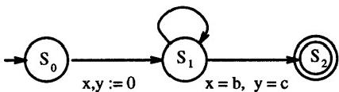{width="2.958370516185477in"
height="0.7985990813648294in"}

> Figure 1:A parametric timed automaton

**An example**

As an example,consider the parametric timed au- tomaton shown in Figure
1.The automaton consists of three states;so is the only initial
state,and s₂is the only final state.The input alphabet is unary,the set
of clocks is {x,y},and the set of parameters is {a,b,c}.An
edge(s,a,s\',λ,μ)is shown by an arrow from state s to state s\'.Since
the alphabet is unary, the edges are not labeled with any input symbols.
The edges are labeled with constraints x∈μ(x),and with assignments x :=0
for each z∈λ.Constraints of the form z∈(0,∞)are suppressed,and the con-
straint x=a means μ(x)=\[a,a\].

For a parameter valuation y,the final state s₂is reachable from the
initial state(i.e.,γ∈T(A))iff γ(c)=n·γ(a)+γ(b)for some n∈N.

**Real-time verification**

Parametric timed automata can be used to solve veri- fication problems
for real-time systems.In automata- theoretic
verification(cf.\[31,5,22\]),a finite-state system is modeled by an
automaton:the set of words accepted by the automaton corresponds to the
pos- sible behaviors of the system.While automata on infinite words can
be used to deal with nonterminat- ing processes,for verifying safety
properties it suffices to consider automata over finite words.

We specify each concurrent process of a finite-state real-time system as
a parametric timed automaton. For a given parameter valuation,the
possible behav- iors of the system are those timed words whose pro-
jections are accepted by the component automata. Let Li,i=1,2,be two
timed languages over the al- phabets ∑;.We write L₁NL₂for the timed
language over the alphabet ∑₁U∑₂that contains all timed words whose ∑
1-projection is in L₁and whose ∑2- projection is in L₂(the ∑i-projection
of a timed word is obtained by repeatedly replacing each two-element
substring(σ,t)·(d\',t\')with σ∉∑;by the pair (c\',t+t\')).Given two
parametric timed automata A₁and A2,we can define another parametric
timed automaton,the product automaton A₁⊗A₂(using a product construction
similar to the one in \[5\]),such

that for all parameter valuations y,

> L┐(A₁⊗A₂)=L┐(A₁)nL┐(A₂).

A system is modeled,then,by a product automa- ton ⊗A;.We specify the
correctness condition of the system by another parametric timed
automaton, B,which accepts the "bad"or undesirable behaviors (i.e.,the
complement of the safety property to be ver- ified).It follows that for
a parameter valuation γ, the system is incorrect precisely when the
automaton ⊗A:generates a bad behavior that is accepted by the automaton
B;that is,iffγ∈T(A)for the product automaton A=(⊗A;)⊗B.Equivalently,the
system is correct for given delay valuesγ iffγ∉T(A).

In a typical parametric verification problem,we want to prove that a
system satisfies its specification for all parameters values that meet a
given set of con- straints.In other words,given a set △C\[P→T\]of
possible parameter valuations,we wish to verify that noγ∈△is consistent
with A;that is,△∩I(A)=0. In a typical parametric synthesis problem,we
want to find all parameter valuations T(A)that are consis- tent with
A,or we want to find a parameter valuation that is consistent with A and
is optimal with respect to some criterion.For instance,one can pose the
problem of finding minimum or maximum delays in this form.Later,we will
present two examples of the parametric synthesis problem and their
solutions.

**3 Decision Problems**

Given a parametric timed automaton A,different types of questions can be
asked about the set T(A) of consistent parameter valuations.The
membership question---i.e.,the question of deciding whether a specific
parameter valuation γ is consistent with A--- can be solved using the
techniques developed in \[5\]. The method applies to both cases T=N and
T=R+, provided that the valuationγ assigns rational num- bers to all
parameters in the latter case.In fact, given a parameter valuation γ,one
can construct a finite-state automaton Ay that accepts L┐(A).Then
γ∈T(A)iff Ayaccepts some string.The membership question is known to be
PSPACE-complete.

The solution of the membership question allows the solution of the
parametric verification problem for fi- nite sets △of possible parameter
valuations.In this paper,we concentrate on solving the parametric ver-
ification problem for the universal set△ containing all parameter
valuations;that is,we wish to solve the *emptiness question,*

> Is there some parameter valuation consis- tent with A?

The following result applies to both integer and real- number time
domains.

THEOREM \[Recursive enumerability of non- emptiness\] .Given a
parametric timed automaton A,the question if T(A)is not empty is
recursively enumerable.

PROOF.From the decidability of the membership problem,we conclude that
emptiness is co-r.e.for T= N.In the case of T=R+,the same observation
follows from the fact that if T(A)is not empty then it contains a
parameter valuation all of whose values are rational.■

To solve the parametric verification and synthesis problem,it is useful
to obtain an explicit represen- tation of T(A)in a,possibly
decidable,logical for- malism.Notice that the input alphabet plays no
role in the definition of T(A)and,henceforth,we will as- sume that
\|2\|=1 and omit the edge labels σ.We will use existentially quantified
formulas of arithmetic with addition and order for defining sets of
parameter valuations.To be precise,a linear formula φover a set X of
variables is of the form(3Y.ψ),where ψ is a quantifier-free formula over
the variables in XUY that is formed using the primitives =,\<,+,A,V, and
integer constants.Such a formulaφspecifies \|X\|- tuples of values from
T.Given a linear formulaφ,it is decidable to check if φis satisfiable in
both cases in which the variables are interpreted over the natural
numbers or the nonnegative reals,respectively \[14\]. Also for formulas
φ and ψ with the same set of free variables,it is decidable to check
ifφand ψ specify the same sets.

**3.1 A Decidability Result**

A crucial resource of a parametric timed automaton is the number of
clocks it employs.In this section, we show that if an automaton A uses
only one clock, then the question if T(A)is empty is decidable.By
itself,the class of automata with just one clock may not seem very
interesting;however,over a discrete time domain,if in an automaton only
one clock is in- volved in a constraint that contains parameters,then we
can construct an equivalent automaton that uses only one clock.Thus we
can solve the real-time ver- ification problem for systems that contain
one para- metrically constrained clock.Also the problems of computing
minimum and maximum delays in fully specified systems \[11\]can be posed
as synthesis prob- lems on timed automata with one parametric clock.
Throughout Subsection 3.1 let T=N.

**Eliminating nonparametric clocks**

*A clock x ∈C is parametrically constrained iff for* some
edge(s,o,s\',λ,μ)∈E,one of the endpoints of the interval μ(x)is a
parameter in P.We first show how clocks that are not parametrically
constrained can be eliminated.

With each transition the values of the clocks in- crease by a natural
number.To eliminate the non- parametric timing constraints,we label
edges with time increments.Indeed,we show that it suffices to assume
that with every transition the clocks increase by at most 1.Hence we
define 0/1-automata.A para- metric timed 0/1-automaton A=(S,So,C,P,F,E)
is a timed automaton whose edges(s,s\',λ,μ,t)are additionally labeled
with a time incrementt∈{0,1}. As before,a configuration of the automaton
A is rep- resented by a pair(s,v),where s∈S gives the state and v:C N
gives values for all clocks.The tran- sition relation over the
configurations is defined as before,except that the increase in the
clock values is determined by the edge labelt.The following lemma shows
that we can eliminate all clocks that are not involved in a parametric
constraint.

LEMMA \[Eliminating nonparametric clocks\]. Given a parametric timed
automaton A = (S,So,C,P,F,E),we can effectively construct an- other
parametric timed 0/1-automaton A′ = (S\',S%,C\',P,F\',E\')such that C\'g
C contains only the parametrically constrained clocks of A and
T(A)=T(A\').■

**Disjunctive path constraints**

formulas from linear terms using equalities and in- equalities
and,ultimately,we will quantify existen- tially over the variables in
V.The abbreviation e∈I, where e is an expression and I is a symbolic
interval, denotes a formula;for instance,if I=\[2,a\],then e∈I stands
for the conjunction(2\<e)\^(e≤a).

**A(simple)path constraint φhas one of two forms:**

> 1.φis a conjunction(x′=x+α)\^ψ,where a is a linear term,and ψ is a
> conjunction of atomic formulas of the form(x+β∈I),with β being a
> linear term and I being a symbolic interval;or
>
> 2.φis a conjunction(x′=α)\^x,where α is a linear term,and x is a
> conjunction of atomic formulas of the form(z+β∈I)or(β∈I),with β being
> a linear term and I being a symbolic interval.

*A disjunctive path constraint is a disjunction of* simple path
constraints.

Every formula φ over the free variables VU PU {z,x\'}defines,for a fixed
parameter valuation γ,a bi- nary relation R(φ)over N:(t,t\')belongs to
R(φ)iff (3V.φ)holds for the interpretation
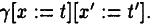{width="1.0624759405074367in"
height="0.16664916885389328in"} The operations of composition and
transitive closure over binary relations can,then,be applied to formu-
las.We say that a formulaψ defines the composition φ1·φ2 iff for every
parameter valuation γ,the relation R(ψ)is the composition of the
relation R(φ1)with the relation R(φ2).Similarly,a formulaψ defines φ\*
iff for every γ,the relation R(4)is the reflexive and transitive closure
of R(φ).Thus φ\*is the infinite disjunction

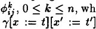{width="1.1110837707786527in"
height="0.34715988626421695in"}Consider a parametric timed 0/1-automaton
A= (S,So,C,P,F,E)that contains only a single clock z. Suppose that
S={81,.sn}.For all1≤i,j≤n,we define a formulaφij over the free variables
{x,x\'}UP. The intended meaning of this formula is that for ev- ery
parameter valuation γ,the formulaφij specifies a binary relation over
N:for clock values t and t\',the machine configuration(sj,t\')is
reachable from(si,t) with respect to γ iff φij holds for the
interpretation γ\[x:=t\]\[x\':=t!\].Our goal is to show that the formu-
las中ij are linear formulas of a special form.To define these formulas
in a dynamic-programming fashion,we use auxiliary formulas ere
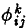{width="0.1736253280839895in"
height="0.19436898512685916in"} holds for the interpretation iff the
con-

figuration(s;,t\')can be reached,with respect to γ, from(8:,t)without
visiting any state indexed higher than k.

Let V be a new set of variables.A linear term is of the form
n₁i1+...+nmim +nm+1,where i1,..im ∈V and n₁,\...nm+1 ∈N.We will build

> (x\'=x)VφV(φ · φ)V(φ ·中 · φ)V....

The following closure allows us to replace this infinite disjunction by
a finite disjunction.

> LEMMA \[Disjunctive path constraints\]. The

set of disjunctive path constraints is closed under
disjunction,composition,and reflexive-transitive clo- sure.

PROOF.Disjunctive path constraints are closed un- der disjunction by
definition.

The composition of two simple path constraints φ1 andφ2 is defined as
follows.We assume that the vari- ables in V that appear in φ1 and in φ2
are disjoint; otherwise,renaming is necessary.Suppose that φ1 contains
the conjunct(x′=β)for some termβ(here, β may contain x).Then φ1·φ2 is
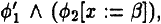{width="1.1179910323709537in"
height="0.1597189413823272in"} where the formula φ2\[z:=\]is obtained
from φ2 by replacing every occurrence of x with β,and the for- mulaφi is
obtained fromφ1 by omitting the conjunct

(x′=β).It is easy to check that for a given param- eter valuation
γ,(3V.φ1·φ2)holds for the interpre- tation γ\[x:=t\]\[z′:=t\'\]iff there
exists a clock value t\"∈N such that(3V.φ1)holds for r\[z:=t\]\[x\':=t\"
and (3V.φ2)holds for γ\[x:=t\"\]\[x′:=t\'\].Com- position can easily be
extended to disjunctive path constraints,because composition distributes
over dis- junction.

For a linear termα=n₁i1+...+nmim+nm+1,let a\*be the linear term
n₁i1+...+nmim+nm+12m+1, where im+1 ∈V is a variable not appearing
ina.The reflexive and transitive closure of a disjunctive path
constraint φis defined as follows:

(1)Suppose that φ contains a disjunct φ of the form(x′=α)\^x.Let φbe
ø\'Vφ\"(note that disjunction commutes,and φ\"may be false).Then φ\*is
φ\"\*V(φ\"\*·φ\'·φ\"\*),where false\*is(x′=x).

(2)Suppose that φis V¹=1,....n中1,where each φ1 is of the
form(x′=x+α₁)\^ψi.Let l =l₁,..lk be a sequence such that 1≤1≤n for each
l;,and each integer appears at most twice in the sequence l. There are
only finitely many such sequences.For each such sequence l,the
formulaøcontains a disjunct

中L: ΦI₁ ·X1...... 中1k-1 ·Xk-1 · 中 1 · The formula xi,for
1≤i\<k,stands for

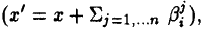{width="1.4166349518810148in"
height="0.20833989501312336in"}

where each term β is a;if there exist 1≤k₁≤i\< k₂≤k such
thatk₁=lk₂=j,and β is 0 otherwise.

**Computing consistent parameter valuations**

We use the closure properties of disjunctive path constraints to define
the formulas 中ij in a dynamic- programming fashion.For e
=(s,s\',λ,μ,t)∈E, if z∈λ,then let φ(e)be the formula(x′=0)\^
(x+t∈μ(x));otherwise,let φ(e)be the formula
(x\'=x+t)\^(x+t∈μ(x)).Now,for 1≤i,j≤n, i≠j,define

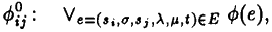{width="1.881984908136483in"
height="0.2152701224846894in"}

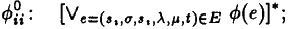{width="1.9931124234470692in"
height="0.19447944006999124in"}

and for 1≤i,j,k≤n,define

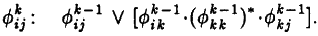{width="2.201357174103237in"
height="0.24309930008748906in"}

Each formula
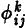{width="0.16664698162729658in"
height="0.18061898512685914in"};is a disjunctive path constraint.The
following lemma explains the meaning of these formu- las.

> **LEMMA \[Computing** T(A)\].For all 1≤i,j≤n,

0≤k≤n,clock values t,t′∈N,and parameter

valuations γ,the configuration(s;,t\')can be reached from the
configuration(8i,t)with respect to γ,with- out visiting any state
in{8k+1...sn}along the way, iff the interpretation
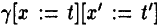{width="1.0902580927384078in"
height="0.17954396325459318in"}\]satisfies the

formula 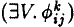{width="0.5139512248468942in"
height="0.18408464566929134in"}. ■

The desired formula中ij is
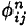{width="0.17356627296587926in"
height="0.17343613298337707in"} for all 1≤i,j≤n.

Observe that

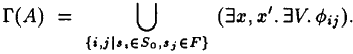{width="2.4444542869641297in"
height="0.36805883639545056in"}

Thus we have an algorithm for computing the set T(A)of consistent
parameter valuations for discrete- time automata with one parametrically
constrained clock.

THEOREM \[Deciding the single-clock case\].

For a parametric timed automaton A that contains only one parametrically
constrained clock,if T=N, then the set T(A)can be defined by a linear
formula, and testing emptiness of T(A)is decidable.■

We point out that in the case of real-number time, a similar
dynamic-programming construction can be used to show that for a
parametric timed automa- ton A with a single clock,the set T(A)is
definable by a linear formula and testing emptiness of T(A)is decidable.

**Verification example:computing delay bounds**

We wish to design a controller that opens and closes a gate at a
railroad crossing \[24\].The system is composed of three
components:TRAIN,GATE,and CONTROLLER.The automata that model the three
components are shown in Figure 2.

The input alphabet for TRAIN is{approach,erit, in,out}.The train
communicates with the controller via the two events(input
symbols)approach and exit. The events in and out mark the events of
entry and exit of the train with respect to the railroad cross- ing.The
train is required to send the signal approach at least a minutes before
it enters the crossing,and the maximum delay between the signals
approach and erit is b minutes.The alphabet for GATE is {raise,
lower,up,down}.The gate is open in state 0 and closed in state 2.It
communicates with the controller using the signals lower and raise.The
events up and down denote the opening and the closing of the gate. The
response time of the gate is in the interval (c,d). Finally,for the
controller,the alphabet is{approach, erit,raise,lower}.Whenever the
controller receives the signal approach from the train,it responds by
sending the signal lower to the gate,and whenever it receives the signal
erit,it responds with the signal raise.The response time of the
controller has a lower bound e and an upper bound f.

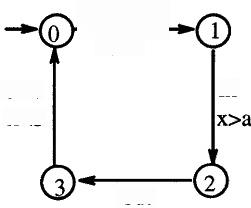

> **TRAIN**

+-----------------------------------------------------------------+-----------+------------+---------+
| > 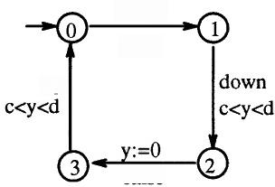{width="2.1041535433070866in" | > raise   | > approach | lower   |
| > height="1.4305500874890638in"}lower                           | > e\<z\<f | > Z:=0     |         |
| >                                                               |           | >          | e\<z\<f |
| > y:=0                                                          |           | > exit     |         |
| >                                                               |           |            |         |
| > up                                                            |           |            |         |
| >                                                               |           |            |         |
| > raise                                                         |           |            |         |
+-----------------------------------------------------------------+-----------+------------+---------+

> GATE CONTROLLER
>
> Figure 2:Railroad gate controller

One of the correctness requirements for the system is the following
safety condition:

> Whenever the train is inside the gate,the gate should be closed.

To test this safety property,we obtain an au- tomaton A from the product
TRAIN⊗GATE ⊗ CONTROLLER by requiring that a state(81,82,83) of the
product is an accepting state iff s1=2(i.e., the train is inside the
crossing)and s₂≠2(i.e.,the gate is not closed).A parameter valuation γ
belongs to I(A)iff the safety property does not hold.The reader can
check thatγ∈T(A)iffγ(a)\<γ(d)+γ(f).

Suppose we are given particular values for the train and gate delays
a,b,c,and d.Then only the con- troller clock z is parametrically
constrained.Thus we may use the algorithm outlined above to automati-
cally derive necessary and sufficient bounds e and f on the controller
delays,namely,γ(f)\>a-d.

**3.2 Undecidability of Emptiness**

We now show that the emptiness problem for para- metric timed automata
is in general undecidable.In- deed,undecidability ensues even if we
restrict the number of clocks to three,and the proof applies to both
possible choices ofthe time domain T.

> THEOREM \[Undecidability of emptiness\].

Given a parametric timed automaton A,the problem of deciding if T(A)is
empty is undecidable.

PROOF.We reduce the halting problem for 2- counter machines to the
problem of testing if there exists a consistent parameter
valuation.Consider a 2-counter machine M with two counters C₁and C₂ .
The control variable e for M ranges over the sett {l1,...ln}.Each
instruction of M can either incre- ment or decrement one of the
counters,test if one of the counters equals 0,and change the location of
control.A configuration of M is given by the triple

(li,c₁,c₂),specifying the values of l,C₁,and C2,re- spectively.The
initial configuration of M is(l₁,0,0). The halting problem is to decide
if M reaches a con- figuration(ln,c₁,c2)for some ciand c₂.We construct a
parametric timed automaton AM with three clocks such that T(Am)is
nonempty iff M halts.The theo- rem follows.

The automaton AM uses three clocks x,y,and z, and the set of parameters
is{a,a-1,a+1,b,b-1,b+1}. The automaton has a start state so,a state
l;corre- sponding to each possible value of the control vari- able e,and
some auxiliary states. We want that for a parameter valuation γ,a
configuration(li,v) of Am is reachable iff v(x)=0 and the configuration
(l;,γ(b)-v(y),γ(b-a)-v(z))is reachable for M.

Using some auxiliary states and appropriate edges between them,we add a
path between so and l₁such that for a given γ,the configuration(l₁,v)is
reach- able from(so,v\')iff γ(a)=γ(a-1)+1=γ(a+1)-1,
γ(b)=γ(b-1)+1=γ(b+1)-1,v(z)=0,v(y)=γ(b), and v(z)=γ(b-a).This sets up
the initial configu- ration.

For every instruction of M we add a path between the appropriate states
l;of AM.For instance,con- sider an instruction of M of the form\"if
l=1;then C1:=C1+1 and l:=1;."Corresponding to this instruction,AM
contains a path from state l;to state l;as shown in Figure 3.Consider a
configuration (li,v)of Am with v(x)=0.It encodes the config-
uration(li,c₁,c2)of M with c₁=γ(b)-v(y)and c2=γ(b-a)-v(z).The path can
be traversed if γ(a)≥c1+1,and the new configuration is(lj,v\') with
v\'(x)=0,v\'(y)=v(y)-1,and v\'(z)=v(z). Thus the new configuration
correctly encodes the con- figuration(l;,c1+1,c₂)of M.

If the instruction is \"ifl=li then C₁:=C₁-1 and :=1;,"then the path
will be as shown in Figure 3 with the constraint y=b+1 replaced by
y=b-1.And if the instruction is"ifL=1 and C₁=0 then l:=1;,"

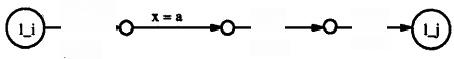

> Figure 3:Undecidability proof
>
> then the path will be as shown in Figure 3 with the constraint y=b+1
> replaced by(y=b) へ(x=0).
>
> The accepting state of Am is ln.If M does not halt,then there is no
> way to reach ln in AM,and T(A)=0.If M halts,and suppose the values of
> C₁ and C2 never exceed c1 and c₂,respectively.Then for a parameter
> valuationγ,γ∈T(A)iffγ(a)=γ(a-1)+ 1=γ(a+1)-1,and
> γ(b)=γ(b-1)+1=γ(b+1)-1, and γ(a)≥c₁,and γ(b-a)≥c₂.■
>
> Symbolic computation
>
> Even though the problem of testing the emptiness of T(A)is in general
> undecidable,we can attempt to construct a logical formula that
> explicitly repre-. sents the set T(A).Methods that use symbolic fix-
> point computation for this purpose have been devel- oped for analyzing
> timed automata \[17\]and hybrid automata\[4\].
>
> Consider a parametric timed automaton A = (2,S,So,C,P,F,E).For i≥0 and
> s ∈S,define the set φ³(s)∈\[(CUP)→T\]of clock and parameter valuations
> such that a final state can be reached from the state s within at most
> i transitions:(v,γ)∈φ(s) iff(s\',v\')∈δγ(s,v,w)for some final state
> s\'∈F, some clock values v\',and some timed word w with \|w\|≤i.
>
> THEOREM \[Bounded reachability\].For alli≥0 and s∈S,the set φ(s)can be
> defined by a linear formula over the free variables CU P.■
>
> PROOF.We define the formulas φ(s)by induction on i.First we set,for
> s∈F,φ(s):=true,and for s∉F,φ(s):=false.Then we compute the formula
>
> φ(s): φ-¹(s)v(V₃\'es pre(s,s\',φ-¹(s))),
>
> where pre(s,s\',ψ)defines the set of clock and pa- rameter valuations
> such that from s some transition leads to s\'and a clock and parameter
> valuation sat- isfying ψ.For every linear formula ψ,and for either
> choice of time domain,the set pre(s,s\',ψ)is definable by a linear
> formula\[4\].■
>
> Since there are algorithms for checking the equiva- lence of linear
> formulas,we obtain a procedure for computing the set T(A):if for all
> states s∈S, the successive approximations φ³(s)and φ-¹(s)are
>
> equivalent,then a fixpoint is reached,and we let T(A):=Vses
> 。(3C.φ³(s)).If a fixpoint is reached within a finite number of
> iterations,then the linear formula T(A)correctly defines the desired
> set of pa- rameter valuations.This gives us a semidecision pro- cedure
> for solving the emptiness problem for para- metric timed
> automata.Also,techniques for linear programming can be used to obtain
> parameter values that are optimal with respect to (linear)cost func-
> tions.

Termination of the fixpoint computation is,how- ever,not guaranteed in
general.For instance,the procedure will not terminate for the automaton
of Figure 1.This is because for i≥1,(γ,v)∈φ(s1)iff
γ(c)equals(i-1)·γ(a)+γ(b).Hence for all i≥1,the formulas φ³+¹(s1)and
φ(81)are inequivalent,and the fixpoint is never reached.Notice that even
if the parameters a and b are replaced by constants,the fixpoint
computation will not terminate.Thus the procedure cannot be used to
decide the emptiness problem even in the case of a single parametrically
constrained clock.

> The fixpoint computation does terminate in many cases of practical
> interest,including the following ex- ample with two parametrically
> constraint clocks.

Verification example:timing-based mutual ex- clusion

We consider Fischer\'s protocol for mutual exclu- sion \[23\].The
mutual-exclusion problem is to design a protocol that guarantees
mutually exclusive access to a critical section among competing
processes P₁ and P₂.Fischer proposed a very simple protocol that
exploits the knowledge about the timing delays of a system.In this
protocol,a shared variable lock is used for communication;initially lock
has the value0. Each process P;,i=1,2,follows the following algo- rithm
whenever it wants access to the critical section:

> repeat
>
> await lock=0;lock:=i
>
> until lock=i;
>
> *Critical section;*
>
> lock:=0

The correctness of this protocol depends on the as- sumptions about the
time taken by each read and write operation.Suppose that for each
process,the read operation in the test lock =i has a delay in the
interval(a,b),and the write operation in the as- signment lock:=i has a
delay in the interval(c,d). The protocol can then be modeled by a
product au- tomaton with two parametrically constrained clocks, one for
each process.While the decision procedure

of Subsection 3.1 does not apply in this case,the fix- point computation
procedure outlined above will ter- minate.By symbolic computation we can
thus derive the necessary and sufficient parameter constraint that
ensures mutual exclusion:γ∈T(A)iff γ(d)\>γ(a).

**3.3 The Gap between Decidability**

> **and Undecidability**

We proved that testing the emptiness of T(A)is un- decidable if A
contains three clocks,and decidable if A contains one clock.It is an
open question whether testing the emptiness of T(A)is decidable if A
con- tains two clocks.Note that two clocks are sufficient to give rise
to complex nonlinear constraints,as is the case for the automaton of
Figure 1.To illustrate the hardness of the two-clock emptiness
problem,we present some intriguing connections with difficult and open
problems in logic and automata theory.

**Presburger arithmetic with divisibility**

In \[26\],Lipshitz gives an algorithm for deciding the satisfiability of
quantifier-free formulas involving ad- dition and the divisibility
relation over the natural numbers.Our problem is at least as hard.

THEOREM \[Existential Presburger arithmetic with divisibility\]. Let φbe
a quantifier-free for- mula over the primitives of addition,the integer
divis- ibility relation,comparisons,and integer constants, and let
T=N.We can construct a parametric timed automaton Aφwith two clocks such
that the formula φis satisfiable over the natural numbers iff T(A)is
nonempty.■

PROOF.First we transform the formula φ into a formulaφ\'such that φis
satisfiable iffφ\'is satisfiable, andφ\'is a positive boolean
combination of atoms of the form(a=a),α\<a,a\|b,and -(a\|b),where α is a
linear term(with positive coefficients),and a,b are variables with
b\>0.This can be achieved in a straightforward way by introducing extra
variables.

We now construct a parametric timed automa- ton Aφ,with two clocks z and
y such that the pa- rameters of Aφ,are the variables of φ\'.For an atom
ψ=(k₁a₁+...+kmam+km+1=a),the automaton A consists of a single path whose
transition labels form the following sequence:

> (z,y:=0);(x=a1,x:=0)k1; ... ..
>
> ...(x=am,x:=0)\*m;(x=km+1,y=a).

Atoms of the form(α\<a)are handled similarly.For an atom ψ=(a\|b),the
automaton Aψ is

> (z,y:=0);(x=a,x:=0)\*;(x=a,y=b),

resembling the automaton of Figure 1.The atom ψ=→(a\|b)is equivalent
to(a\>b)Vψ′,where ψ′= 一(a\|b)\^a≤b.The automaton A is

> (x,y:=0);(x=a,y\<b,x:=0)\*;(x=a,y\>b).

Disjunction corresponds to nondeterminism and con- junction to
sequential composition of automata.

While in certain cases,given a parametric timed automaton A,we can
construct a formula φA that characterizes I(A),and then use Lipshitz\'s
algorithm to test the emptiness of T(A),the reduction from parametric
timed automata with two clocks to ex- istential Presburger arithmetic
with divisibility does not seem to exist in general.

**A restricted class of 1-register machines**

We consider a simple class of (nondeterministic)1- register
machines.Such a machine consists of a finite- state control and one
register that can hold any inte- ger value.The input to the machine is
an interpreta- tion γ that assigns natural numbers to a finite set P of
input variables;the initial value of the register is 0. Each instruction
can add one of the input variables to the register,subtract one of the
input variables from the register,or nondeterministically change the
loca- tion of the control depending on whether the register value is
negative,zero,or positive.The machine ac- cepts the input γ iff a
sequence of instructions leads from an initial state to a final state.

A 1-register machine is restricted iff whenever an input variable is
added to the register,the result- ing register value must be
nonnegative,and whenever an input variable is subtracted,the resulting
regis- ter value must be nonpositive.We can reduce the emptiness problem
for restricted 1-register machines to the emptiness problem for
parametric timed au- tomata with two clocks.

THEOREM \[Restricted 1-register machines\].

Given a restricted 1-register machine M with k input variables,we can
construct a parametric timed au- tomaton Am with two clocks and k
parameters such that M accepts an input γ iffγ∈T(A).■

PROOF.The automaton AM has two clocks,x and y,and a state for each
control location of the 1-register machine M.The value of the register
is en- coded by the clock difference z-y.The register ma- chine
instruction that adds(or subtracts)the input variable a to the register
corresponds,then,to a tran- sition labeled with(y=a,y:=0)(or(x=a,x:=0),
respectively).Transition labels of the form(x～y), for\~∈{=,\<,\>},which
correspond to test instruc- tions,can be eliminated by duplicating each
state so that all states have at most one incoming transition.

In certain cases,given a parametric timed automa- ton A,we can construct
a restricted 1-register ma- chine MA that accepts T(A),and thus reduce
the emptiness problem for parametric timed automata with two clocks to
the emptiness problem for re- stricted 1-register machines.A recent
result in \[19\] shows that the emptiness problem is decidable for de-
terministic restricted 1-register machines.The prob- lem is still open
for nondeterministic restricted 1- register machines.

**References**

> \[1\]M.Abadi and L.Lamport.An old-fashioned recipe for real time.In
> Proc.REX Workshop on Real Time, LNCS 600.Springer,1992.
>
> \[2\]R.Alur.Techniques for Automatic Verification of Real-time
> Systems.PhD thesis,Stanford Univ.,1991.
>
> \[3\]R.Alur,C.Courcoubetis,and D.Dill.Model- checking for real-time
> systems.In Proc.5th IEEE *LICS,1990.*
>
> \[4\]R.Alur,C.Courcoubetis,T.Henzinger,and P.-H. Ho.Hybrid automata:An
> algorithmic approach to the specification and verification of hybrid
> systems. *In Proc.Workshop on Theory of Hybrid Systems,*
> LNCS.Springer,1993.To appear.
>
> \[5\]R.Alur and D.Dill.Automata for modeling real- time systems. In
> Proc.17th ICALP,LNCS 443. Springer,1990.
>
> \[6\]R.Alur,T.Feder,and T.Henzinger.The benefits of relaxing
> punctuality.In Proc.10th ACM PODC, 1991.
>
> \[7\]R.Alur and T.Henzinger.A really temporal logic. *In Proc.30th
> IEEE FOCS,1989.*
>
> \[8\]R.Alur and T.Henzinger.Real-time logics:Com- plexity and
> expressiveness.In Proc.5th IEEE LICS, 1990.
>
> \[9\]R.Alur and T.Henzinger. Back to the future: Towards a theory of
> timed regular languages. In *Proc.33rd IEEE FOCS,1992.*

\[10\]H.Attiya,C.Dwork,N.Lynch,and L.Stockmeyer. Bounds on the time to
reach agreement in the pres- ence of timing uncertainty. In Proc.23rd
ACM *STOC,1991.*

\[11\]C.Courcoubetis and M.Yannakakis.Minimum and maximum delay problems
in real-time systems.In Proc.3rd CAV,LNCS 575.Springer,1991.

\[12\]D.Dill. Timing assumptions and verification of finite-state
concurrent systems.In Proc.1st CAV, LNCS 407.Springer,1989.

\[13\]E.Emerson,A.Mok,A.Sistla,and J.Srinivasan. Quantitative temporal
reasoning.In Proc.2nd CAV, LNCS 531.Springer,1990.

\[14\]H.Enderton.A Mathematical Introduction to Logic. Academic
Press,1972.

\[15\]E.Harel,O.Lichtenstein,and A.Pnueli.Explicit- clock temporal
logic.In Proc.5th IEEE LICS,1990.

\[16\]T.Henzinger.The Temporal Specification and Veri- *fication of
Real-time systems.PhD thesis,Stanford* Univ.,1991.

\[17\]T.Henzinger,X.Nicollin,J.Sifakis,and S.Yovine. Symbolic
model-checking for real-time systems.In *Proc.7th IEEE LICS,1992.*

\[18\]J.Hooman.Specification and compositional verifica- tion of
real-time systems.LNCS 558.Springer,1991.

\[19\]O.Ibarra,T.Jiang,N.Tran,and H.Wang.New decidability results
concerning two-way counter ma- chines and applications. In Proc.20th
ICALP, LNCS.Springer,1993.To appear.

\[20\]F.Jahanian.Verifying properties of systems with variable timing
constraints. In Proc.10th IEEE RTSS,1989.

\[21\]R.Koymans.Specifying real-time properties with metric temporal
logic.J.Real-time Systems,2:255- 299,1990.

\[22\]R.P.Kurshan.Analysis of discrete-event coordina- tion.In LNCS
430.Springer,1990.

\[23\]L.Lamport. A fast mutual exclusion algorithm. ACM Trans.Computer
Systems,5:1-11,1987.

\[24\]N.Leveson and J.Stolzy. Analyzing safety and fault tolerance using
timed Petri nets. In *Proc.Int.Conf.Theory and Practice of Software De-*
velopment,LNCS 186.Springer,1985.

\[25\]H.Lewis.A logic of concrete time intervals. In *Proc.5th IEEE
LICS,1990.*

\[26\]L.Lipshitz.The diophantine problem for addition and
divisibility.Trans.AMS,235:271-283,1978.

\[27\]Z.Manna and A.Pnueli. The Temporal Logic of Reactive and
Concurrent Systems.Springer,1992.

\[28\]J.Ostroff.Temporal Logic of Real-time Systems.Re- search Studies
Press,1990.

\[29\]F.Schneider,B.Bloom,and K.Marzullo.Putting time into proof
outlines.In Proc.REX Workshop on Real Time,LNCS 600.Springer,1992.

\[30\]R.Strong,D.Dolev,and F.Cristian.New latency bounds for atomic
broadcast.In Proc.11th IEEE RTSS,1990.

\[31\]M.Vardi and P.Wolper.An automata-theoretic approach to automatic
program verification. In *Proc.1st IEEE LICS,1986.*

\[32\]F.Wang,A.Mok,and E.Emerson. Real-time distributed system
specification and verification in APTL.In Proc.12th Int.Conf.Software
Engineer- ing,1992.

\[33\]H.Weinberg and L.Zuck.Timed Ethernet:Real- time formal
specification of Ethernet.In Proc.3rd CONCUR,LNCS 630.Springer,1992.
